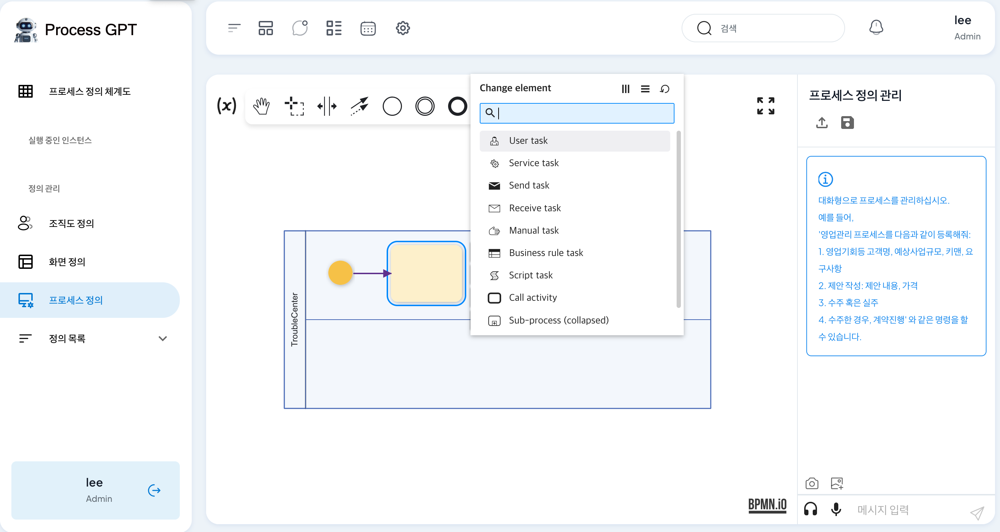
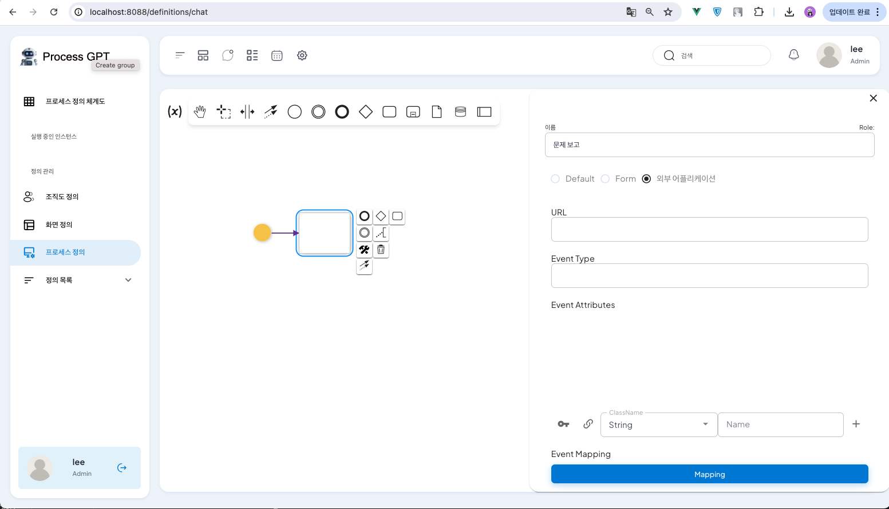

# 외부서비스와 BPM연동

## 1. 예제 어플리케이션
"장애 신청및 처리" 예제입니다. 사용자가 컴퓨터 사용에 문제가 있어서 A/S를 맡기기 위해 문제에 대한 정보를 입력 하여, A/S 접수를 받은 담당자가 어떤 엔지니어에게 업무를 전달하는 예제 입니다. 
 
이미지 1) "장애 신청및 처리" 예제

해당 App과 BPM으로 데이터를 전달 위해서 Message Broker를 통해 메시지를 전송 합니다. App은 이벤트를 Message Broker에 송신하고 BPM에서 해당 메시지를 수신하여 처리합니다.


이미지 2) "장애 신청및 처리" 흐름

- 예제의 이벤트 타입
    - 장애 티켓 발행 (TroubleIssued)
    - 장애 티켓 해결 (TroubleCompleted)

예시로 App에서는 "장애 티켓 발행(TroubleIssued)" 라는 문제가 발생되었다는 이벤트를 송신 하게 됩니다. 
송신처리는 메시지브로커를 통해서 BPM으로 전달 되고, BPM에서는 "TroubleIssued"의 타입에 따라서 인스턴스 생성하게 됩니다.

이후, 처리된 인스턴스는 해당 담당자에게 업무 화면(TroubleCompleted)을 표시 하고, 해당 화면에서는 "장애 티켓 해결(TroubleCompleted)" 라는 이벤트 메시지 수신시 처리 하게 됩니다.

### BPM 연동 이점
예제와 같이 어플리케이션(App)에서 BPM과 연동을 하게 되면, App에서 처리되는 이벤트를 시각적으로 처리하고, 자신의 업무관리및 업무내용을 공유 할 수 있습니다. 또한 추가적인 화면 작업 없이 App에서 처리한 업무 화면을 그대로 iframe을 사용하여 처리 할 수 있습니다. 
BPM에서는 프로세스에 대한 흐름을 정의 하고, Role을 설정 하여 업무 배분을 쉽게 할 수 있고, 진행 상태를 확인 할 수 있습니다. 

App과 BPM 통신을 비동기방식인 메시지브로커를 통해서 연결을 하여, 서로의 서비스의 간섭 없이(비의존성) 연동을 할 수 있습니다.

아래와 같이 연동 하기 위한 원칙을 지켜 쉽게 연동 할 수 있습니다.

### 1.2 연동 원칙
App과 BPM을 독립적으로 유지하면서 연동하기 위해 아래와 같은 구조로 구성되어 있습니다.
* 단방향 의존성 
    - 비의존성: App에서 이벤트 메시지를 전송할 뿐, BPM 호출을 기다리지 않습니다.
    - 장애차단: BPM에서 오류및 중지가 되었더라도, App에서의 영향이 없습니다. 
    - 보장성: 중지된 BPM이 재실행 되더라도, 이전의 데이터가 반드시 처리가 되도록 보장합니다.

* 역할분리
    - App
        - 업무 화면 
        - 도메인로직 
        - 데이터 관리
    - BPM
        - 업무 규칙(컨디션)에 따른 프로세스 분기/반복 
        - 담당자를 조직도에서 찾아서 담당자에게 업무 화면(App)을 라우팅 (워크아이템)

### 1.3 Req/Res 방식과 Pub/Sub 방식의 차이점
* Request/Response(동기식) 방식
    - App에서 BPM으로 요청을 보내고, BPM의 응답을 기다리는 방식입니다.
    - 단점: BPM이 응답하지 않거나 지연될 경우 App의 처리가 지연되거나 실패할 수 있습니다.
    - 장점: 요청에 대한 즉각적인 응답을 받을 수 있어 처리 상태를 바로 확인할 수 있습니다.

* Publisher/Subscriber(비동기식) 방식
    - App에서 이벤트를 Message Broker에 publish하면, BPM이 이를 수신(subscribe)하여 처리하는 방식입니다.
    - 단점: 이벤트 처리의 순서나 타이밍을 보장하기 어렵습니다.
    - 장점: App과 BPM이 독립적으로 동작할 수 있으며, 시스템의 결합도를 낮추고 확장성을 높일 수 있습니다.

이러한 방식의 차이에서 BPM과 App을 독립적으로 작동시키면서, BPM이 App을 바라볼수 있는 구조를 가져가기 위해서는 Pub/Sub(비동기식)이 BPM과 App 간의 통신에 적합합니다.


## 2. Message broker
Message Broker는 시스템간 비동기(Pub/Sub)통신을 가능하게 하여, 시스템의 독립성을 높이고, 결합도는 낮게 하여 시스템의 효율성을 향상시킵니다. 이러한 특성으로 인해 대규모 시스템, 분산 시스템, 마이크로서비스 아키텍처에 널리 사용됩니다.

App에서는 BPM과 연동하기 위해 Message Broker(Kafka)를 이용해서 서로 독립적인 서비스로 유지 하면서 아래와 같이 비동기적 통신으로 구성 되어 있습니다. 따라서 App에서 메시지브로커 쪽으로 이벤트만 송신 처리만 하면, 추가적인 정보가 필요 없이 연동이 가능합니다. 

비동기 통신의 이점으로, BPM에서 장애가 발생 하더라도 App에서 장애로 인한 문제가 생기지 않고, App이 문제가 되어도, 추후에 다시 메시지브로커를 통해서 메시지를 읽어서 복구가 가능 합니다. 

### 2.1 어플리케이션(Publisher)
이벤트 메시지 송신처리하는 App에서는 메시지브로커에 메시지를 전달 하면 됩니다. 비동기식 방식에서 송신쪽 처리를 하기 위한 App의 예제 입니다. App에서 장애 티켓 발행(TroubleIssued) 이벤트를 발생시키고, BPM에서 장애 티켓 발행(TroubleIssued) 이벤트를 수신하여 처리하게 됩니다.

```java
public class TroubleIssued extends AbstractEvent {

    private Long id;
    private String troubleType;
    private String description;
   
    public TroubleIssued() {
        super();
    }

    public TroubleIssued(TroubleTicket ticket) {
        super(ticket);
    }   
}
```
1. 장애 티켓 발행(TroubleIssued) 이벤트 작성시 AbstractEvent클래스를 상속하고, TroubleIssued 속성값을 설정 합니다.

```java
// 예시 2-1) Kafka를 통한 메시지 송신
public class AbstractEvent {

    public void publish() {
        KafkaProcessor processor = ItsmApplication.applicationContext.getBean(KafkaProcessor.class);
        MessageChannel outputChannel = processor.outboundTopic();

        outputChannel.send(
            MessageBuilder
                .withPayload(this)
                .setHeader(
                    MessageHeaders.CONTENT_TYPE,
                    MimeTypeUtils.APPLICATION_JSON
                )
                .setHeader("type", getEventType())
                .build()
        );
    }

    public void publishAfterCommit() {
        TransactionSynchronizationManager.registerSynchronization(
            new TransactionSynchronizationAdapter() {
                @Override
                public void afterCompletion(int status) {
                    AbstractEvent.this.publish();
                }
            }
        );
    }
}
```
2. AbstractEvent 클래스는 메시지브로커 채널 연결하여 메시지를 전달 할 수 있도록 선언한 클래스입니다.

```java
// TroubleTicket.java
@Entity
@Table(name = "troubleTicket_table")
@Data
public class TroubleTicket {

    @Id
    @GeneratedValue(strategy = GenerationType.AUTO)
    private Long id;

    private String troubleType;
    private String description;
    private String reason;
    
    @PostPersist
    public void onPostPersist() {
        TroubleIssued trouble = new TroubleIssued(this);
        trouble.publishAfterCommit();
    }

    public void complete(TroubleTicket ticket) {
        TroubleCompleted troubleTicketCompleted = new TroubleCompleted(this);
        troubleTicketCompleted.setReason(ticket.getReason());
        troubleTicketCompleted.publishAfterCommit();
    }

    public static TroubleTicketRepository repository() {
        TroubleTicketRepository troubleTicketRepository = ItsmApplication.applicationContext.getBean(TroubleTicketRepository.class);
        return troubleTicketRepository;
    }
}
```
3. TroubleTicket 클래스로 이벤트를 송신(Publisher) 하기 위해서 실행하는 클래스 입니다. publishAfterCommit() 함수를 통해서 메시지브로커 쪽으로 송신 하게 됩니다.
- 송신 메시지 예시
```sh
{"eventType":"TroubleIssued","timestamp":1718873491127,"id":1,"troubleType":"sw","description":"sw is error."}
```


### 2.2 BPM(Subscriber)
App에서 메시지가 발행될 때마다 수신되며, 조건에 따라 메시지를 분류할 수 있습니다.


## 3. 프로세스 모델링
"프로세스 정의"탭 에서 프로세스에 대한 정의를 진행합니다. 프로세스를 정의하기 위해서 전체적인 TASK를 그리고, 각 TASK 마다 역할을 설정하여, 업무에 대한 내용을 정의합니다.

### 3.1 연동 방법

1. "프로세스정의" 탭에서 정의 하고자 하는 프로세스를 정의 합니다.

2. 상단에 tools 중 "Create task"를 클릭하여 task를 생성합니다. 
    - Ex) 생성된 task를 "User Task"타입 변경합니다.

이미지 3) User Task 설정

3. TASK에 대한 정의를 합니다. 
    - Ex) "문제 보고"로 정의하고, Default, Form, 외부어플리케이션 중에 App과 연동을 위해서 외부어플리케이션을 설정 합니다.

이미지 4) User Task 내용 설정

4. 외부 어플리케이션 설정
    - Ex) 화면 URL, "Event Type"은 수신 받을 타입인 "TroubleIssued"을 설정 합니다.

이미지 5) 외부 어플리케이션 설정


#### 3.1.1 "외부 어플리케이션" 설정 내용
- URL
    - 화면에 대한 정의 하는 부분으로서, 외부 어플리케이션의 정의된 화면에 접근 URL정보 입니다.
- Event Type
    - 이벤트 타입을 정의 하는 부분으로서, 이벤트 발생시 어떤한 이벤트를 수신 할 지에 대한 타입의 정의하는 부분 입니다.
- Event Attributes
    - 메시지의 속성값 정의 하는 부분으로서, 수신된 메시지를 속성값에 맞게 처리 하기 위해서 정의하는 부분입니다.
- Event Mapping
    - 수신된 메시지에서 "Event Attributes"에 정의된 부분과 다른 정보를 매핑하는 역할으로서, 수신된 메시지에서 정의된 속성값을 추출하여 저장및 처리를 하기 위한 매핑 부분 입니다.


### 3.2 실행방법

1. "프로세스 정의 체계도"에서 실행하고자 하는 프로세스를 클릭합니다.

이미지 6) 실행 방법

2. 우측 상단에 플레이 버튼을 클릭하여 프로세스 실행합니다.
실행시 화면에서 설정한 화면URL을 iframe을 이용하여 화면에 표시하고, 실행 할수 있습니다.
 
이미지 7) 실행 화면

## 4. 예제 영상  
[](https://youtu.be/wZ3VW7YF98g)


