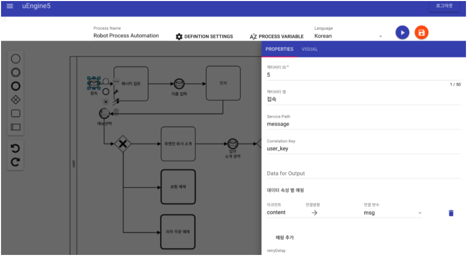

# [API] Message Listener API

유엔진 프로세스 정의를 곧바로 API 화 하여 Expose 하는 방법과 API 명세입니다.

## Service Definition

```java
http POST localhost:8080/service correlationKey="user_key" defId="Robot Process Automation.xml" path="message"
```

- path 는 오픈될 서비스의 url path 가 됩니다. 예를 들어 message 로 주게되면, process-service 에서 다음으로 접근가능하게 됩니다:

```java
localhost:8080/services/message
```

- defId 는 서비스 메시지와 연결될 프로세스 정의를 나타냅니다.
- correlationKey 는 프로세스 인스턴스를 구분하는 키 값이 됩니다. 이 값이 같은 값으로 payload 에 들어오면, 해당 프로세스 인스턴스를 찾아서 매핑시켜 주게 됩니다.


## 카카오톡 챗봇 예제

카카오톡으로 받은 메시지가 봇서버로 전송되게 되면 다음과 같은 형식의 호출로 메시지가 들어오게 됩니다:

```java
http localhost:8080/services/message content="메시지" user_key="XXXXX"
```

- user_key 는 카카오톡 단말기나 사용자에 유일하게 정해져서 넘어오기 때문에 이 값을 correlation key 로 사용하면 됩니다. 따라서, 다음과 같은 MessageStartEvent 설정으로 서비스를 열 수 있습니다:



- path: message
- correlation key: user_key
- 결과 변수 바인딩:  content -> 입력받은 값을 담을 프로세스 변수