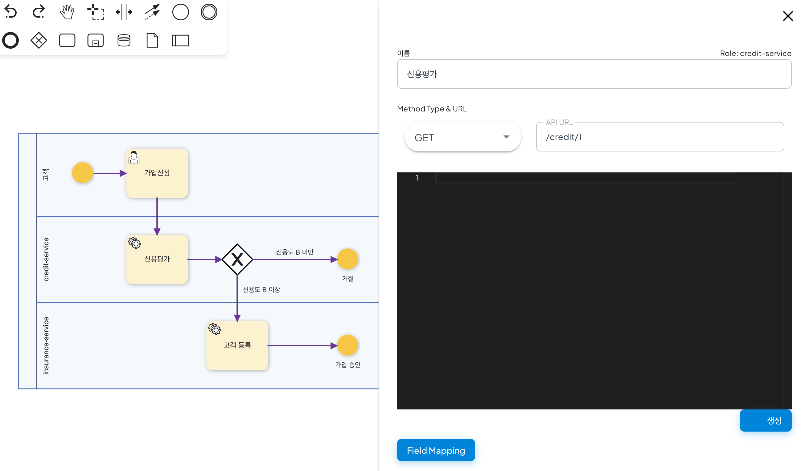
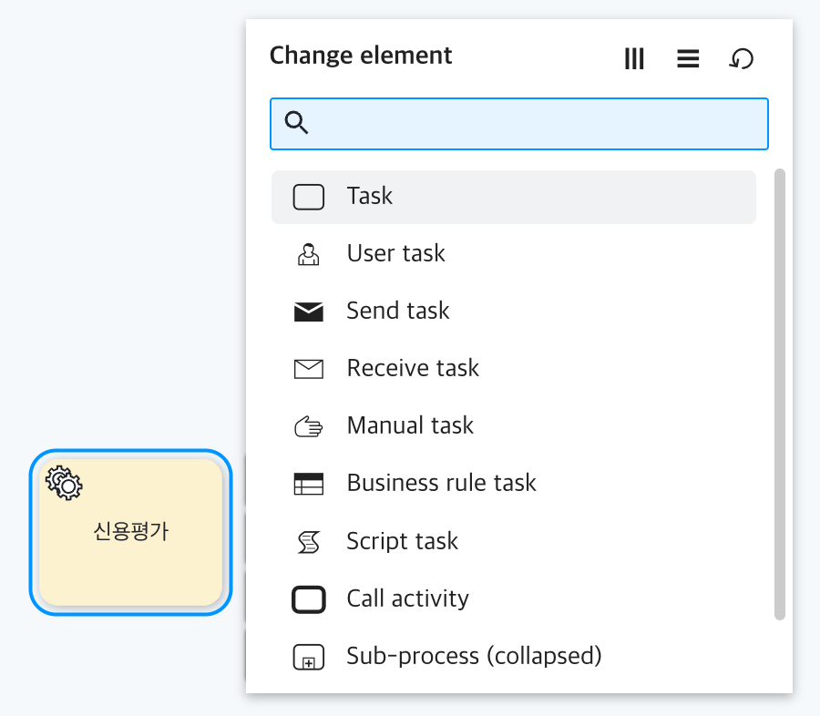
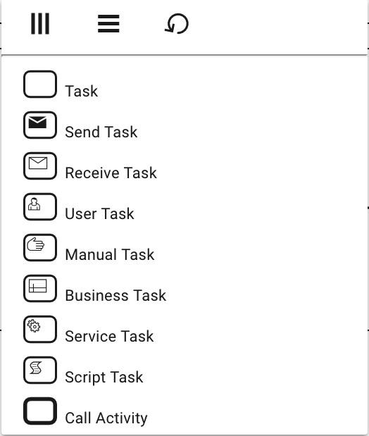

# 새로운 액티비티 타입 만들기

<h3>Creating New Activity Type</h3>

To create a new activity type, you need to implement activity class and vuejs component corresponding to the logic and configuration UI for that:
- Activity class (extends org.uengine.kernel.DefaultActivity)
- VueJS component

And register that VueJS component to the list of the context menu of task.


## Example


- **[Source](https://github.com/TheOpenCloudEngine/uEngine5-base/commit/a6a0339af75b5e2013a16f28fc7831d04d7ad529)**

**ServiceTask.java**

Activity class must extends org.uengine.kernel.Activity or DefaultActivity (if system activity) or HumanActivity (if the activity is done by human with some user interface). The class must be located at the project can be accessed by the uEngine6-base/definition and /process project for both or you can add the dependency to uEngine6-base/pom.xml to be accessed by the whole uEngine6-base sub projects)

```javascript
package org.uengine.kernel.bpmn;

...

public class ServiceTask extends DefaultActivity {

    @Override
    protected void executeActivity(ProcessInstance instance) throws Exception {
        ...
        super.executeActivity(instance);
    }

}
```
- **[here is whole source code](https://github.com/TheOpenCloudEngine/uengine-bpm/blob/master/uengine-core/src/main/java/org/uengine/kernel/bpmn/ServiceTask.java)**


## ServiceTask.vue
The vue component that provides a user interface for the activity:

```java
<template>
  <div>
    <geometry-element
...    >
      <geometry-rect
...      >
      </geometry-rect>

      <sub-elements>

<!-------------------  1. activity type symbol image ----------------------->

        <image-element
          :image="'/static/image/symbol/Service.png'"
...
        >
        </image-element>

        <bpmn-loop-type :loopType="loopType"></bpmn-loop-type>
        <bpmn-state-animation :status="status" :type="type"></bpmn-state-animation>
      </sub-elements>
      <bpmn-sub-controller :type="type"></bpmn-sub-controller>
    </geometry-element>

    <bpmn-property-panel
      :drawer.sync="drawer"
      :item.sync="activity"
    >


<!----------------- 2. property mappings from UI and activity data -------------------->


      <template slot="properties-contents">
        <md-input-container>
          <label>액티비티 명</label>
          <md-input type="text"
                    v-model="activity.name.text"></md-input>
        </md-input-container>
        <md-input-container>
          <label>역할</label>
          <md-select v-model="activity.role.name">
            <md-option v-for="role in definition.roles"
                       :key="role.name"
                       :value="role.name">
              {{ role.name }}
            </md-option>
          </md-select>
        </md-input-container>
        <md-input-container>
          <label>호출 URI 패턴</label>
          <md-input type="text"
                    v-model="activity.uriTemplate"></md-input>
        </md-input-container>
        <md-input-container>
          <label>호출 메서드</label>
          <md-select type="text"
                     v-model="activity.method">

            <md-option value="GET">GET</md-option>
            <md-option value="POST">POST</md-option>
            <md-option value="DELETE">DELETE</md-option>
            <md-option value="PUT">PUT</md-option>
            <md-option value="PATCH">PATCH</md-option>

          </md-select>
        </md-input-container>
        <md-input-container if="'GET,DELETE'.indexOf(activity.method) == -1">
          <label>입력 데이터 (JSON template)</label>
          <md-textarea v-model="activity.inputPayloadTemplate"></md-textarea>

        </md-input-container>
        <p>결과 데이터 매핑</p>
          <bpmn-parameter-contexts
            :parameter-contexts="activity.outputMapping"
            :definition="definition"
          ></bpmn-parameter-contexts>

          <md-checkbox
                    v-model.number="activity.skipIfNotFound">리소스 없을 경우 (404) 오류 처리 하지 않음</md-checkbox>

        <md-input-container>
          <label>retryDelay</label>
          <md-input type="number"
                    v-model.number="activity.retryDelay"></md-input>
        </md-input-container>
      </template>
      <template slot="additional-tabs">

      </template>
    </bpmn-property-panel>
  </div>
</template>

<script>
  import IBpmn from '../IBpmn'
  export default {
    mixins: [IBpmn],

/// -----------------   3:  name of the vue component ------------------- //
    name: 'bpmn-service-task',     
    props: {},
    created: function(){
      if(!this.activity.role)
          this.activity.role = {name:''};
    },
    computed: {
      defaultStyle(){
        return {}
      },
      type(){
        return 'Task'
      },
// ------------------  4. The actual class name of created activity above ----------------------//
      className(){
        return 'org.uengine.kernel.bpmn.ServiceTask'       
      },

// ------------------  5. initialization for activity in javascript format which reflects the UI --------//
      createNew(newTracingTag, x, y, width, height){
        return {
          _type: this.className(),
          name: {
            text: ''
          },
          role: {
            name: ''
          },
          outputMapping: [],
          tracingTag: newTracingTag,
          elementView: {
            '_type': 'org.uengine.kernel.view.DefaultActivityView',
            'id': newTracingTag,
            'x': x,
            'y': y,
            'width': width,
            'height': height,
            'style': JSON.stringify({})
          }
        }
      }
    },
    data: function () {
      return {};
    },
    watch: {},
    mounted: function () {

    },
    methods: {}
  }
</script>


<style scoped lang="scss" rel="stylesheet/scss">

</style>
```
- **[full source code](https://github.com/TheOpenCloudEngine/uEngine5-base/blob/master/front-end/src/components/bpmn/task/ServiceTask.vue)**

There are several parts to be implemented:

- Give the representative symbol image url for the activity.
- Bind vueJS components to input the activity's properties.
- Give the html tag name of the vue component.
- Give the activity class type name. it is used for adding '_type' information so that the json object can be properly deserialized by the definition / process service.
- Initialize the property UI by initializing the activity data in javascript.

It must be located in the project - 'front-end/src/components/bpmn/task'

**Finally, add the component in the list of the configuration context menu**



<!--  -->

- **[The source code for launching the list of task types can be found at BpmnComponentChanger.vue](https://github.com/TheOpenCloudEngine/uEngine5-base/blob/master/front-end/src/components/bpmn/BpmnComponentChanger.vue)**

- You should edit the vue file directly for now. (If you don't want to change the original file, copy the .vue file and locate it in your project and override the tag name by using Vue.component('bpmn-component-changer', NewComponent))

```java
        else if (this.bpmnComponent.type == 'Task') {
          this.items = [
            {
              component: 'bpmn-task',
              label: 'Task',
              icon: 'bpmn-icon-task-none'
            },
            {
              component: 'bpmn-send-task',
              label: 'Send Task',
              icon: 'bpmn-icon-send-task'
            },
            {
              component: 'bpmn-receive-task',
              label: 'Receive Task',
              icon: 'bpmn-icon-receive-task'
            },
            {
              component: 'bpmn-user-task',
              label: 'User Task',
              icon: 'bpmn-icon-user-task'
            },
            {
              component: 'bpmn-manual-task',
              label: 'Manual Task',
              icon: 'bpmn-icon-manual-task'
            },
            {
              component: 'bpmn-business-task',
              label: 'Business Task',
              icon: 'bpmn-icon-business-rule-task'
            },
// ------------- append your new activity vue component here -----------------
            {
              component: 'bpmn-service-task',  // the vue component name specified. we have marked with comment -
 "3:  name of the vue component" above
              label: 'Service Task',     
              icon: 'bpmn-icon-service-task'   // the icon showed in the list
            },

...
          ]
        }
```
That's it.


