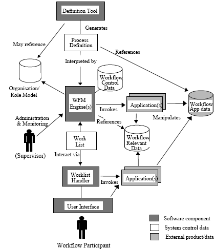
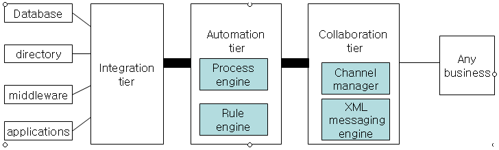
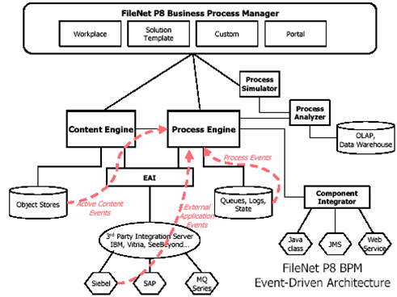
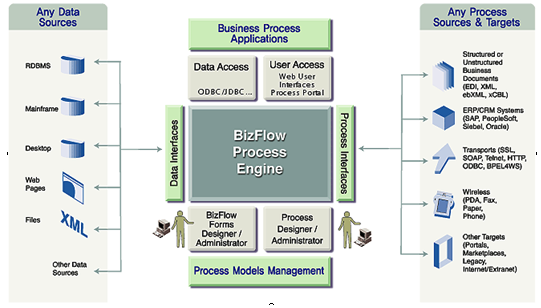
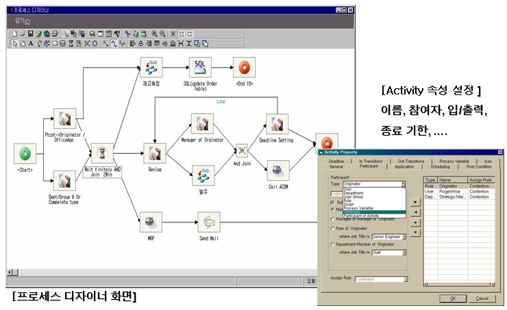
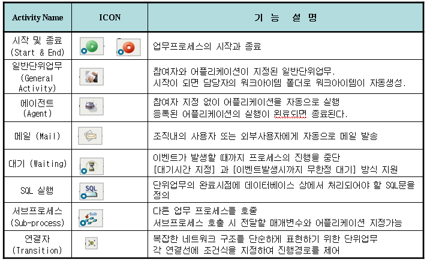
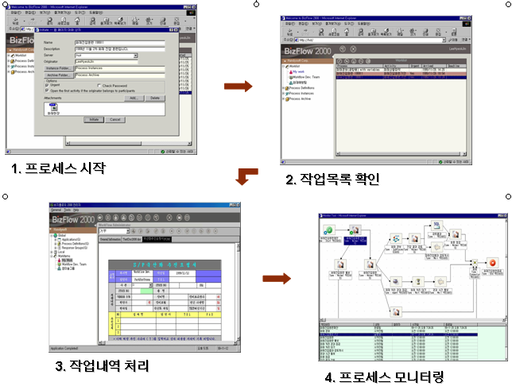

# 워크플로우 관리 시스템과 RTE BPM

## 1. 워크플로우 관리 시스템 (WFMS)

워크플로우 관리 시스템은 업무 프로세스 통제와 조정의 자동화를 지원하는 일반화된 소프트웨어를 말한다. 업무 프로세스 조정의 예로는 작업의 시작, 작업자 할당, 작업 항목의 흐름 제어 등을 들 수 있다. 업무 프로세스 통제의 예로는 진도(progress)를 모니터링하고 마감을 재촉하며 지연 작업을 촉진시키는 것 등을 들 수 있다. 워크플로우 관리시스템은 프로세스 정의 도구, 워크플로우 엔진, 업무목록 처리기 및 사용자 인터페이스로 구성된다. 워크플로우 관리 시스템의 내부 구성 요소는 아니지만 외부의 관련 시스템으로는 응용 시스템을 들 수 있다.

>
>**그림 3-1) 워크플로우 관리 시스템 구조**

<그림 3-1> 에서 프로세스 정의 도구는 워크플로우 프로세스를 정의하고 정의된 프로세스를 워크플로우 엔진에게 전달하기 위한 도구이다. 워크플로우 엔진은 비즈니스 프로세스 케이스를 수행하는 부분으로 워크플로우에서 실제 동작을 담당한다. 업무목록 처리기는 워크플로우 엔진에서 업무를 담당자에게 할당하면, 할당된 업무는 담당자의 업무 목록에 저장된다. 담당자는 자신의 업무목록 처리기를 통해서 수행해야 할 업무의 목록을 파악하며, 업무 종료 후 업무목록 처리기를 통해서 업무 완료 사실을 워크플로우 엔진으로 전달한다. 응용 시스템은 기간계 시스템 혹은 ERP 등의 타 IT 도구들이나, word processor, spread sheet등 업무에 사용되는 어플리케이션으로 워크플로우 엔진에 의해 기동되며 워크플로우 엔진에게서 필요한 데이터를 전달 받아 업무를 수행하고 수행 결과를 워크플로우 엔진에 반납하게 된다.

사용자 인터페이스는 사용자가 작업하는 화면이다. 워크플로우 사용자는 사용자 인터페이스에 의해 시스템에 로그인하고 새로운 프로세스 인스턴스를 생성하며 새로운 업무 항목을 요청하거나 업무 수행에 필요한 데이터에 접근하여 사용하고, 업무가 완료됨을 워크플로우 관리 시스템에 알리며 프로세스 진도를 파악하는 등의 역할을 수행한다. 프로세스 관리자나 감독은 관리 및 모니터링 기능을 이용하여 워크플로우 엔진에 접근하여 필요 정보를 습득하고 업무를 재조정한다.

워크플로우 시스템이 기업의 업무에 적용되어 운용되는 모습은 프로세스를 분석하고 정의하는 구축 단계와 정의된 프로세스가 실행되는 수행 단계의 2가지 단계를 기준으로 구분될 수 있다. 구축 단계는 워크플로우 시스템에서 사용할 프로세스를 분석하고 정의하는 단계이다. 구축 단계에서 하는 일에는 비즈니스 프로세스를 분석하고 모델링 도구로 프로세스를 모델링 하는 작업과, 모델링 된 프로세스를 워크플로우 시스템에서 실행할 수 있는 형태로 변환하는 일이 있다. 구축 단계에서 정의된 프로세스는 수행 단계에서 워크플로우 엔진에 의해 해석되며 워크플로우 엔진은 정의한 프로세스에 따라 여러 가지 단위 업무들의 실행 순서를 조정하여 프로세스를 처리한다. 수행 단계의 주요 기능으로는 프로세스 실행, 작업목록 통보, 마감일 알려주기, 응용 시스템 기동, 프로세스 평가/개선과 프로세스 실행 중에 동적으로 프로세스나 단위 활동의 내용을 변경하는 기능 등을 들 수 있다.

## 2. RTE (Real Time Enterprise)

2. RTE (Real Time Enterprise)
시장과 고객 요구 변화에 대한 민첩한 대응을 위해 각 기업은 구성원간 원활한 의사소통과 지식 공유 및 긴밀한 업무 협조가 절실히 요구되고 있다. 최근의 ‘실시간 기업’ 개념은 이러한 요구에 대응하기 위해 대두된 개념으로 ‘주요 비즈니스 프로세스의 관리와 실행 과정에서 최신의 실시간 정보를 이용하여 적극적으로 지연을 제거함으로써 경쟁 우위를 달성하고자 하는 기업’으로 정의된다.

즉, RTE는 기업 내 외부를 포괄하는 전반에 걸쳐 지속적인 프로세스의 개선과 실시간 정보제공을 통해 업무지연을 최소화하고 의사결정 스피드를 높여 경쟁력을 극대화하는 기업을 말한다. 근래에 RTE(Real-Time Enterprise) 즉, 실시간 기업은 갈수록 치열해지는 경쟁환경에 직면한 기업들에게 고갈되지 않을 경쟁력을 가지고 지속적으로 앞서갈 수 있는 방안으로 대두되고 있다.

이미 많은 선도 기업들이 RTE를 목표로 다양한 전략을 수립하여 추진 중에 있으며, 그 전략의 핵심에 BPM(S)가 있다. RTE 실현을 위하여는 지속적인 프로세스 개선을 위한 인프라 구축, End-to-End Process의 통합 등 프로세스의 관리가 가장 시급한 과제임을 인식한 결과일 것이다.

## 3. BPM 역할과 향후 방향

관리 시스템 관점에서 최근의 워크플로우 관리 시스템은 비즈니스 프로세스의 유연 자동화 방향으로 진화하고 있으며 정보 시스템 관점에서는 협업 중심의 전략적 정보화를 목표로 하는 BPMS로 발전하고 있다. 즉, BPM은 워크플로우, EAI (Enterprise Application Integration) 및 비구조적 프로세스들을 전체적으로 수렴하여 데이터, 응용 시스템, 문서들을 통합하는 기반 구조를 제공함으로써 비즈니스를 혁신하고 있다. 즉, BPM은 이러한 기반 구조를 이용하여 수작업이나 시스템 작업으로 이루어진 비즈니스 프로세스를 자동화하고 관리하는 추세이다.

향후 BPM(S)에는 아래와 같은 10 가지의 기능이 포함된 통합 시스템의 형태로 발전할 것이라고 예측된다: 프로세스 모델링, 프로세스 자동화, B2B 협업, 프로세스문서화, 사용자에 의한 시스템 개선, 프로세스 시뮬레이션, 지식 관리, 프로세스 분석, 응용 시스템 통합, 협업적 제품 개발.

BPMS의 적용 추세는 데이터 관리를 위해 DBMS (Data base Management System)가 기업에 적용된 지금까지의 추세와 유사하여 DBMS와 BPMS의 적용 추세를 비교해볼 필요가 있다. 즉, 기업의 데이터 처리에 있어서 데이터가 프로그램에 임베디드 되어 있었던 과거에서 현재 SQL (structured Query Language)을 가진 표준 RDBMS에 의해 전사적으로 광범위하게 사용되는 방향으로 진화했듯이, BPMS도 프로세스가 프로그램 내에서 표현되어 있었던 과거에서 BPQL (Business Process Query Language)을 구비한 BPMS가 전사적 표준으로 널리 쓰이는 미래로 진화될 것이다.

기업 운영에 있어서 BPMS의 역할은 우선 프로세스 통합 방법의 명백한 기반 구조가 되어야 하고 그 다음에 미래의 B2B 협업을 지원하는 점진적 방법을 제공해야 한다. 이러한 역할을 수행하기 위한 BPM(S)는 <그림 3-2>에서와 같이 통합 계층, 자동화 계층 및 협업 계층으로 구성되는 3계층 구조를 가질 것이라 예상된다. 첫째, 통합 계층은 데이터베이스, 디렉토리, 미들웨어, 각종 응용 시스템 등과 같은 관련 시스템들과의 통합을 책임진다. 둘째, 자동화 계층은 비즈니스 규칙 처리와 비즈니스 프로세스의 신뢰성 있는 실행을 책임지게 된다. 마지막으로 협업 계층은 채널 관리자와 XML 메시지 엔진을 이용하여 표준 B2B 협업 프로토콜을 지원함으로써 관련 기업과의 커뮤니케이션을 책임지게 된다.

>
>**그림 3-2) 계층 BPMS 아키텍처**

BPMS는 향후 3 계층 아키텍처에 기반하여 프로세스 실행 기능과 비즈니스 방화벽 역할을 하면서 프로세스 분석 기능과 결합하여 현대 기업 아키텍처의 ‘무게 중심점’이 될 것이다. BPMS는 프로세스 분석 서버와 연결되는데, 프로세스 분석 서버는 향후 차세대 프로세스 지능 기술의 중심점 역할을 할 것이다. 즉, 전사적 프로세스 저장소를 갖는 BPMS를 중심으로 내부적으로는 감사 데이터를 활용하는 프로세스 분석 서버와 프로세스 지능 소프트웨어가 연결되며, 기업 외부로는 방화벽을 사이에 두고 협업 프로세스 저장소와 연결되어 진정한 B2B를 가능케 할 것이다.

## 4. BPM 시스템 예

이 절에서는 현재 널리 사용되고 있는 국산 및 외산 제품을 하나씩 소개하고자 한다. 우선 외산 제품으로 Filenet P8 Business Process manager는 <그림 3-3> 과 같이 그 구성 요소로서, 1) 프로세스 자동화를 위한 프로세스 설계 도구 및 2) 프로세스 엔진, 3) 모델링 시 사전 분석 도구인 프로세스 시뮬레이터와, 4) 실행 시 발생한 데이터를 이용하여 성과를 측정하고 리포팅하는 프로세스 분석기를 기본으로 하고 있으며, 5) 타 시스템과의 통합을 위해 정형/비정형 정보를 관리하는 컨텐츠 엔진과, 6) SAP나 IBM websphere server등과의 통합을 위한 EAI (Enterprise Application Integration) 미들웨어와, 7) 자바 오브젝트나 웹 서비스와 직접 호출하기 위한 컴포넌트통합기와 8) ILOG jRule과 같은 규칙 엔진과의 연계 기능을 갖추고 있다.

>
>**그림 3-3) Filenet P8 Business Process Manager 구조**

  

>
>**그림 3-4) BizFlow BPM 구조**

국내에서 개발된 핸디 소프트의 BIzFlow BPM은 <그림 3-4> 에서와 같이 그 구성 요소로  
1) 프로세스 설계, 단위 업무 설계, 어플리케이션 설계 등 설계 모듈과  
2) 프로세스 운영/모니터링 모듈,  
3) 프로세스 결과 분석 모듈 및  
4) 데이터 및 응용 시스템 통합 모듈로 구성되어 있다. 

>
>**그림 3-5) BizFlow BPM 프로세스 디자이너**

<그림 3-5> 는 BIzFlow BPM에서 프로세스 디자이너를 이용하여 전체적인 프로세스를 정의하는 방법과 프로세스 내의 단위 활동의 속성을 상세히 입력하는 것을 나타내고 있다. 즉, 단위 활동 속성인 활동 이름, 참여자, 입력, 출력 및 종료 기한 등을 입력한다.

>
>**그림 3-6) BizFlow BPM 단위 활동 유형**

<그림 3-6> 은 BIzFlow BPM에서 프로세스 정의에 사용되는 다양한 단위 활동 유형을 나타내고 있다. 활동의 특성에 따라 일반 업무나 에이전트 소프트웨어에 이한 자동 업무, 메일 발송 및 데이터베이스 갱신 등의 업무로 구분된다.

프로세스 실행 단계에서는 <그림 3-7> 과 같이 프로세스를 개시하고 해당작업자는 자신의 작업 목록에서 작업 항목을 선택하여 작업을 처리하고, 관리자나 작업자는 해당 프로세스의 현재 상태를 모니터링 하여 작업을 수행및통제해 나가는 과정을 거치게 된다.

>
>**그림 3-7) BizFlow BPM 프로세스 실행**

**참고문헌** 
(1) 안승해, 백창현, Workflow, 시사정보기술, 2000. 
(2) 핸디소프트, Handy BPM, www.handysoft.co.kr, 2007. 
(3) Janowski W. Management Update: The Real-Time Enterprise at the Customer Front Line, Inside Gartner: Note Number IGG-05282003-01. 2003. 
(4) IBM, IBM FileNet Business Process Manager, www.ibm.com, 2007. 
(5) Smith H. and Fingar P., Business Process Management- The Third Wave, Meghan-Kiffer Press, Tampa, FL,2003. 
(6) Workflow management Coalition, Workflow management coalition terminology & glossary (Document number WFMC-TC-1011), www.wfmc.org, 1999. 
(7) Workflow Management Coalition, Workflow Reference Model (Document Number TC00-1003), http://www.wfmc.org, 1998.

