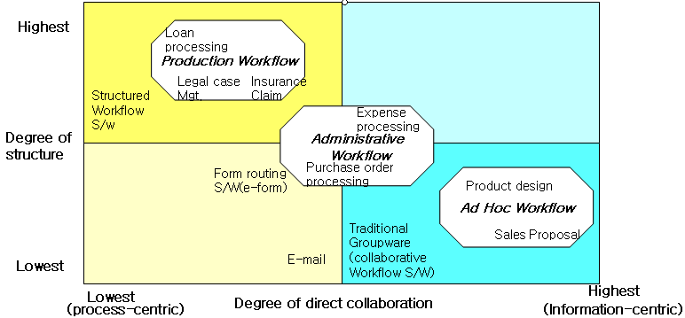
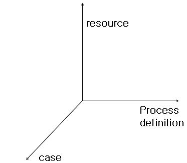
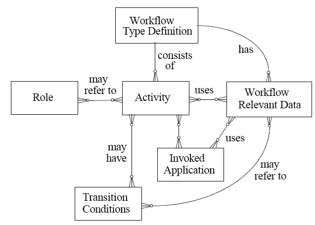
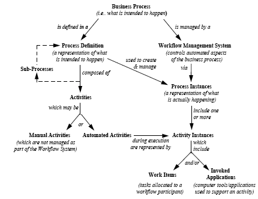
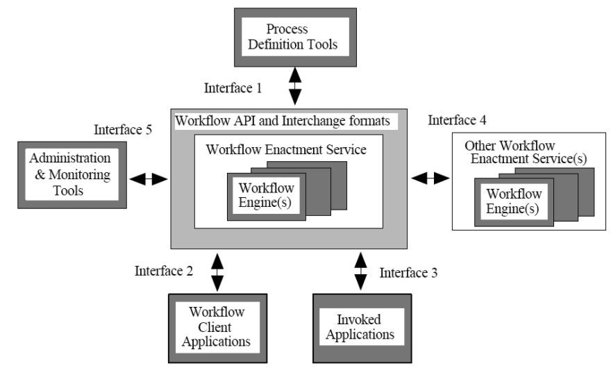
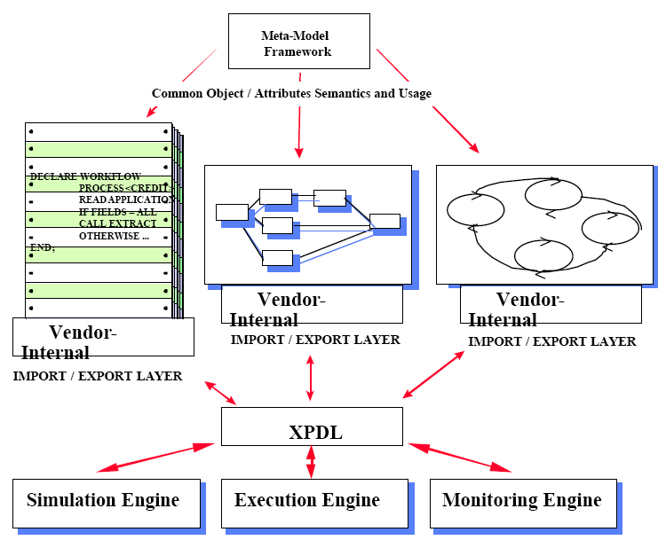
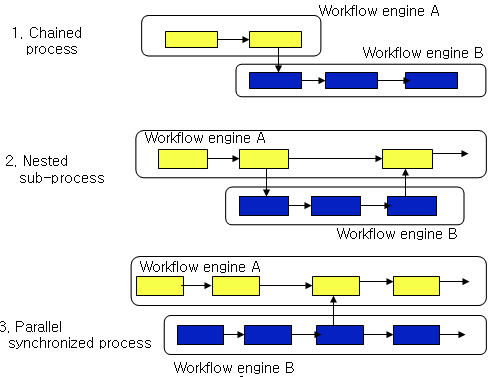

# 워크플로우

## 1. 워크플로우 개념과 유형

사무자동화 실현이라는 개념에 근간하여 IT로서 워크플로우의 개념이 처음으로 등장한 것은 1980년대 초반이라고 할 수 있다. 1990년대 초에 이르러서야 서서히 워크플로우라는 말이 인식되면서 상용 제품이 등장하였으며 1990년대 중반 이후 안정기를 거쳐 2000년대에는 BPM으로 진화해 가고 있다. 워크플로우는 비즈니스 프로세스의 전체나 일부분의 자동화나 컴퓨터화를 의미하며, 대표적인 비즈니스 프로세스의 예로는 주문처리, 구매, AS 클레임처리, 신제품 개발 프로세스 등을 들 수 있다. 워크플로우를 다른 말로 표현하면 기업 내외적으로 정해진 업무들과 그에 관련된 사람, 정보 및 기타 자원의 흐름을 통합적으로 관리, 지원해주는 업무처리 자동화라고 정의할 수 있는데 여기에는 기업 구성의 3 요소라고 할 수 있는 사람, 프로세스, 자원이 필수 요소로 포함된다.

워크플로우는 프로세스 리엔지니어링 도구의 하나로서 (재)설계된 비즈니스 프로세스를 자동화하기 위해 주로 사용된다. 워크플로우의 기능은 크게 프로세스 정의, 프로세스 수행, 프로세스 평가 및 프로세스 개선의 4 가지로 구분할 수 있다. 워크플로우 관리 시스템(WFMS)은 워크플로우 개념에 기반하여 프로세스 정의를 해석할 수 있고, 워크플로우 참여자와 상호작용하며 필요할 경우에는 IT 도구나 응용 시스템을 기동시킬 수 있는 하나 이상의 워크플로우엔진 위에서 운영되는 소프트웨어 시스템을 말한다. 이 시스템은 소프트웨어 기능을 사용하여 워크플로우를 정의하고 생성하며 실행을 관리하는 정보 시스템이다.

워크플로우의 목적은 작업이 적기에 접합한 사람에 의해 수행될 수 있도록업무의 흐름을 관리하는 것이다. 즉, 참여자에게 작업을 할당하고 작업에 필요한 데이터를 응용 시스템을 통해 적절하게 제공하며 프로세스가 성공적으로 종료될 수 있도록 프로세스의 투명성을 제고하는 것이다. 해머와 챔피(1993)는 워크플로우를 BPR이나 PI (Process Innovation)를 성공적으로 이끌게 하는 주요 IT 기술이라 평가하고 있다. 워크플로우의 효과로는 자동화를 통해 불필요한 단계를 제거함으로써 효율성을 개선하고, 일하는 방법의 표준화와 감사를 가능케 함으로써 더 나은 프로세스 통제를 가능케 한다. 그리고, 고객에 대한 응답성을 향상 시킴으로써 고객 서비스를 개선하고, 비즈니스 프로세스 (재)설계를 가능케 함으로써 프로세스의 유연성을 향상시키며, 프로세스 단순화 및 유선형화(streamlining)를 통해 프로세스를 개선할 수 있다는 점을 들 수 있다.

워크플로우는 주로 사무실에서의 작업을 대상으로 하고 있는데 ‘일의 흐름’이란 측면에서 생산 현장에서의 제품의 흐름과 비교할 수 있다. 제품의 흐름과 사무실에서의 정보의 흐름 사이의 유사점으로는 공장에서의 제품은 사무실에서는 문서에 해당하며, 공장에서의 기계는 사무실에서는 작업자와 유사점을 가지고 있다. 차이점으로는 사무 작업에서는 생산현장과 달리 복사본을 만드는 것이 용이하며, 평가 측면에서 작업 결과의 질을 평가하기 어렵다는 점이다. 이외에도 사무 작업에서는 재고 축적에 대한 용량 제약이 없으며, 운송이 순식간적이고 고정적 처리 경로를 가지고 있지 않다.

워크플로우는 그룹웨어와 성격이 유사하나, 그룹웨어는 주로 문서나 정보 처리에 중점을 두고 구조화되지 않은 프로세스를 대상으로 하며 주로 정보 공유를 목적으로 하는 반면에, 워크플로우는 업무의 흐름에 중점을 두며 주로 잘 정립된 프로세스를 대상으로 한다. 워크플로우는 참여자간 직접 협력이 필요한 정도와 프로세스의 정형화 정도에 따라 생산 워크플로우, 행정적 워크플로우, 임시적 비구조적 워크플로우로 구분될 수 있다.

(1) 생산 워크플로우 (Production Workflow)
업무 처리에 예외상황 발생이 거의 없는 반복적 프로세스를 상시 계속적으로 수행하는 전담자가 있는 상황에서 사용되며 담당자간 직접 협력의 정도는 약하다. 이 워크플로우의 핵심은 프로세스 처리 능력, 프로세스와 단위 업무 정의 능력, 그리고 수행 및 통계 처리 능력에 달려 있다. 대출처리, 보험 클레임 처리, 소송 사건 처리 프로세스 등을 그 예로 들 수 있다.

(2) 행적적 워크플로우 (Administrative Workflow)
비교적 잘 정의된 기업의 일상적인 업무와 관련된 프로세스를 처리하는 워크플로우로서 핵심 프로세스보다는 주로 구매 신청, 출장 경비 신청, 지출 보고서 작성 등과 같은 지원 프로세스를 처리한다. 많은 경우 간단한 양식과 필요로 하는 문서 첨부가 수반되며 협력의 정도와 프로세스 정형화 정도는 생산 워크플로우와 임시적 비구조적 워크플로우의 중간이다.

(3) 임시적 비구조적 워크플로우 (Ad hoc Workflow)
처리 절차가 사전에 정의되지 않고 매 업무 발생시 그에 해당하는 새로운 절차가 생성되는 프로세스를 처리하는 워크플로우로서 프로세스가 비정형적이어서 참여자간 협력이 많이 요구된다. 이 프로세스의 핵심은 참여자들이 함께 일할 수 있도록 협업의 기반을 얼마나 잘 제공해주는가에 달려 있다. 제품 설계나 제안서 작성 프로세스 등을 그 예로 들 수 있다. 이를 정리하면 <그림 2-1>과 같다.

>
>**그림 2-1) 워크플로우 유형**

## 2. 워크플로우 구성 요소

>
>**그림 2-2) 워크플로우 구성 요소**

워크플로우의 3대 구성 요소는 <그림 2-2> 에서와 같이 첫째, 워크플로우의 처리 대상인 케이스와, 둘째, 처리를 수행하는 주체인 자원 및 셋째, 처리 절차를 기술하는 프로세스 정의 데이터이다. 워크플로우의 처리 대상인 케이스는 프로세스 정의에 의해 처리되어야 할 필요가 있는 어떤 것을 지칭한다. 예를 들면 ABC 보험회사에 특정 일자에 청구된 홍길동 씨의 보험 청구 건이 하나의 케이스가 되는 것이다. 이 케이스는 ABC 회사의 보험 청구 처리 프로세스에 의해 해결된다. 케이스는 프로세스 인스턴스, 잡 (job), 혹은 프로젝트라 하기도 한다. 케이스는 정의된 프로세스 단계를 따라 진행하는데 가능한 진행 경로를 라우팅 (routing)이라 하며, 라우팅의 유형은 순차 (sequential), 병렬 (Parallel: AND), 선택 (Choice: OR), 반복 (Iteration)의 4가지 유형이 있다. 순차 경로는 복수 개의 단위 업무들이 순서적으로 처리되는 것이며, 병렬 경로는 두 개 이상의 단위 업무들이 병렬적으로 처리되는 것이며, 선택 경로는 복수 개의 업무 중에서 하나나 혹은 그 일부가 수행되는 것을 의미한다. 마지막으로 반복 경로는 하나 이상의 업무가 한 번 이상 반복적으로 수행됨을 의미한다.

병렬 경로와 선택 경로는 그 유형에 따라 다시 분기 (Split)와 병합 (Join)로 나뉘어져서 총 4개의 유형으로 분화 된다 (AND-split, AND-join, OR-split, OR-join). 여기서 AND-split는 선행 업무가 완료되면 두 개 이상의 후행 업무가 병렬적으로 시작된다. AND-join은 두 개 이상의 선행 업무가 완료되어야 후행 업무가 시작될 수 있다. OR-split는 하나의 선행 업무가 완료되면 조건에 따라 두 개 이상의 업무 중 하나나 그 이상의 후행 업무가 시작될 수 있으나 후행 업무 모두가 시작될 수는 없다. OR-join은 두 개 이상의 선행 업무 중 하나 이상의 선행 업무만 완료되면 후행 업무가 시작될 수 있다. 즉, 후행 업무를 위해 복수 개의 후행 업무가 모두 완료될 필요는 없다.

프로세스 정의는 프로세스 수행을 위해 어떤 단위 업무들이 필요하며 그것들이 어떤 순서로 수행되어야 하는지를 명세화한다. 프로세스 정의는 라우팅 정의, 절차, 혹은 워크플로우 스크립트라고 부르기도 한다. 프로세스 정의를 위해 필요한 구성 요소로는 프로세스를 구성하는 단위 활동과, 단위 활동에서 필요한 관련 데이터들과, 활동의 수행 주체를 나타내는 역할과, 단위 활동의 수행에 필요해서 기동된 응용 시스템 및 단위 활동 간의 전이 조건이다.

>
>**그림 2-3) 기본 프로세스 정의 메타 모델**

<그림 2-3> 는 프로세스 정의의 구성 요소와 요소간 관계를 ER 다이어그램 형태로 나타낸 WfMC (Workflow Management Coalition)의 프로세스 정의 메타 모델을 나타내고 있다. 즉, 워크플로우 유형 정의는 복수 개의 단위 활동으로 구성되고, 단위 활동은 그 활동을 수행할 역할을 참조할 수 있으며 업무 수행 중에 워크플로우 관련 데이터를 사용한다. 또, 단위 활동은 복수 개의 전이 조건을 기질 수 있고 응용 시스템을 기동시킬 수 있다. 응용 시스템도 워크플로우 관련 데이터를 사용하며 전이 조건도 워크플로우 관련 데이터를 참조할 수 있다.

프로세스의 기본 구성요소인 단위 활동, 즉 액티비티는 다양한 속성을 가지고 있다. 즉, 단위 활동은 활동을 수행하는 참여자, 참여자가 사용하는 응용 시스템이나 전자양식, 문서 등과 활동 수행에 필요한 선행 조건이나 후행 조건 등을 가지고 있다.

워크플로우 3대 구성 요소 중의 하나인 자원은 특정 케이스를 위해 특정 활동을 수행하는 처리의 주체이다. 자원은 사람이거나 혹은 컴퓨터 소프트웨어나 프린터 등과 같이 사람이 아닌 대상일 수도 있다. 자원은 주어진 역할이나 조직과 같은 그룹에 근거하여 동일한 묶음으로 분류될 수 있다. 이와 같이 유사한 특성을 갖는 자원의 집합을 자원 클래스라 하는데, 여기서 역할은 자원이 무엇을 할 수 있는가에 근거한 분류이고, 그룹은 조직에 근거한 분류이다. 케이스와 단위 활동이 합쳐져서 구체적인 ‘업무 항목’이 되는데, 프로세스 실행을 위해서는 업무 항목을 특정한 자원에 할당하는 방법이 필요해진다. 이 의사결정은 첫째, 관련 자원들이 업무를 마쳤을 때 대기하고 있는 업무 항목 중에서 어떤 업무 항목을 먼저 처리 해야 할 것인가를 결정하는 것과, 둘째, 새로운 업무 항목이 새로이 추가되었을 때 이 업무 항목을 어떤 자원이 수행해야 하는가를 결정하는 것이다. 결정 방법으로는 FIFO (First-In First-Out), 즉 선입 선출, LIFO (Last-In Last-Out), 즉, 후 입 선출, 최단 처리시간 (SPT: Shortest Processing Time), 최단납기 (Earliest Due Date), 우선 순위 (Priorities) 기준 등이 있다.

## 3. 워크플로우 참조 모델
워크플로우 제품들은 90년대 초반부터 다양한 제품들이 출시되었지만 각기 나름대로의 방식에 따라 구현되었다. 이의 결과로 상이한 제품들 간의 연동성 (interoperability)이 문제로 대두됨에 따라 워크플로우 제어를 위한 표준화 노력의 하나로 WfMC (Workflow Management Coalition)가 1993년에 결성되어 활발한 활동을 하고 있다. WfMC에는 현재 약 200여 개의 업체가 참여하고 있으며 API나 프로토콜 및 교환 포맷 등을 표준화하기 위해 노력하고 있다. WfMC에서 제시한 워크플로우 참조 모델 (WfMC workflow reference model)은 워크플로우 제품간의 상호연동을 실현하기 위해 워크플로우 시스템이 제공하는 서비스를 5개의 기능적 인터페이스로 구분하여 각각의 스펙을 규정한 것을 말한다.

>
>**그림 2-4) 워크플로우 기본 용어간 관계**

<그림 2-4> 는 워크플로우와 관련된 위한 여러 용어 사이의 관계를 보여주고 있다. 즉, 비즈니스 프로세스는 프로세스 정의 내에서 정의되며, 프로세스 정의는 여러 개의 단위 활동들로 구성된다. 단위 활동들은 수동이거나 자동으로 수행된다. 비즈니스 프로세스는 프로세스 인스턴스 (instance)를 가지고 워크플로우 관리 시스템에 의해 관리되고, 프로세스 인스턴스는 1개 이상의 단위 활동 인스턴스 들을 포함한다. 단위 활동 인스턴스는 작업 항목이나 기동된 응용 소프트웨어를 포합한다. 그리고 비즈니스 프로세스 정의는 프로세스 인스턴스를 생성하거나 관리하는데 사용된다.

<그림 2-5> 에서 워크플로우 시스템이 제공하는 6개의 서비스 사이의 5개 인터페이스를 표현하는 WfMC 참조 모델을 나타내고 있다. 인터페이스 1은 정의된 프로세스의 상호 교환을 위한 인터페이스로서 공용 메타모델에 근거하고 있으며 프로세스 정의 언어인 WPDL(Workflow Process Definition Language)과 XML기반의 XPDL (XML Process Definition Language)을 제공한다. 이 언어들은 공용 메타 모델에서 정의된 내용들을 프로세스 저장소에 저장하기 위한 규약을 표현하고 있는데 구체적으로는 저장을 위한 규약, 저장 형식, 저장에 사용되는 키워드 들을 정의하고 있다. 공용 메타 모델은 워크플로우 구성 요소들의 종류와 구성 요소에서 사용되는 속성, 속성들의 종류와 데이터 타입 및 이들 간의 연관 관계를 정의하고 있는 모델이다.

>
>**그림 2-5) WfMC 워크플로우 참조 모델**

<그림 2-6> 에서 보는 바와 같이 워크플로우 관련 시스템 사이에는 다양한 형태의 정의 데이터 교환 요구가 존재하며, 이러한 요구를 만족시키기 위해 메타 모델에 기반한 XPDL이 교환 메커니즘을 제공하고 있다. XPDL 메타 모델은 프로세스 정의 데이터의 시스템간 교환을 위해 필요한 개체들과 개체들의 속성들의 집합을 표현하고 있다. 프로세스 정의를 위해서는 워크플로우 프로세스 활동, 활동 간 전이 정보, 참여자, 사용하는 응용시스템, 워크플로우 관련 데이터 등이 정의되어야 한다.

>
>**그림 2-6) 프로세스 정의 데이터 교환 유형**

인터페이스 2와3에서는 어플리케이션들이 다양한 워크플로우 엔진들에 일관되게 접근할 수 있도록 지원해주는 워크플로우 어플리케이션 프로그래밍 인터페이스인 WAPI (Workflow Application Programming Interface)를 규정해 놓고 있다. 그리고, COM이나 CORBA 인터페이스도 정의하고 있다. 인터페이스 4에서는 서로 다른 워크플로우 시스템간에 프로세스 관련 정보를 주고 받고, 프로세스를 연계하기 위한 표준과 API들의 집합을 규정하고 있으며, 이를 wf-XML이란 스펙으로 정의하고 있다. 또한 인터페이스4에서는 워크플로우 엔진간에 지원해야 할 프로세스 연동 시나리오를 3 가지로 제시하고 있다. 첫 번째는 연결 프로세스 (chained process)로서 한 워크플로우 시스템에서 다른 워크플로우 시스템에 진행중인 프로세스를 넘겨 주게 된다. 두 번째는 서브 프로세스 (Nested sub process)로서 특정 워크플로우 시스템의 프로세스가 다른 워크플로우 시스템의 프로세스의 일부분으로서 수행된다. 세 번째는 병렬 동기화 프로세스 (Parallel synchronized process)로서 2개의 독립된 워크플로우 시스템 내에 있는 프로세스 실행 시점 중 일부가 동기화 되며, 동시에 병렬적으로 특정 단위 업무들이 시작되는 경우를 의미한다. 이를 그림으로 표현하면 <그림 2-7> 과 같다.

>
>**그림 2-7) 시스템간 연동 시나리오**

인터페이스5는 부가적인 관리 기능 및 모니터링 도구를 이용하여 워크플로우 엔진의 상태를 관찰 할 수 있도록 하기 위한 상세 기능을 정의하고 있다

**참고문헌** 
(1) 안승해, 백창현, Workflow, 시사정보기술, 2000. 
(2) Hammer M. and Champy J., Reengineering the Corporation, Harper Business, New York, 1993. 
(3) Prior, C., Workflow and Process Management, 2003 workflow handbook, p17-25,Future Strategies Inc., Lighthouse Point, Florida, 2003. 
(4) Rickayzen A., Dart, J., Brennecke, C. and Schneider, M., Practical Workflow for SAP, Galileo Press, Bonn, Germany, 2002. 
(5) Van der Aalst W. M.P. and Kees van Hee, Workflow management-models, methods, and systems, The MIT Press, Cambridge, MA, 2002. 
(6) Workflow Management Coalition, Workflow Reference Model (Document Number TC00-1003), http://www.wfmc.org, 1998. 
(7) Workflow Management Coalition, Workflow management Coalition Interface - XML Process, Definition Language (Document Number WFMC-TC-1025), http://www.wfmc.org, 2002.

