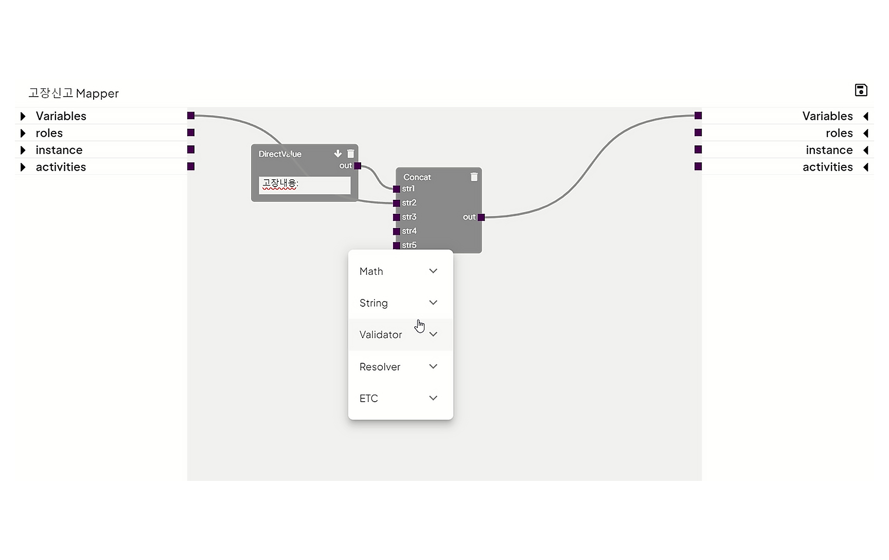
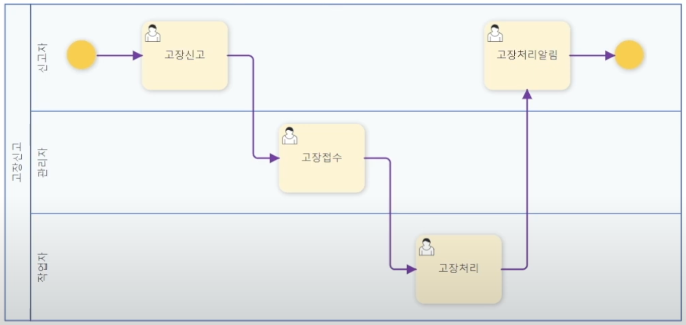
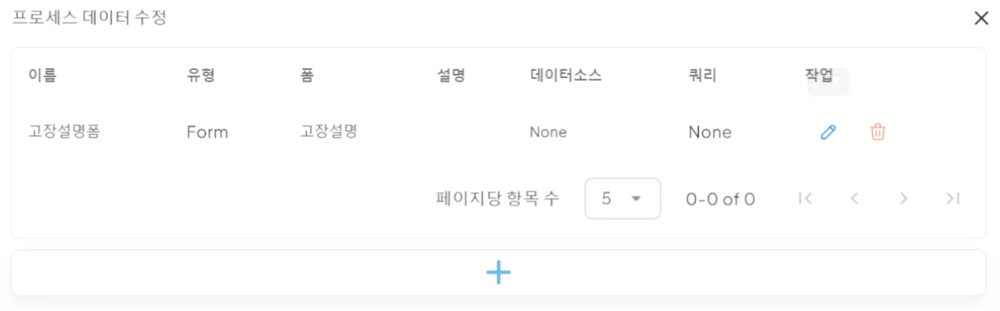
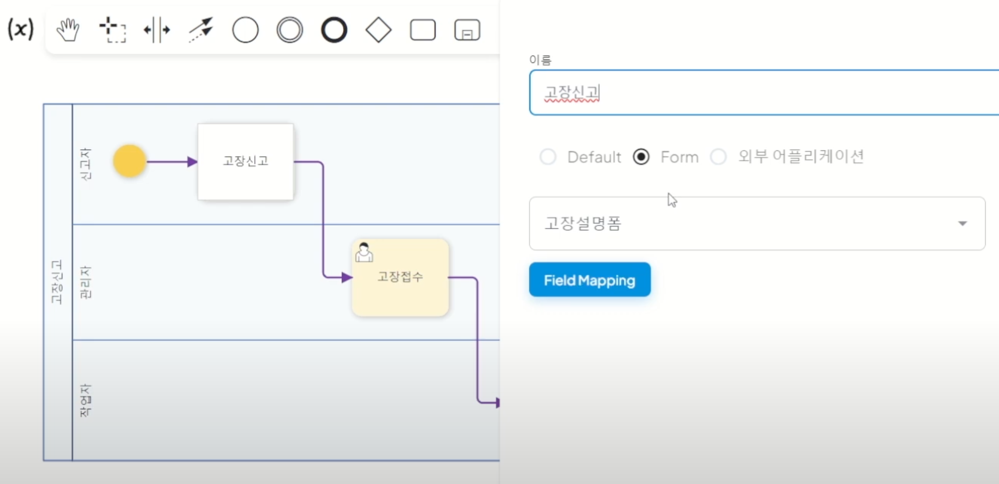

# 데이터 매핑

## Data Form Mapper

- 데이터 폼 매핑 예시 화면

    
### 데이터 폼 매핑 정의
프로세스 실행 중에 다른 도구 (ex. Legacy Systems) 등과의 통합을 위하여 다른 스키마 간의 데이터를 연계, 트랜스포밍할 수 있는 설정 도구

### 액티비티 간 폼 매핑 활용법
프로세스 변수 등의 값을 변경하기 위해 각 액티비티 간의 매핑 처리를 진행한다.

프로세스 변수를 추가할 때 변수 타입을 "Form"으로 설정 후 필드 매핑 기능을 활용해 폼에 내용을 추가하고 각 변수 별 블록을 연결해 매핑 처리를 완료한다.

## 폼 매핑 과정 예시

이번 장에서는 프로세스 변수 등의 설정값을 조정하여 각 액티비티 간의 폼 매핑 처리를 진행하는 과정을 설명하겠다.

>

>**그림 1) 기본 프로세스**

우선 기본적인 고장신고 프로세스를 작성한다.

>

>**그림 2) 프로세스 변수 설정**

프로세스 변수 설정 시 변수 유형을 Form으로 설정하여 매핑이 가능한 변수로 지정한다.

>

>**그림 3) 액티비티 유형 변경**

이후 각 액티비티 내의 Field Mapping 기능을 활용해 각 변수 별로 블록을 연결하여 매핑 처리를 완료한다.

>

>**그림 4) 필드 매핑 처리**

