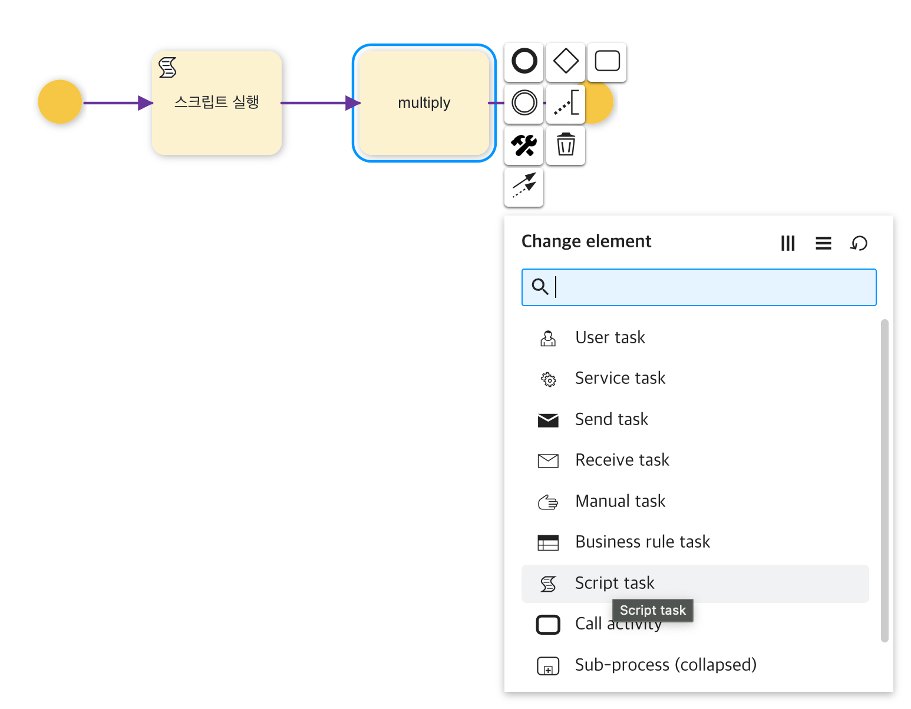
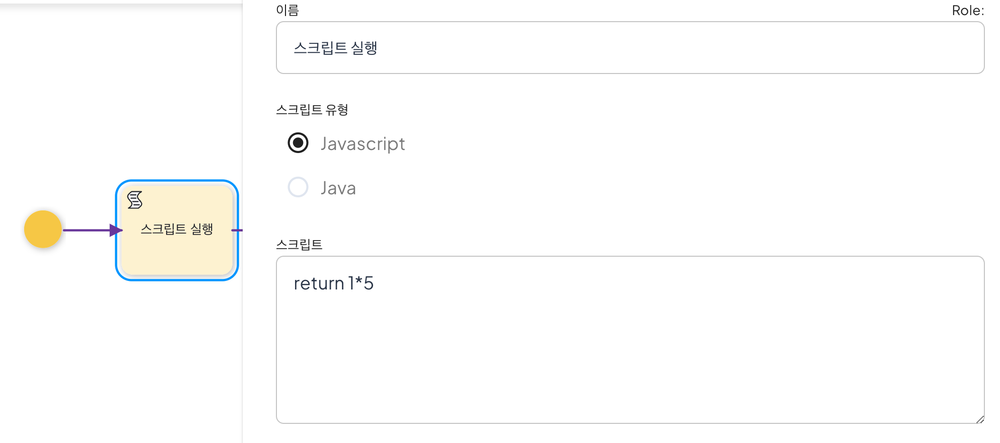
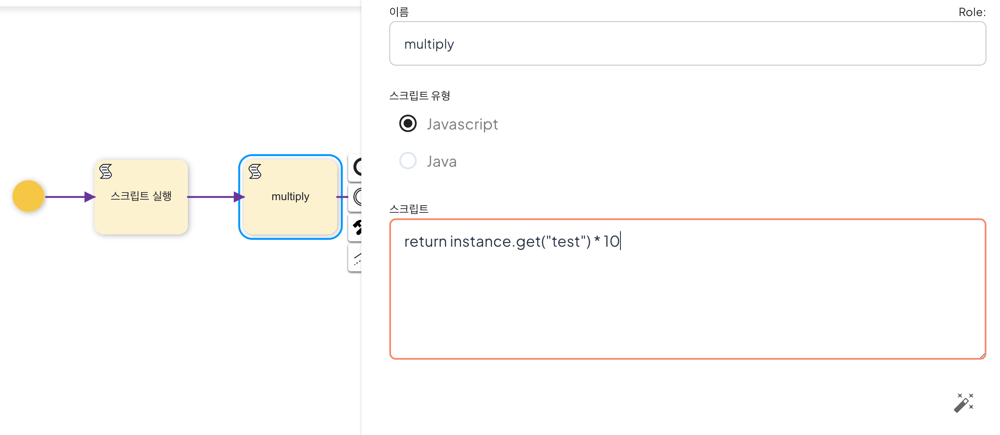

# [Modeling] ScriptTask

Script Task 는 Javascript 나 Java 언어를 직접 액티비티에 설정하여 프로세스 설정만으로 처리하기 힘든 마이크로한 설정이나 액션을 실행가능하게 합니다.

[Warn] Script Task 에 의존하여 너무 많은 로직을 작성하지 마십시오! 이후, 프로세스가 비대해지며 관리하기 힘들어지므로, 프로세스 정의로 가능한 설계하되 그것이 어려운 경우, 별도의 서비스로 개발하여 형상 관리하시기 바랍니다.

## 설정







## 예제 프로세스 (json)
```java
{"definition":{"_type":"org.uengine.kernel.ProcessDefinition","name":{"text":"script test"},"retryDelay":60,"isDynamicChangeAllowed":true,"childActivities":["java.util.ArrayList",[{"_type":"org.uengine.kernel.ScriptActivity","name":{"text":"스크립트 실행"},"tracingTag":"2","retryDelay":60,"isDynamicChangeAllowed":true,"elementView":{"_type":"org.uengine.kernel.view.DefaultActivityView","id":"2","shapeId":"OG.shape.bpmn.A_Task","x":452.0,"y":136.0,"width":100.0,"height":100.0,"style":"{\"stroke\":\"black\",\"fill-r\":1,\"fill-cx\":0.1,\"fill-cy\":0.1,\"fill\":\"#FFFFFF\",\"fill-opacity\":0,\"label-position\":\"center\",\"stroke-width\":1.2,\"r\":\"10\",\"cursor\":\"move\"}"},"script":"return 1*5","out":{"name":"test","displayName":{},"defaultValue":""},"dynamicChangeAllowed":true},{"_type":"org.uengine.kernel.bpmn.StartEvent","name":{},"tracingTag":"3","retryDelay":60,"isDynamicChangeAllowed":true,"elementView":{"_type":"org.uengine.kernel.view.DefaultActivityView","id":"3","shapeId":"OG.shape.bpmn.A_Task","x":309.0,"y":136.0,"width":30.0,"height":30.0,"style":"{\"stroke\":\"black\",\"fill-r\":\".5\",\"fill-cx\":\".5\",\"fill-cy\":\".5\",\"fill\":\"white\",\"fill-opacity\":0,\"label-position\":\"bottom\",\"stroke-width\":1.5,\"cursor\":\"move\"}"},"dynamicChangeAllowed":true},{"_type":"org.uengine.kernel.ScriptActivity","name":{"text":"multiply"},"tracingTag":"4","retryDelay":60,"isDynamicChangeAllowed":true,"elementView":{"_type":"org.uengine.kernel.view.DefaultActivityView","id":"4","shapeId":"OG.shape.bpmn.A_Task","x":621.0,"y":136.0,"width":100.0,"height":100.0,"style":"{\"stroke\":\"black\",\"fill-r\":1,\"fill-cx\":0.1,\"fill-cy\":0.1,\"fill\":\"#FFFFFF\",\"fill-opacity\":0,\"label-position\":\"center\",\"stroke-width\":1.2,\"r\":\"10\"}"},"script":"return instance.get(\"test\") * 10","out":{"name":"multi","displayName":{},"defaultValue":""},"dynamicChangeAllowed":true}]],"sequenceFlows":[{"relationView":{"TERMINAL_IN_OUT":"_TERMINAL_C_INOUT_0","shapeId":"OG.shape.bpmn.C_Flow","value":"[[324,136],[402,136]]","style":"{\"stroke\":\"black\",\"fill-r\":\".5\",\"fill-cx\":\".5\",\"fill-cy\":\".5\",\"fill\":\"none\",\"fill-opacity\":0,\"label-position\":\"center\",\"stroke-width\":1.5,\"stroke-opacity\":1,\"edge-type\":\"plain\",\"arrow-start\":\"none\",\"arrow-end\":\"block\",\"stroke-dasharray\":\"\",\"stroke-linejoin\":\"round\",\"cursor\":\"pointer\"}"},"sourceRef":"3","targetRef":"2","condition":{"_type":"org.uengine.kernel.Evaluate","description":{},"pv":{"displayName":{},"defaultValue":""},"val":"","condition":"=="}},{"relationView":{"TERMINAL_IN_OUT":"_TERMINAL_C_INOUT_0","shapeId":"OG.shape.bpmn.C_Flow","value":"[[502,136],[571,136]]","style":"{\"stroke\":\"black\",\"fill-r\":\".5\",\"fill-cx\":\".5\",\"fill-cy\":\".5\",\"fill\":\"none\",\"fill-opacity\":0,\"label-position\":\"center\",\"stroke-width\":1.5,\"stroke-opacity\":1,\"edge-type\":\"plain\",\"arrow-start\":\"none\",\"arrow-end\":\"block\",\"stroke-dasharray\":\"\",\"stroke-linejoin\":\"round\",\"cursor\":\"pointer\"}"},"sourceRef":"2","targetRef":"4","condition":{"_type":"org.uengine.kernel.Evaluate","description":{},"pv":{"displayName":{},"defaultValue":""},"val":"","condition":"=="}}],"defaultFlowchartViewType":"swimlane","defaultFlowchartViewOption":"vertical","duration":10,"simulationInstanceCount":10,"simulationInputFrequency":10,"archive":true,"id":"script test.xml","isAdhoc":true,"shortDescription":{},"initiateByFirstWorkitem":true,"adhoc":true,"dynamicChangeAllowed":true}}
```

## 프로세스 배포

```java
http POST localhost:8080/definition/raw/script.json < scriptTest.json
```

## 프로세스 실행
```java
http POST http://localhost:8080/instance?defPath=script.xml
```

## 실행 확인
```java
http http://localhost:8080/instance/{인스턴스ID}/variables
```
