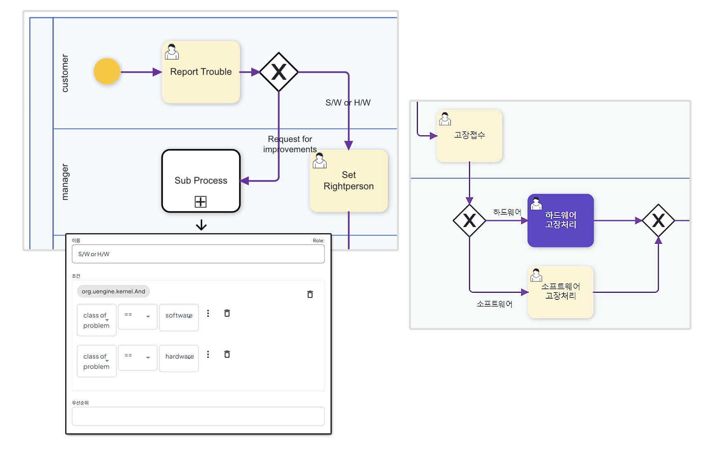

# 조건 분기 처리

## 게이트웨이를 활용한 프로세스 내 분기 처리

- 게이트웨이 분기 처리 적용 예시

>

### 프로세스 정의 시 조건 적용 및 분기 처리

Gateway 노테이션을 활용해 프로세스 변수를 정의하고 조건을 설정함으로써 분기 처리를 진행한다.

Gateway 설정에서 단순한 프로세스 변수를 비교하고 And/Or 조합의 복잡한 규칙을 정의할 수 있다.

각 프로세스 변수에 분기 처리 변수를 알맞게 매핑해줌으로써 상황 별로 프로세스의 실행 단계를 지정한다.

프로세스에서 메인으로 다루는 이슈에 대한 유형, 타입 별로 메시지를 요청해 각 풀에서 지정된 액션이 실행될 수 있도록 처리한다.