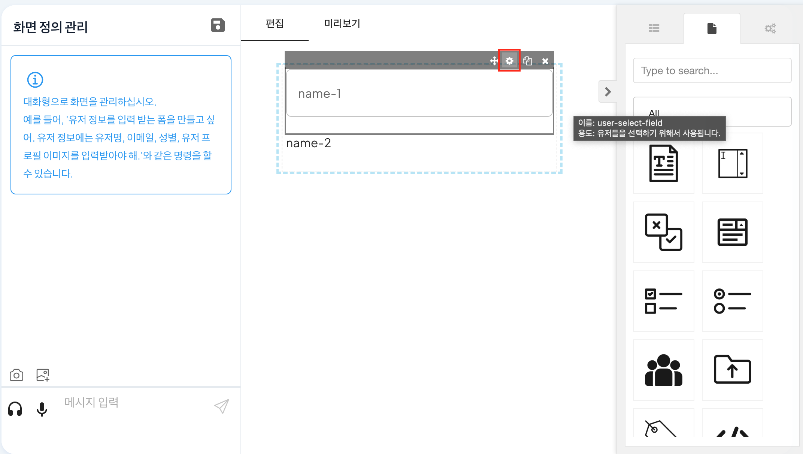

# 폼 관리

## 폼 기반 태스크 액티비티 수행

좌측 '화면 정의'아이콘을 클릭하면 아래와 같이 태스크 액티비티의 파라미터 컨텍스트에 필요한 내용을 토대로 폼을 생성할 수 있는 화면 정의로 이동할 수 있다.

우측 영역을 보면 AI를 통하여 요구사항에 맞게 폼을 자동 생성하는 기능과 직접 추가하여 폼을 생성할 수 있다. 장애 처리 프로세스 예제의 첫 번째 프로세스인 '장애 신고'를 폼 기반으로 생성해보자.

## STPE1. 폼 생성

장애 신고 프로세스에는 다음과 같은 데이터를 요구한다

- 장애 설명
- 장애 유형

요구사항을 토대로 화면 정의를 진행하기 위해 Container > 1column을 편집 영역으로 drag&drop한다.

이후, Components > text-field(장애 설명), radio-field(장애 유형)를 편집영역으로 drag&drop하여 아래와 같은 화면을 생성한다.

## STPE2. 세부 폼 설정

생성한 폼의 'name-1' hover > 우측 상단 설정을 클릭하면 아래와 같이 'name-1'에 대한 form의 세부 설정을 할 수 있다.

form 세부 설정에 아래와 같이 장애 설명에 대하여 데이터 이름, label, 데이터 유형 등의 속성을 설정 후 'Apply'를 클릭하여 설정을 완료한다.

'name-2'를 통해 장애 유형에 대한 세부 form 설정도 아래와 같이 설정한다.

장애신고에 대한 설정을 완료한 후, 좌측 화면 저장을 진행하면 아래와 같이 좌측 정의 목록에 생성한 폼을 확인할 수 있다.

## STPE3. 변수 정의

생성한 폼은 프로세스 정의 > 프로세스 변수에서 아래와 같이 form형태로 변수를 저장한 다음, 장애 신고 태스크 액티비티의 패널에서 form으로 설정할 수 있다.

