# 모델링 툴의 사용법

## 1. 프로세스 정의 생성
아래 화면과 같이 좌측 프로세스 정의를 클릭하면 프로세스 디자이너 화면이 나타나며 프로세스 정의를 생성할 수 있다.

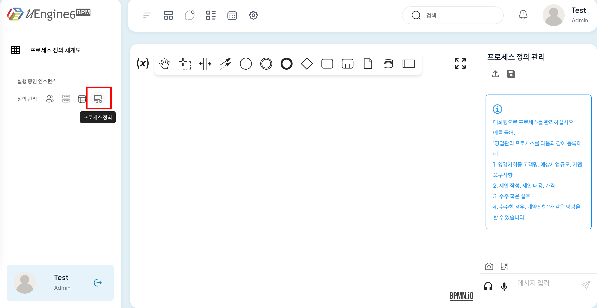
    
### 1.1 프로세스 디자이너 도구
    
프로세스 디자니어 상단에는 모델링 생성에 필요한 다양한 Acitivity Type들이 존재하며 이 영역을 액티비티 타입 팔레트라고 한다.

Activity를 Drag & Drop하면 아래와 같이 선택한 Activity가 프로세스 플로우 차트에 추가된 것을 확인할 수 있다.

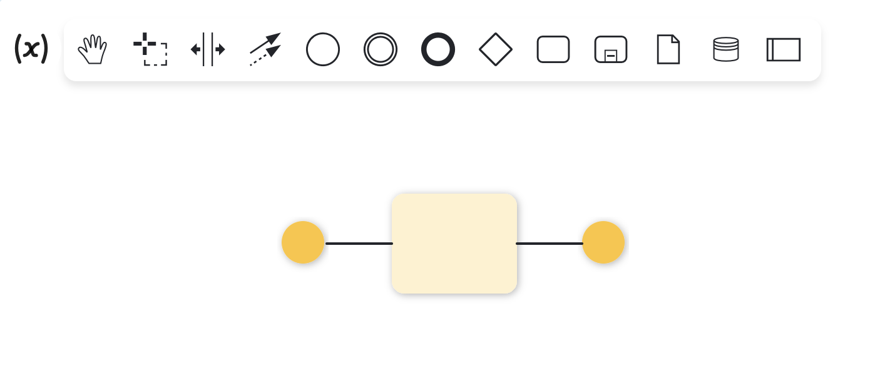

추가된 Activity를 클릭하면 Activity에 대하여 세부 유형을 설정하거나 이후 진행될 Activity 설정, Activity 삭제 등을 진행할 수 있다.

Activity를 더블클릭하면 아래 화면과 같이 우측 영역에 패널이 생성된다.

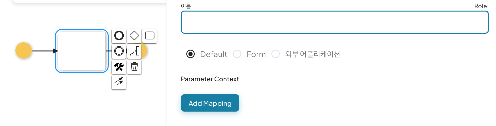

해당 패널을 통해 Activity의 이름, 파라미터, 역할 등 Activity의 속성을 설정할 수 있다.

### 1.2 프로세스 데이터
액티비티 타입 팔레트 좌측에 위치한 '(x)'버튼을 클릭하면 프로세스 데이터 화면이 나타나며, '+'버튼을 클릭하여 프로세스에서 사용할 변수의 이름과 유형 등을 설정할 수 있다. 

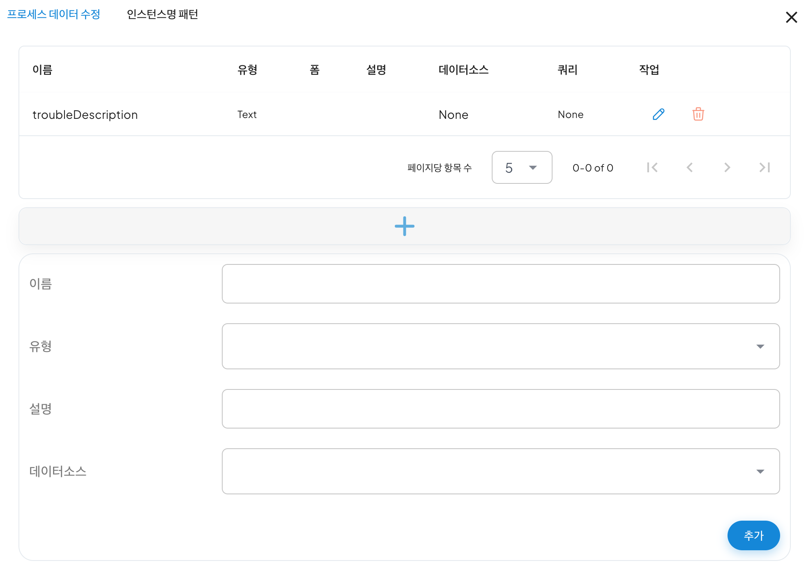

프로세스 데이터를 통해 추가한 변수는 Task Activity 패널 >  Add Mapping > Process Data에서 사용가능하다.

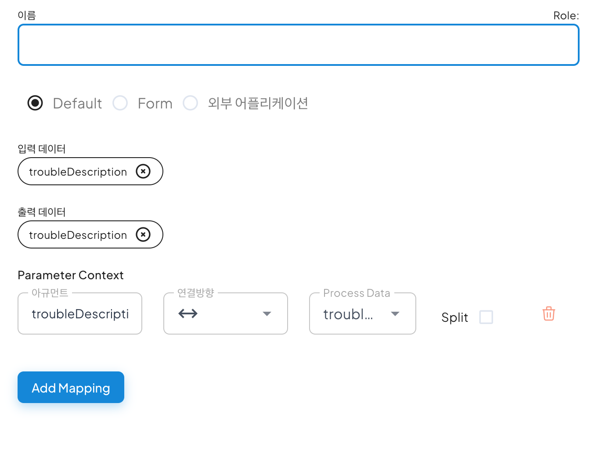

## 2. 예제 프로세스

### 2.1 예제 프로세스 설명

사용자가 장애를 신고하고 장애를 처리한 후, 처리 결과를 신고한 사용자에게 안내하는 장애 프로세스를 예제로 프로세스 모델을 생성 및 실행한다.

### 2.2 프로세스 시나리오

장애처리 프로세스의 시나리오는 다음과 같다. 

1. 사용자가 장애를 신고한다. 

2. 관리자는 사용자가 신고한 장애를 확인 후 장애를 처리할 담당자를 지정한다. 

3. 지정받은 담당자는 장애 처리를 진행 후, 처리 결과 내용을 입력한다. 

4. 처리 결과 내용을 사용자에게 전달된다. 

프로세스 시나리오를 통해 완성되는 모델은 아래와 같다.
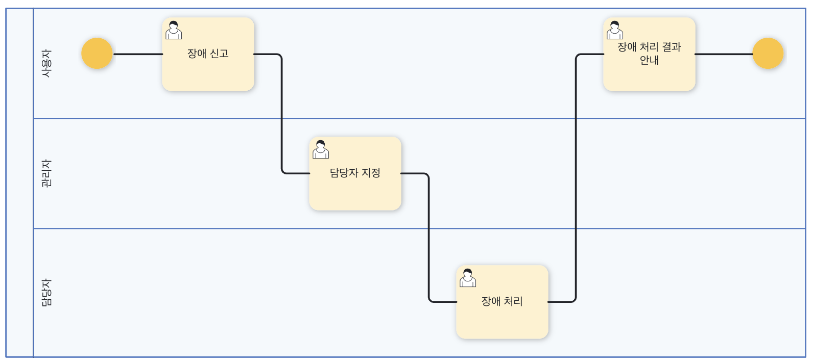

### 2.3 프로세스 정의

장애처리 프로세스의 모델링 단계는 아래와 같이 나누며 각 단계는 필요에 따라 병행하면서 작업한다.

#### 참여자 정의

참여자 정의는 프로세스에 참여하는 역할 들을 정의하는 단계이며, 장애처리 프로세스에서의 역할은 다음과 같이 분류할 수 있다. 

사용자: 장애 신고자

관리자: 장애업무를 접수받고 담당자를 지정할 관리자

담당자: 부여받은 장애업무를 실제로 처리할 장애 처리자

아래 화면과 같이 장애처리 프로세스의 역할을 등록하기 위해 다음의 단계를 진행한다.
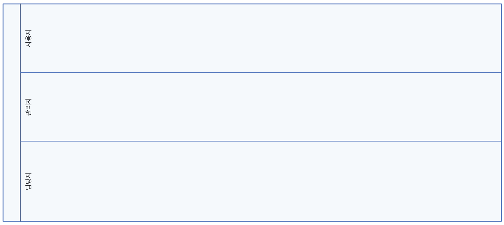

1. pool activity를 Drag&Drop으로 플로우 차트에 생성한다.

2. pool activity를 클릭 후 오른쪽 나오는 메뉴를 통해 참여자의 수에 맞게 분할 해준다.

3. 각각의 lane을 더블클릭 후 패널을 통해 사용자, 관리자, 담당자를 설정한다.

#### 변수 정의

변수 정의는 각 업무 단계별로 주고 받아야 할 데이터를 정의하는 변수 정의 단계이며 예제에서는 다음과 같은 변수를 사용한다.

troubleDescription 
troubleType 
troubleResult 
selectManager 

해당 변수를 프로세스 데이터에 다음과 같이 등록한다.

| 이름 | 유형 |
| ------ | --- |
| troubleDescription | Text |
| troubleType | Text |
| troubleResult | Text |
| selectManager | Text |

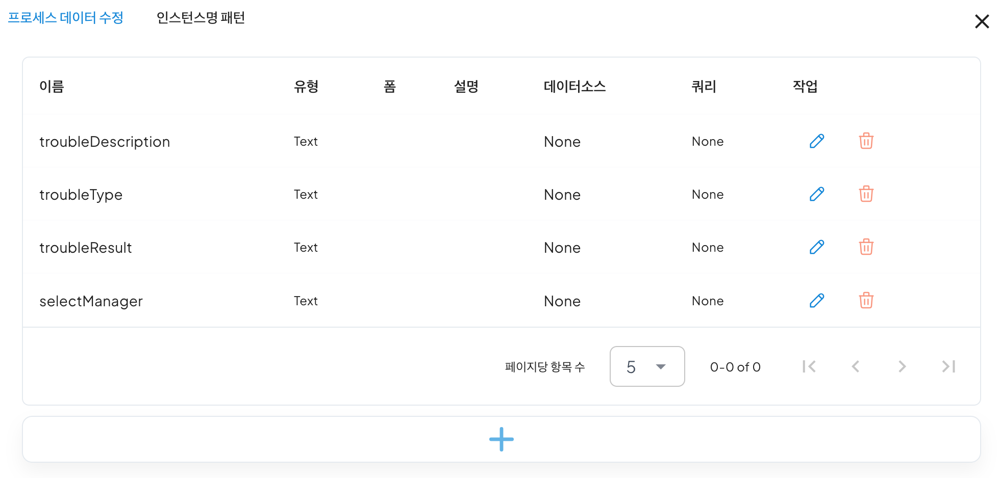

#### 흐름 정의   

흐름 정의는 각 업무 단계의 참여자와 변수를 정의하고 프로세스 간의 흐름을 정의하는 단계로 다음과 같이 진행한다.

1. Start Event와 Task Activity를 다음과 같이 lane에 drag&drop 후 패널을 통해 각 업무단계의 이름을 다음과 같이 수정한다.  
이때, Start Event는 첫 프로세스가 진행되는 lane에 배치한다.

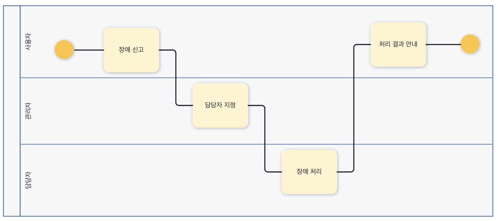

2. 각 단계별 task activity를 클릭하여 User task로 타입으로 지정 후, 단계별 프로세스 변수를 지정한다.

<장애 신고>

장애 신고 task를 더블 클릭하여 패널을 열고 입력 받아야 할 프로세스 변수들인 장애 설명(troubleDescription)과 장애 유형(troubleType)을 각각 Parameter Context에 추가해 준다.

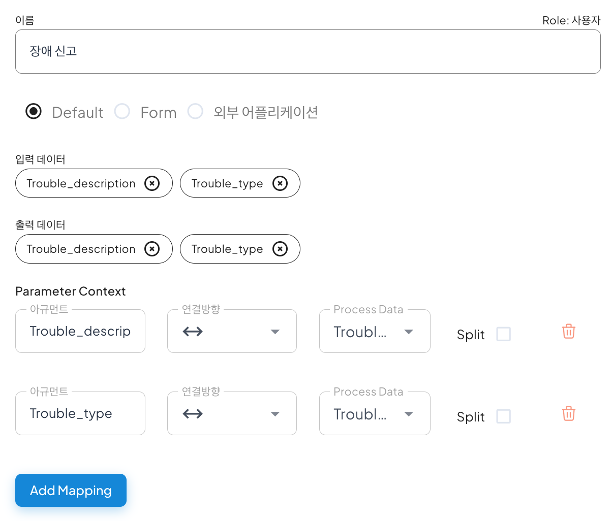

<담당자 지정>

|Variable|Direction|
|------|---|
|Trouble_description|→|
|Trouble_type|→|
|Select_manager|↔|

<장애 처리>

|Variable|Direction|
|------|---|
|Trouble_description|→|
|Trouble_type|→|
|Trouble_result|↔|

<처리 결과 안내>

|Variable|Direction|
|------|---|
|Trouble_result|→|

- 연결방향을 “→”으로 주면 해당 프로세스 변수는 사용자가 ‘read’할 목적으로 제공된다.   
즉 사용자 업무처리 화면에서 기존 값이 화면에 출력만 되고 값을 입력하지는 못한다.  
기본 연결방향은 “↔”설정이며, 화면에 출력과 사용자로부터의 입력 창이 동시에 보여지게 된다.

3. Task별 프로세스 변수가 지정되었다면 프로세스의 흐름에 맞게 sequence flow를 지정한 후, 장애 처리 결과 안내 task 다음 End Event를 생성하여 연결한다.

#### 2.4 프로세스 실행

프로세스 정의 과정을 통해서 프로세스 생성을 완료한 후, 해당 프로세스 실행을 위해 아래와 같이 우측 상단에 있는 '프로세스 실행' 버튼을 클릭한다.
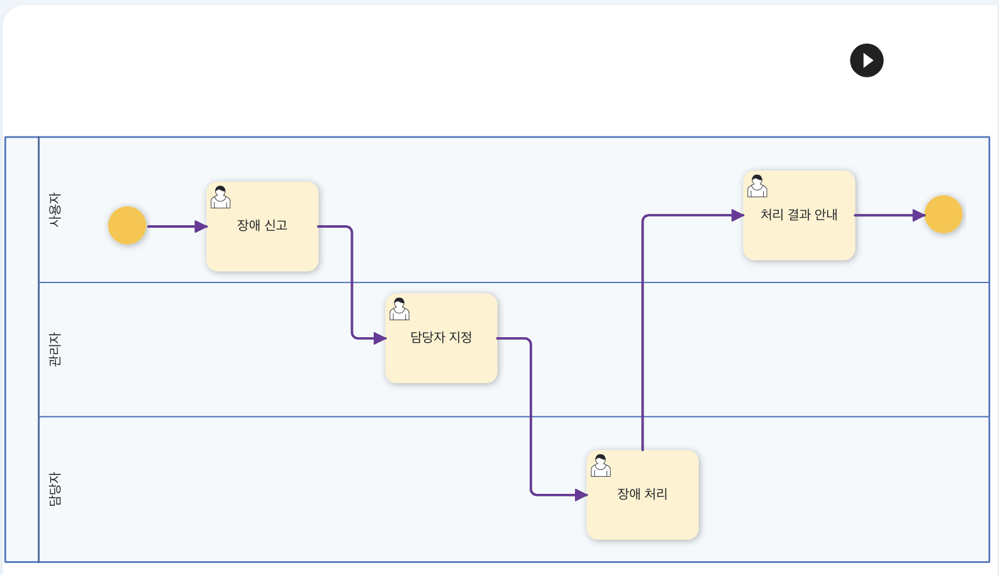
 
클릭하면 '장애 신고' 화면과 함께 프로세스가 실행되며 장애 처리 프로세스에 대한 업무를 진행할 수 있다.

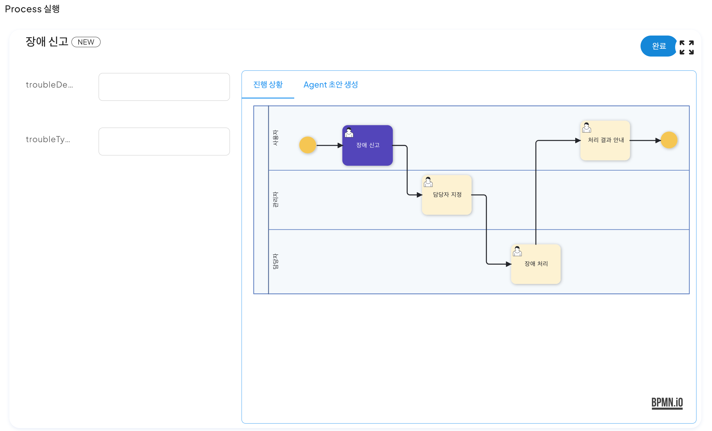

장애 설명과 유형을 입력한 후, 완료를 누르면 좌측 화면에 다음과 같이 실행중인 프로세스가 생성되며 클릭하면 다음과 같은 화면이 나타난다.

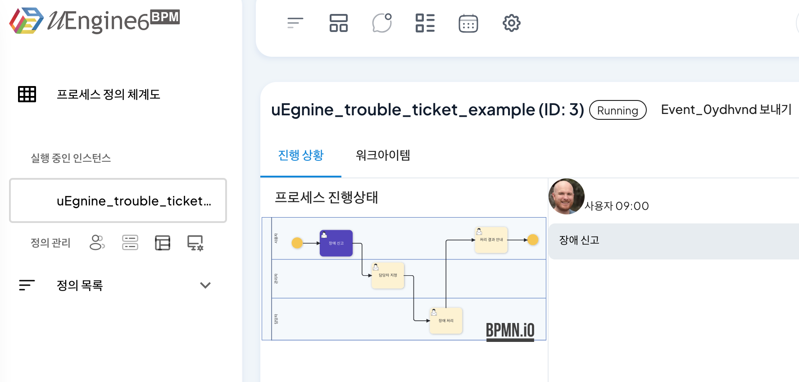

화면에는 진행된 프로세스의 상태와 함께 상단의 두 가지의 탭이 존재하며, 

진행 상황탭에서는 현재 프로세스의 진행도와 진행된 프로세스들의 입력된 내용을 확인할 수 있다.

워크아이텝 탭에서는 완료한 이전 단계들과 현재 진행가능한 단계들이 표시가 된다.

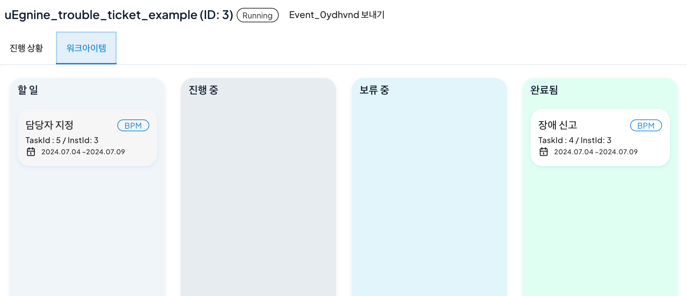

'할 일'에 있는 워크아이템을 클릭하면 다음과 같은 화면이 나타나며, 참여자는 업무를 진행한 후 완료를 통해 프로세스를 완료할 수 있다.

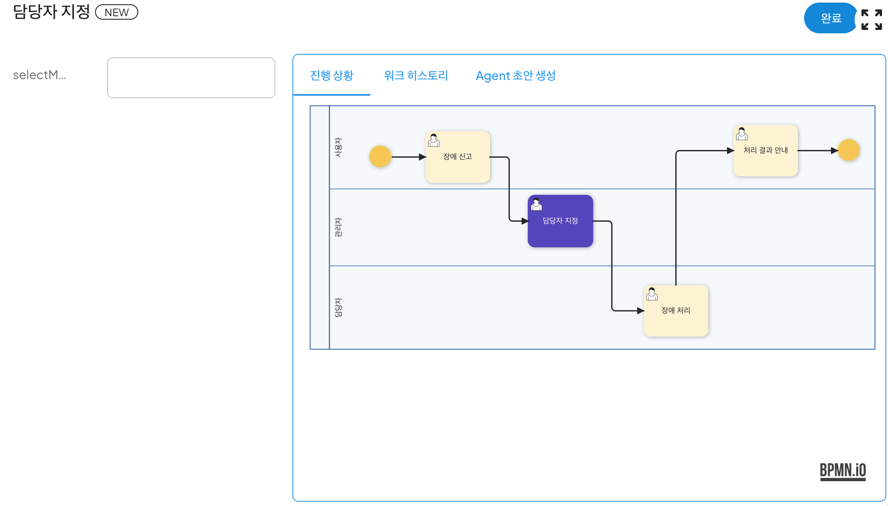

이후 프로세스를 진행하면 시나리오에 맞게 장애 처리 프로세스가 진행되는 것을 확인할 수 있다.

