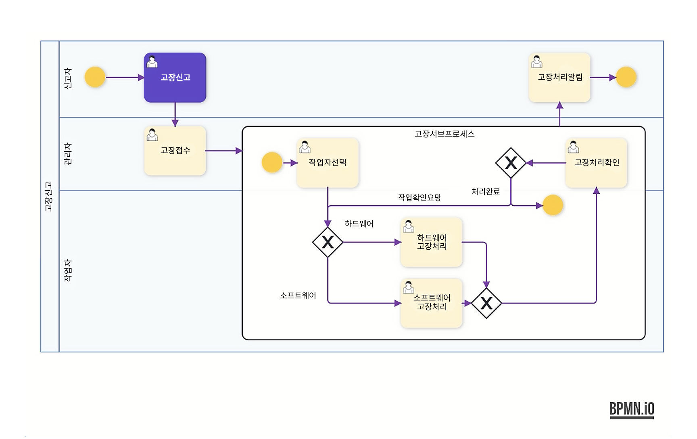

# 멀티플 인스턴스

## 서브 프로세스를 활용한 멀티플 인스턴스 처리

- 멀티플 인스턴스 적용 모델 예시

>

### 멀티플 인스턴스의 정의
실행 중에 어떠한 실행 구간의 개수가 정해지는 특성의 복잡한 프로세스 실행 기능

### 멀티플 인스턴스 지정 요령
멀티플 인스턴스 실행구간의 범위를 지정해주는 서브프로세스가 지원되고, 서브프로세스의 설정에 멀티플 인스턴스를 발생시키는 인자값 (배열값) 에 해당하는 프로세스 변수를 지정해주면, 해당 변수에 입력된 값의 개수만큼을 Parallel 혹은 Loop 방식으로 반복하여 멀티플 인스턴스를 동적으로 발생시켜 준다.

메인 프로세스 내부에 특정 업무에 해당하는 서브 프로세스를 배치하여 다양한 인스턴스를 처리하도록 하고 업무를 배분한다.

서브 프로세스 생성 시 ForEach Variable에 저장할 수 있는 변수를 추가하고 폼 매핑을 통해 멀티 데이터가 있는 항목을 해당 변수에 매핑한다.
