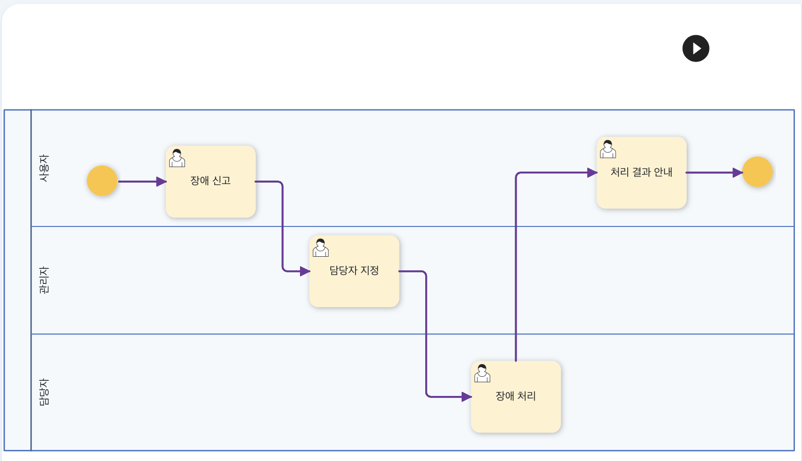
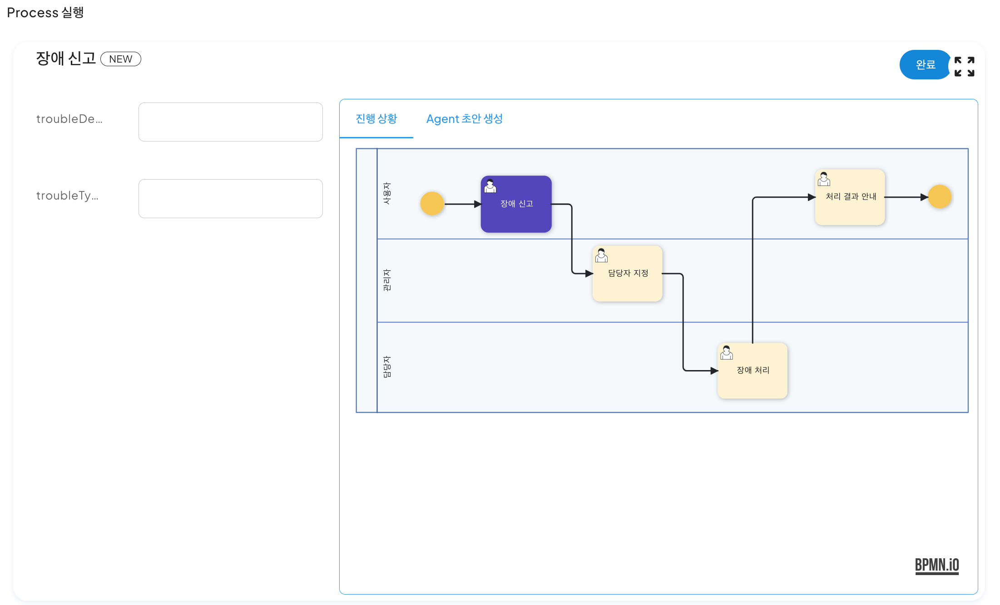

# 프로세스 실행

## 프로세스 실행

프로세스 정의를 통해서 프로세스 생성을 완료한 후, 해당 프로세스 실행을 위해 아래와 같이 우측 상단에 있는 '프로세스 실행' 버튼을 클릭한다.

 
클릭하면 첫 번째 프로세스인 '장애 신고' 화면과 함께 프로세스가 실행되며, 화면 좌측에 파라미터 컨텍스트에 지정한 변수가 나타나며 장애 신고에 대한 업무를 진행할 수 있다.

장애 설명과 유형을 입력한 후, 완료를 누르면 좌측 화면에 다음과 같이 실행중인 프로세스가 생성되며 클릭하면 다음과 같은 화면이 나타난다.

## 워크아이템
화면에는 진행된 프로세스의 상태와 함께 상단의 두 가지의 탭이 존재하며, 

진행 상황탭에서는 현재 프로세스의 진행도와 진행된 프로세스들의 입력된 내용을 확인할 수 있다.

워크아이텝 탭에서는 모델링에서 생성한 프로세스들이 나타난다. '할 일'에는 현재 진행중인 프로세스가, '완료됨'에는 이전에 완료 처리를 진행한 프로세스들이 표시된다.

## 업무 처리
'할 일'에 있는 워크아이템을 클릭하면 다음과 같은 화면이 나타나며, 진행중인 프로세스에 해당되는 참여자는 업무 진행 후 '완료'를 통해 프로세스를 완료할 수 있다.

이후 프로세스를 진행하면 시나리오에 맞게 장애 처리 프로세스가 진행되는 것을 확인할 수 있다.