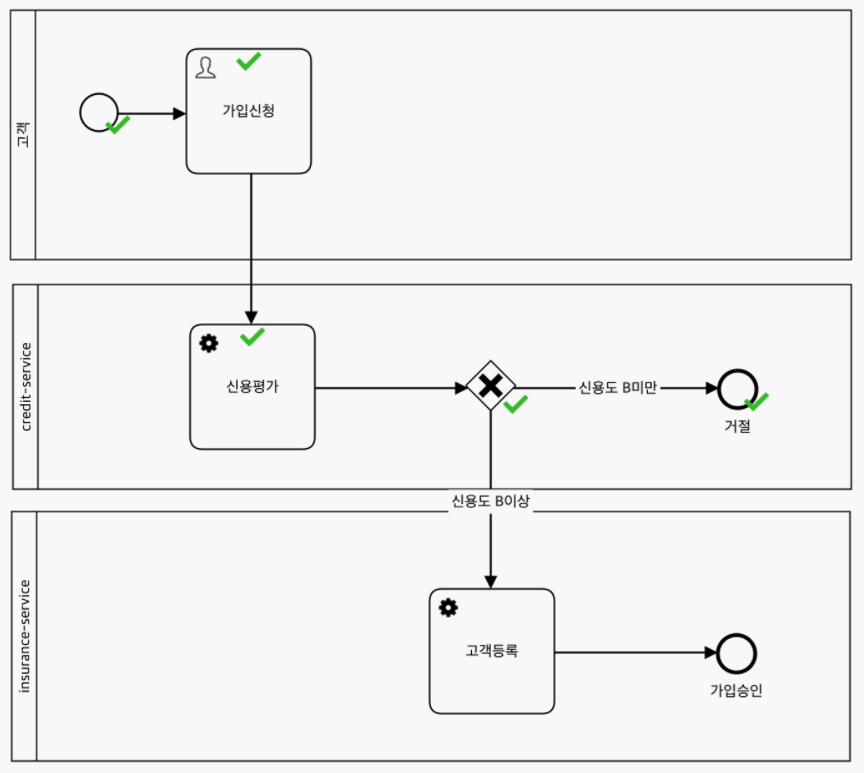
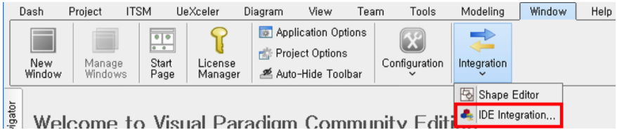
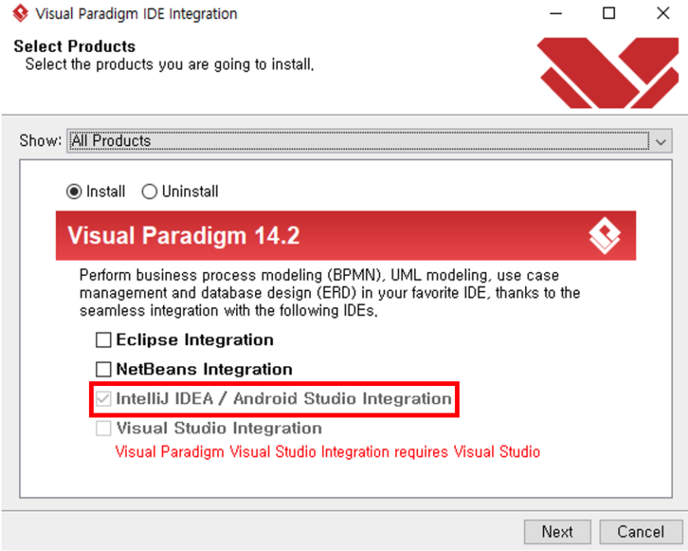
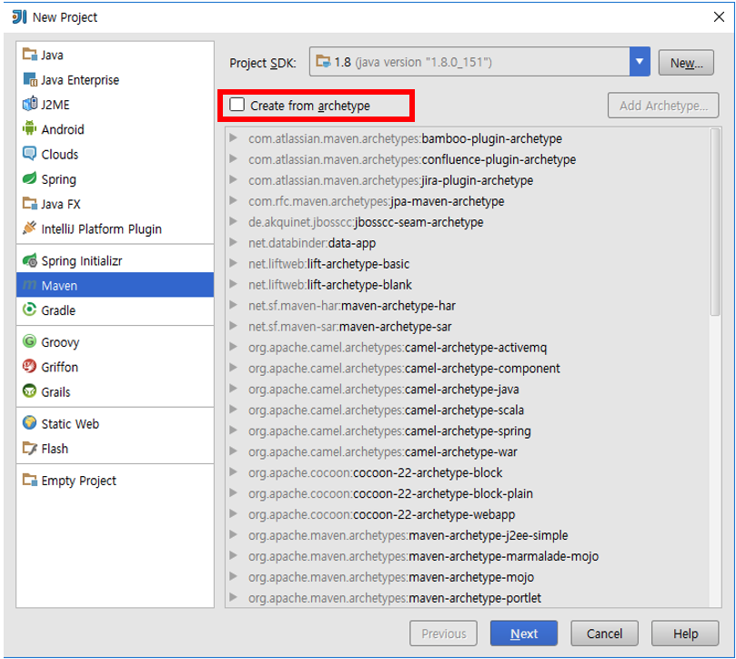
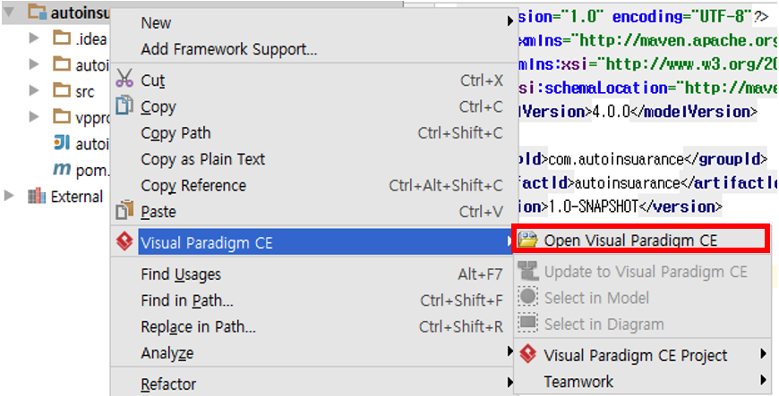
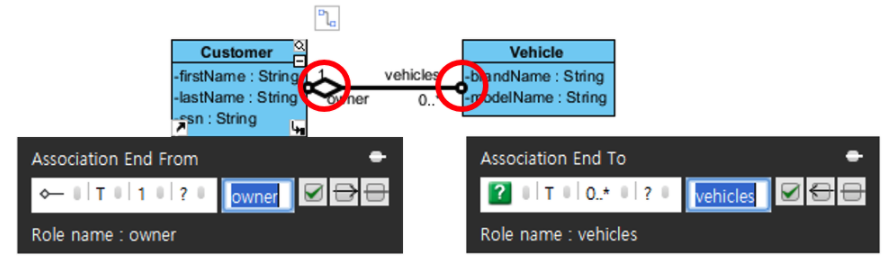
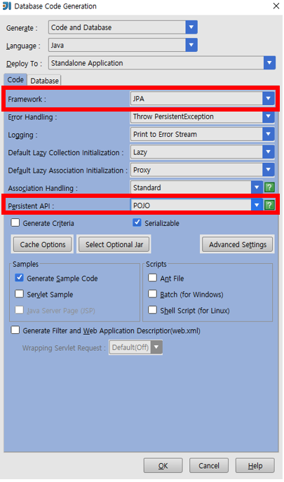
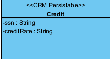
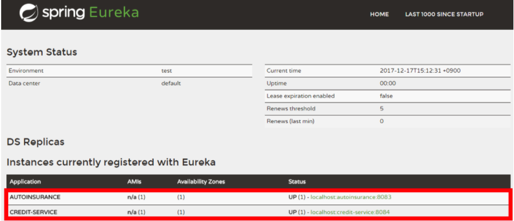

# SOA (MSA) 아키텍처 예제

## 서비스 시나리오

- BPM 을 통한 보험 처리 프로세스

>


<details>
<summary style = "font-weight:900;">프로세스 정의 JSON</summary>
<div markdown="1">

```java
{
    "definition": {
        "_type": "org.uengine.kernel.ProcessDefinition", 
        "adhoc": true, 
        "archive": true, 
        "childActivities": [
            "java.util.ArrayList", 
            [
                {
                    "_type": "org.uengine.kernel.bpmn.StartEvent", 
                    "dynamicChangeAllowed": true, 
                    "elementView": {
                        "_type": "org.uengine.kernel.view.DefaultActivityView", 
                        "height": 30.0, 
                        "id": "1", 
                        "parent": "5cd16e9e-1533-9bb1-6fcb-47e59df7f3bd", 
                        "shapeId": "OG.shape.bpmn.A_Task", 
                        "style": "{\"stroke\":\"black\",\"fill-r\":\".5\",\"fill-cx\":\".5\",\"fill-cy\":\".5\",\"fill\":\"white\",\"fill-opacity\":0,\"label-position\":\"bottom\",\"stroke-width\":1.5,\"cursor\":\"move\"}", 
                        "width": 30.0, 
                        "x": 298.0, 
                        "y": 135.0
                    }, 
                    "isDynamicChangeAllowed": true, 
                    "name": {}, 
                    "retryDelay": 60, 
                    "tracingTag": "1"
                }, 
                {
                    "_type": "org.uengine.kernel.bpmn.ServiceTask", 
                    "dynamicChangeAllowed": true, 
                    "elementView": {
                        "_type": "org.uengine.kernel.view.DefaultActivityView", 
                        "height": 100.0, 
                        "id": "2", 
                        "parent": "4127adfb-f7d4-7d56-7fb9-f5991dd551aa", 
                        "shapeId": "OG.shape.bpmn.A_Task", 
                        "style": "{\"stroke\":\"black\",\"fill-r\":1,\"fill-cx\":0.1,\"fill-cy\":0.1,\"fill\":\"#FFFFFF\",\"fill-opacity\":0,\"label-position\":\"center\",\"stroke-width\":1.2,\"r\":\"10\",\"cursor\":\"move\"}", 
                        "width": 100.0, 
                        "x": 421.0, 
                        "y": 355.0
                    }, 
                    "isDynamicChangeAllowed": true, 
                    "method": "GET", 
                    "name": {
                        "text": "신용평가"
                    }, 
                    "outputMapping": [
                        {
                            "argument": {
                                "text": "$.creditRate"
                            }, 
                            "direction": "IN-OUT", 
                            "variable": {
                                "defaultValue": "", 
                                "displayName": {}, 
                                "name": "creditRate"
                            }
                        }
                    ], 
                    "retryDelay": 60, 
                    "role": {
                        "askWhenInit": true, 
                        "displayName": {}, 
                        "elementView": {
                            "_type": "org.uengine.kernel.view.DefaultActivityView", 
                            "height": 200.0, 
                            "id": "4127adfb-f7d4-7d56-7fb9-f5991dd551aa", 
                            "shapeId": "OG.shape.bpmn.A_Task", 
                            "style": "{\"stroke\":\"black\",\"fill-r\":\".5\",\"fill-cx\":\".5\",\"fill-cy\":\".5\",\"fill\":\"#ffffff\",\"fill-opacity\":0,\"label-position\":\"center\",\"label-direction\":\"vertical\",\"vertical-align\":\"top\",\"cursor\":\"move\"}", 
                            "width": 400.0, 
                            "x": 425.0, 
                            "y": 373.0
                        }, 
                        "name": "credit-service"
                    }, 
                    "tracingTag": "2", 
                    "uriTemplate": "/credit/<%=ssn%>"
                }, 
                {
                    "_type": "org.uengine.kernel.bpmn.EndEvent", 
                    "dynamicChangeAllowed": true, 
                    "elementView": {
                        "_type": "org.uengine.kernel.view.DefaultActivityView", 
                        "height": 30.0, 
                        "id": "4", 
                        "parent": "a11b2b68-e03f-03bf-5c29-8b3b954101e7", 
                        "shapeId": "OG.shape.bpmn.A_Task", 
                        "style": "{\"stroke\":\"black\",\"fill-r\":\".5\",\"fill-cx\":\".5\",\"fill-cy\":\".5\",\"fill\":\"white\",\"fill-opacity\":0,\"label-position\":\"bottom\",\"stroke-width\":3,\"cursor\":\"move\"}", 
                        "width": 30.0, 
                        "x": 809.0, 
                        "y": 569.0
                    }, 
                    "isDynamicChangeAllowed": true, 
                    "name": {
                        "text": "가입승인"
                    }, 
                    "retryDelay": 60, 
                    "tracingTag": "4"
                }, 
                {
                    "_type": "org.uengine.kernel.bpmn.ServiceTask", 
                    "dynamicChangeAllowed": true, 
                    "elementView": {
                        "_type": "org.uengine.kernel.view.DefaultActivityView", 
                        "height": 100.0, 
                        "id": "3", 
                        "parent": "a11b2b68-e03f-03bf-5c29-8b3b954101e7", 
                        "shapeId": "OG.shape.bpmn.A_Task", 
                        "style": "{\"stroke\":\"black\",\"fill-r\":1,\"fill-cx\":0.1,\"fill-cy\":0.1,\"fill\":\"#FFFFFF\",\"fill-opacity\":0,\"label-position\":\"center\",\"stroke-width\":1.2,\"r\":\"10\",\"cursor\":\"move\"}", 
                        "width": 100.0, 
                        "x": 613.0, 
                        "y": 567.0
                    }, 
                    "inputPayloadTemplate": "{ \n  \"ssn\": \"<%=ssn%>\", \n  \"firstName\": \"<%=firstName%>\", \n  \"lastName\": \"<%=lastName%>\"\n}", 
                    "isDynamicChangeAllowed": true, 
                    "method": "POST", 
                    "name": {
                        "text": "고객등록"
                    }, 
                    "retryDelay": 60, 
                    "role": {
                        "askWhenInit": true, 
                        "displayName": {}, 
                        "name": "insurance-service"
                    }, 
                    "skipIfNotFound": true, 
                    "tracingTag": "3", 
                    "uriTemplate": "/customer"
                }, 
                {
                    "_type": "org.uengine.kernel.HumanActivity", 
                    "allowAnonymous": true, 
                    "description": {}, 
                    "duration": 5, 
                    "dynamicChangeAllowed": true, 
                    "elementView": {
                        "_type": "org.uengine.kernel.view.DefaultActivityView", 
                        "height": 100.0, 
                        "id": "5", 
                        "parent": "5cd16e9e-1533-9bb1-6fcb-47e59df7f3bd", 
                        "shapeId": "OG.shape.bpmn.A_Task", 
                        "style": "{\"stroke\":\"black\",\"fill-r\":1,\"fill-cx\":0.1,\"fill-cy\":0.1,\"fill\":\"#FFFFFF\",\"fill-opacity\":0,\"label-position\":\"center\",\"stroke-width\":1.2,\"r\":\"10\"}", 
                        "width": 100.0, 
                        "x": 418.0, 
                        "y": 134.0
                    }, 
                    "instruction": {}, 
                    "isAllowAnonymous": true, 
                    "isDynamicChangeAllowed": true, 
                    "isSendEmailWorkitem": true, 
                    "keyword": {}, 
                    "name": {
                        "text": "가입신청"
                    }, 
                    "parameters": [
                        {
                            "argument": {
                                "text": "이름"
                            }, 
                            "direction": "IN-OUT", 
                            "variable": {
                                "defaultValue": "", 
                                "displayName": {}, 
                                "name": "firstName", 
                                "type": "java.lang.String", 
                                "typeClassName": "java.lang.String"
                            }
                        }, 
                        {
                            "argument": {
                                "text": "성"
                            }, 
                            "direction": "IN-OUT", 
                            "variable": {
                                "defaultValue": "", 
                                "displayName": {}, 
                                "name": "lastName"
                            }
                        }, 
                        {
                            "argument": {
                                "text": "주민번호"
                            }, 
                            "direction": "IN-OUT", 
                            "variable": {
                                "defaultValue": "", 
                                "displayName": {
                                    "text": "Social Security Number"
                                }, 
                                "name": "ssn"
                            }
                        }
                    ], 
                    "retryDelay": 60, 
                    "role": {
                        "askWhenInit": true, 
                        "displayName": {}, 
                        "name": "고객"
                    }, 
                    "sendEmailWorkitem": true, 
                    "tool": "defaultHandler", 
                    "tracingTag": "5"
                }, 
                {
                    "_type": "org.uengine.kernel.bpmn.ExclusiveGateway", 
                    "dynamicChangeAllowed": true, 
                    "elementView": {
                        "_type": "org.uengine.kernel.view.DefaultActivityView", 
                        "height": 40.0, 
                        "id": "6", 
                        "parent": "4127adfb-f7d4-7d56-7fb9-f5991dd551aa", 
                        "shapeId": "OG.shape.bpmn.A_Task", 
                        "style": "{\"stroke\":\"black\",\"fill-r\":\".5\",\"fill-cx\":\".5\",\"fill-cy\":\".5\",\"fill\":\"white\",\"fill-opacity\":0,\"label-position\":\"bottom\",\"cursor\":\"move\"}", 
                        "width": 40.0, 
                        "x": 612.0, 
                        "y": 354.0
                    }, 
                    "isDynamicChangeAllowed": true, 
                    "name": {}, 
                    "retryDelay": 60, 
                    "tracingTag": "6"
                }, 
                {
                    "_type": "org.uengine.kernel.bpmn.EndEvent", 
                    "dynamicChangeAllowed": true, 
                    "elementView": {
                        "_type": "org.uengine.kernel.view.DefaultActivityView", 
                        "height": 30.0, 
                        "id": "7", 
                        "parent": "4127adfb-f7d4-7d56-7fb9-f5991dd551aa", 
                        "shapeId": "OG.shape.bpmn.A_Task", 
                        "style": "{\"stroke\":\"black\",\"fill-r\":\".5\",\"fill-cx\":\".5\",\"fill-cy\":\".5\",\"fill\":\"white\",\"fill-opacity\":0,\"label-position\":\"bottom\",\"stroke-width\":3,\"cursor\":\"move\"}", 
                        "width": 30.0, 
                        "x": 810.0, 
                        "y": 357.0
                    }, 
                    "isDynamicChangeAllowed": true, 
                    "name": {
                        "text": "거절"
                    }, 
                    "retryDelay": 60, 
                    "tracingTag": "7"
                }
            ]
        ], 
        "defaultFlowchartViewOption": "vertical", 
        "defaultFlowchartViewType": "swimlane", 
        "duration": 10, 
        "dynamicChangeAllowed": true, 
        "id": "invoke.xml", 
        "initiateByFirstWorkitem": true, 
        "isAdhoc": true, 
        "isDynamicChangeAllowed": true, 
        "name": {
            "text": " 신용평가가입"
        }, 
        "processVariableDescriptors": [
            {
                "defaultValue": "", 
                "displayName": {}, 
                "name": "firstName", 
                "type": "java.lang.String", 
                "typeClassName": "java.lang.String"
            }, 
            {
                "defaultValue": "", 
                "displayName": {}, 
                "name": "lastName"
            }, 
            {
                "defaultValue": "", 
                "displayName": {
                    "text": "Social Security Number"
                }, 
                "name": "ssn"
            }, 
            {
                "defaultValue": "", 
                "displayName": {
                    "text": "신용도"
                }, 
                "name": "creditRate"
            }
        ], 
        "retryDelay": 60, 
        "roles": [
            {
                "askWhenInit": true, 
                "displayName": {}, 
                "elementView": {
                    "_type": "org.uengine.kernel.view.DefaultActivityView", 
                    "height": 164.0, 
                    "id": "4127adfb-f7d4-7d56-7fb9-f5991dd551aa", 
                    "shapeId": "OG.shape.bpmn.A_Task", 
                    "style": "{\"stroke\":\"black\",\"fill-r\":\".5\",\"fill-cx\":\".5\",\"fill-cy\":\".5\",\"fill\":\"#ffffff\",\"fill-opacity\":0,\"label-position\":\"center\",\"label-direction\":\"vertical\",\"vertical-align\":\"top\",\"cursor\":\"move\"}", 
                    "width": 671.0, 
                    "x": 565.0, 
                    "y": 355.0
                }, 
                "name": "credit-service"
            }, 
            {
                "askWhenInit": true, 
                "displayName": {}, 
                "elementView": {
                    "_type": "org.uengine.kernel.view.DefaultActivityView", 
                    "height": 200.0, 
                    "id": "a11b2b68-e03f-03bf-5c29-8b3b954101e7", 
                    "shapeId": "OG.shape.bpmn.A_Task", 
                    "style": "{\"stroke\":\"black\",\"fill-r\":\".5\",\"fill-cx\":\".5\",\"fill-cy\":\".5\",\"fill\":\"#ffffff\",\"fill-opacity\":0,\"label-position\":\"center\",\"label-direction\":\"vertical\",\"vertical-align\":\"top\",\"cursor\":\"move\"}", 
                    "width": 672.0, 
                    "x": 564.0, 
                    "y": 555.0
                }, 
                "name": "insurance-service"
            }, 
            {
                "askWhenInit": true, 
                "displayName": {}, 
                "elementView": {
                    "_type": "org.uengine.kernel.view.DefaultActivityView", 
                    "height": 200.0, 
                    "id": "5cd16e9e-1533-9bb1-6fcb-47e59df7f3bd", 
                    "shapeId": "OG.shape.bpmn.A_Task", 
                    "style": "{\"stroke\":\"black\",\"fill-r\":\".5\",\"fill-cx\":\".5\",\"fill-cy\":\".5\",\"fill\":\"#ffffff\",\"fill-opacity\":0,\"label-position\":\"center\",\"label-direction\":\"vertical\",\"vertical-align\":\"top\",\"cursor\":\"move\"}", 
                    "width": 673.0, 
                    "x": 564.0, 
                    "y": 153.0
                }, 
                "name": "고객"
            }
        ], 
        "sequenceFlows": [
            {
                "condition": {
                    "_type": "org.uengine.kernel.ExpressionEvaluateCondition", 
                    "description": {}
                }, 
                "relationView": {
                    "TERMINAL_IN_OUT": "_TERMINAL_C_INOUT_0", 
                    "shapeId": "OG.shape.bpmn.C_Flow", 
                    "style": "{\"stroke\":\"black\",\"fill-r\":\".5\",\"fill-cx\":\".5\",\"fill-cy\":\".5\",\"fill\":\"none\",\"fill-opacity\":0,\"label-position\":\"center\",\"stroke-width\":1.5,\"stroke-opacity\":1,\"edge-type\":\"plain\",\"arrow-start\":\"none\",\"arrow-end\":\"block\",\"stroke-dasharray\":\"\",\"stroke-linejoin\":\"round\",\"cursor\":\"pointer\"}", 
                    "value": "[[663,568],[794,568]]"
                }, 
                "sourceRef": "3", 
                "targetRef": "4"
            }, 
            {
                "condition": {
                    "_type": "org.uengine.kernel.ExpressionEvaluateCondition", 
                    "description": {}
                }, 
                "relationView": {
                    "TERMINAL_IN_OUT": "_TERMINAL_C_INOUT_0", 
                    "shapeId": "OG.shape.bpmn.C_Flow", 
                    "style": "{\"stroke\":\"black\",\"fill-r\":\".5\",\"fill-cx\":\".5\",\"fill-cy\":\".5\",\"fill\":\"none\",\"fill-opacity\":0,\"label-position\":\"center\",\"stroke-width\":1.5,\"stroke-opacity\":1,\"edge-type\":\"plain\",\"arrow-start\":\"none\",\"arrow-end\":\"block\",\"stroke-dasharray\":\"\",\"stroke-linejoin\":\"round\",\"cursor\":\"pointer\"}", 
                    "value": "[[420,184],[420,305]]"
                }, 
                "sourceRef": "5", 
                "targetRef": "2"
            }, 
            {
                "condition": {
                    "_type": "org.uengine.kernel.ExpressionEvaluateCondition", 
                    "description": {}
                }, 
                "relationView": {
                    "TERMINAL_IN_OUT": "_TERMINAL_C_INOUT_0", 
                    "shapeId": "OG.shape.bpmn.C_Flow", 
                    "style": "{\"stroke\":\"black\",\"fill-r\":\".5\",\"fill-cx\":\".5\",\"fill-cy\":\".5\",\"fill\":\"none\",\"fill-opacity\":0,\"label-position\":\"center\",\"stroke-width\":1.5,\"stroke-opacity\":1,\"edge-type\":\"plain\",\"arrow-start\":\"none\",\"arrow-end\":\"block\",\"stroke-dasharray\":\"\",\"stroke-linejoin\":\"round\",\"cursor\":\"pointer\"}", 
                    "value": "[[313,136],[368,136]]"
                }, 
                "sourceRef": "1", 
                "targetRef": "5"
            }, 
            {
                "condition": {
                    "_type": "org.uengine.kernel.ExpressionEvaluateCondition", 
                    "description": {}
                }, 
                "relationView": {
                    "TERMINAL_IN_OUT": "_TERMINAL_C_INOUT_0", 
                    "shapeId": "OG.shape.bpmn.C_Flow", 
                    "style": "{\"stroke\":\"black\",\"fill-r\":\".5\",\"fill-cx\":\".5\",\"fill-cy\":\".5\",\"fill\":\"none\",\"fill-opacity\":0,\"label-position\":\"center\",\"stroke-width\":1.5,\"stroke-opacity\":1,\"edge-type\":\"plain\",\"arrow-start\":\"none\",\"arrow-end\":\"block\",\"stroke-dasharray\":\"\",\"stroke-linejoin\":\"round\",\"cursor\":\"pointer\"}", 
                    "value": "[[471,356],[594,356]]"
                }, 
                "sourceRef": "2", 
                "targetRef": "6"
            }, 
            {
                "condition": {
                    "_type": "org.uengine.kernel.ExpressionEvaluateCondition", 
                    "conditionExpression": "instance.get(\"creditRate\") > \"B\"", 
                    "description": {}
                }, 
                "name": "신용도 B미만", 
                "relationView": {
                    "TERMINAL_IN_OUT": "_TERMINAL_C_INOUT_0", 
                    "shapeId": "OG.shape.bpmn.C_Flow", 
                    "style": "{\"stroke\":\"black\",\"fill-r\":\".5\",\"fill-cx\":\".5\",\"fill-cy\":\".5\",\"fill\":\"none\",\"fill-opacity\":0,\"label-position\":\"center\",\"stroke-width\":1.5,\"stroke-opacity\":1,\"edge-type\":\"plain\",\"arrow-start\":\"none\",\"arrow-end\":\"block\",\"stroke-dasharray\":\"\",\"stroke-linejoin\":\"round\",\"cursor\":\"pointer\"}", 
                    "value": "[[630,356],[795,356]]"
                }, 
                "sourceRef": "6", 
                "targetRef": "7"
            }, 
            {
                "condition": {
                    "_type": "org.uengine.kernel.Otherwise", 
                    "description": {}
                }, 
                "name": "신용도 B이상", 
                "relationView": {
                    "TERMINAL_IN_OUT": "_TERMINAL_C_INOUT_0", 
                    "shapeId": "OG.shape.bpmn.C_Flow", 
                    "style": "{\"stroke\":\"black\",\"fill-r\":\".5\",\"fill-cx\":\".5\",\"fill-cy\":\".5\",\"fill\":\"none\",\"fill-opacity\":0,\"label-position\":\"center\",\"stroke-width\":1.5,\"stroke-opacity\":1,\"edge-type\":\"plain\",\"arrow-start\":\"none\",\"arrow-end\":\"block\",\"stroke-dasharray\":\"\",\"stroke-linejoin\":\"round\",\"cursor\":\"pointer\"}", 
                    "value": "[[612,374],[612,517]]"
                }, 
                "sourceRef": "6", 
                "targetRef": "3"
            }
        ], 
        "simulationInputFrequency": 10, 
        "simulationInstanceCount": 10
    }
}
```
</div>
</details>


## 서비스 디컴퍼지션

- Credit service (신용평가 서비스)

- GMV (goverment of motor vehicle; 교통부) service

- Insurance service (자동차 보험 가입 서비스)

- [참고] 각 서비스들에 대한 사용법 및 API 의 이해: https://github.com/jinyoung/sw-modeling-example-msa


## Registry & API Gateway 서비스

- Registry: 유연한 서비스 연동과 발견을 위한 Registry 서비스
- API Gateway: 서비스 접근 단일화와 보안 처리 일원화를 위한 Proxy 서비스

## 설치 필요한 프로그램

1. Visual Paradigm
2. IntelliJ
3. Maven
4. httpie

## 테스트 과정

- IntelliJ와 Visual Paradigm의 연동

1. Visual Paradigm 실행
>2. Windows 메뉴 탭 클릭 - Integration - IDE Integration
>

<br><br>

>3. IntelliJ IDEA / Android Studio Integration 선택 후, Next - IntelliJ 설치 경로 설정
>
- 만약 Windows에서 에러가 날 경우, Visual Paradigm을 관리자 권한으로 실행시켜줘야함.

4. IntelliJ 재 실행
- IntelliJ 프로젝트 시작

<br><br><br>

1. MAVEN 프로젝트로 새로운 프로젝트 생성
>- Create from archtype은 체크 해제
>

2. GroupID - com.insurance / ArtifactId - autoinsurance
3. 프로젝트 명과, 프로젝트 설치 경로 설정 후 프로젝트 생성
- IntelliJ에서 Visual Paradigm 이용하여 소스코드 생성

<br><br><br>

1. 프로젝트 폴더에서 우클릭 - Visual paradigm 탭 - Open Visual paradigm
>
2. IntelliJ 좌측 탭 중, Project Explorer 선택
3. Diagram Navigator에서, UML Diagrams - Class Diagram을 새로 생성해 준다.
4. 클래스 이름은 com.autoinsurance로 생성하여 준다.
5. 클래스를 추가해 준다. (Class 클릭 후, 오른쪽 캔버스에 클릭하면 생성 된다.)
6. 먼저 추가된 클래스에 Customer라는 이름을 부여해주고, 해당 클래스를 선택하면, 선택한 클래스 우측 상단에 선 표시를 선택하여 준다.
7. Relation 목록중, Aggregation -> Class를 선택하여 준다.
8. 생성된 클래스는 Vehicle이라는 이름을 부여하여 준다.
9. Relation의 좌측 끝을 더블클릭해주면 Association End From, 우측 끝을 더블클릭해주면 Association End To이 나온다.
10. End From가 1개 일때, End to는 여러개가 될 수 있다는 설정과, 각각의 Role Name을 설정해 준다. (아래 그림 참조)

11 .각각의 요소에 attribute를 준다. (타입을 주지 않아도 되지만, DB생성시 타입정보가 없으면 오류가 나므로 타입을 넣어준다.)
>

12. 두개의 Class에 StereoType으로 ORM Persistable 설정하여 준다.
13. Relation에도 ORM Persistable을 주어야한다. Relation 우클릭 후, StereoType이 아닌, ORM 탭 - Persitable - Yes를 선택하여준다.
14. Modeling - ORM - Syncronized to Entity Relationship Diagram을 눌러서 변환 시켜준다.
15. 변환시켜줄때, PrimaryKey를 설정해줄때, Customer의 경우 ssn, Vehicle의 경우엔 AutoGenerated로 설정하여 준다.
16. 변환시켜준 후, Modeling - ORM - Generate Code를 선택한다.
17. 두 곳을 수정하여주는데, Framework를 JPA로, Persistent API를 POJO로 수정하여 준다.

>

18. OK를 누르면 Database Server를 설정하는 창이 뜨는 경우, Database를 설정하여 준다.
19. 다시 IntelliJ에서 Project로 돌아와서 src/main/java/com.autoinsurance를 확인해보면 소스코드가 생성된 것을 확인 할 수 있다.
20. Customer class를 열어보면, 오류가 나는 것을 알 수 있다. 이 오류는 ORM.jar를 불러오지 못하여서 인데, ORM.jar를 부르지 않고, pom.xml파일을 pom.xml 링크 좌측 링크를 타고 들어가서 해당 pom.xml과 같이 작성하여 준다.
    - 10번째 줄의 부터 140번째 줄의 까지만 복사 붙여넣기 하여준다.
21. 다시 Visual Paradigm으로 돌아가, Vehicle의 Attribute를 보면 ID라는것이 int타입으로 설정이 되어있는데, 이것을 java.lang.Integer로 수정하여 준다. 그리고 다시 Generate Code를 하여준다.
    - Application 형태로 만들기

<br><br><br>

1. 각각(Customer, Vehicle)의 Repository를 만들어준다.

```java
Ex) Vehicle Repository

public interface VehicleRepository extends PagingAndSortingRepository<Vehicle, Integer>
- 마지막의 <Vehicle, Integer>는, <Class와, PrimaryKey의 형태>를 이야기한다.
```

2. Application과 WebConfig를 작성하여준다.
- [Application.java](https://github.com/jinyoung/sw-modeling-example/blob/master/src/main/java/com/autoinsurance/Application.java) // [WebConfig](https://github.com/jinyoung/sw-modeling-example/blob/master/src/main/java/com/autoinsurance/WebConfig.java)
    - 해당 링크 소스를 붙여넣기하여 만들어주면 된다. package의 위치가 다를 경우, 수정하여 주면 된다.

3. Command창, PowerShell에서 해당 프로젝트 경로에서 mvn spring-boot:run을 실행하여 정상적으로 작동하는지 확인한다.
- CreditService 만들기

<br><br>

1. 위의 insurance를 만들때와 같이 VisualParadigm에서 만들면 된다.
2. Class Diagram은 Credit 한개만 만들면 되고, 설정은 아래와 같이 해주면 된다. 나머지는 위의 작업과 같다.
>

```java
만약 mvn spring-boot:run을 그냥 실행한다면 기존에 실행했던 autoinsurance와 포트가 충돌되므로, 

mvn spring-boot:run -Dserver.port={포트번호}

로 실행시켜주면 된다.

autoinsurance를 8083, creditservice를 8084로 실행시킨 경우

실행 후, http localhost:8083/ , http http localhost:8084/를 실행하여 접근이 가능한지 확인 가능하다.

데이터 추가는 http localhost:{포트}/{접근할 클래스}/ {추가할 데이터}={데이터} 를 입력해 주면 된다.
```
- autoinsurance와 Creditservice의 연동(1)

1. autoinsurance 프로젝트를 실행시킨 후, Customer Class를 수정한다.
2. Customer는 Serializable만 implements가 되어있는데 BeforeSave를 추가해준다.
3. BeforeSave를 추가해주면, beforeSave()라는 이벤트를 구현할 수 있다. 구현 결과는 아래와 같다.

```java
	public void beforeSave() {
		//REST 호출 to Credit 서비스로, 신용도를 리턴.
		//http localhost:8083/credits/{getSsn()}

		RestTemplate restTemplate = new RestTemplate();
                // RestTemplate을 불러온다.
		String uri= "http://localhost:8083/credits/" + getSsn();
                // 연동 해야하는 uri(이 경우, credits)를 불러온다.

		ResponseEntity<String> response = null;
		response = restTemplate.exchange(uri, HttpMethod.GET, null, String.class);
                
		String result = response.getBody();

		String creditRate = JsonPath.read(result, "$.creditRate");
                //데이터를 Json형식으로 받아오므로 바꿔줘야한다.

		if(creditRate.compareTo("B") > 0) {
			throw new RuntimeException("신용도 부족입니다");
		}
	}
```
```java
결과

cmd에서 http localhost:8083/credits ssn=930117 creditRate=C 와 같이 등록을 해놓은 뒤, 
http localhost:8084/customers ssn="930117" firstName="Kim"를 보낼경우, "신용도 부족입니다"라는 메세지가 나온다.
http localhost:8083/credits ssn=930117 creditRate=A로 등록을 해놓은 경우에는 정상적으로 등록이 된다.
```
- autoinsurance와 Creditservice의 연동(2)
    - 위의 방법을 다른형태로 구현하는 방법.

<br><br>
1. autoinsurance에 일반적인 POJO 형태의 Credit으로 만들어 준다.

```java
예시

public class Credit {
    String ssn;
    String creditRate;

    public String getSsn() {
        return ssn;
    }

    public void setSsn(String ssn) {
        this.ssn = ssn;
    }

    public String getCreditRate() {
        return creditRate;
    }

    public void setCreditRate(String creditRate) {
        this.creditRate = creditRate; 
    }

}
```

- 형태는 http http://localhost:8083/profile/credits 에서 각 attribute의 속성을 확인 후에 만들어주면 된다.

2. 위의 Credit을 만들어 준 후에, CreditService라는 것을 만들어준다.

```java
예시 

@FeignClient(serviceId = "credit-service")
public interface CreditService {
    @RequestMapping(path="/credits/{ssn}", method = RequestMethod.GET)
    public Credit getCredit(@PathVariable("ssn") String ssn);
}
```
3. Customer의 beforeSave methods를 수정하여준다.
```java
	public void beforeSave() {
		CreditService creditService = MetaworksRemoteService.getInstance().getBeanFactory().getBean(CreditService.class);

		Credit credit = creditService.getCredit(getSsn());
		String creditRate = credit.getCreditRate();

		if(creditRate.compareTo("B") > 0) {
			throw new RuntimeException("신용도 부족입니다.");
		}
	}
```
- FeignClient

1. autoinsurance안의 CreditService를 확인해보면, @FeignClient가 있다. 해당 serviceId로 실행이 되어있다라는것이 Eureka서버에 등록이 되어 있다.

```java
Eureka 서버는 https://github.com/jinyoung/sw-modeling-example-msa/를 받은 후, 
registry-service를 mvn spring-boot:run 하여 실행하면 된다.
실행 후, localhost:8761로 접속을 하여 확인할 수 있다.
```

2. Eureka서버를 실행하면 등록이 되어있는것이 없는데, 등록을 위해서 프로젝트안의 resource폴더안에 application.yml 파일을 작성해주어야한다.
```java
application.yml

server:
  port: ${port:(포트번호)}
  servletPath: /

spring:
  application:
    name: credit-service

eureka:
  client:
    serviceUrl:
      defaultZone: http://localhost:8761/eureka/
    healthcheck:
      enabled: true
```
그리고 eureka 사용을 위하여, Application.java에 @EnableEurekaClient를 추가해주고, pom.xml을 수정해준다.

<details>
<summary>pom.xml</summary>
<div markdown="1">

```java
    <dependencyManagement>
        <dependencies>

            <dependency>
                <groupId>org.springframework.cloud</groupId>
                <artifactId>spring-cloud-dependencies</artifactId>
                <version>Dalston.SR4</version>
                <type>pom</type>
                <scope>import</scope>
            </dependency>

        </dependencies>

    </dependencyManagement>


    <dependencies>

        <dependency>
            <groupId>org.springframework.boot</groupId>
            <artifactId>spring-boot-starter-data-rest</artifactId>
        </dependency>

        <dependency>
            <groupId>org.springframework.boot</groupId>
            <artifactId>spring-boot-starter-web</artifactId>
        </dependency>

        <dependency>
            <groupId>org.springframework.cloud</groupId>
            <artifactId>spring-cloud-starter-eureka</artifactId>
        </dependency>

        <dependency>
            <groupId>org.springframework.cloud</groupId>
            <artifactId>spring-cloud-starter-ribbon</artifactId>
        </dependency>

        <dependency>
            <groupId>org.springframework.cloud</groupId>
            <artifactId>spring-cloud-starter-feign</artifactId>
        </dependency>

        <dependency>
            <groupId>com.netflix.hystrix</groupId>
            <artifactId>hystrix-javanica</artifactId>
        </dependency>


        <dependency>
            <groupId>org.springframework.boot</groupId>
            <artifactId>spring-boot-starter-data-jpa</artifactId>
            <exclusions>
                <exclusion>
                    <groupId>org.hibernate</groupId>
                    <artifactId>hibernate-entitymanager</artifactId>
                </exclusion>
            </exclusions>
        </dependency>
        <dependency>
            <groupId>org.springframework.boot</groupId>
            <artifactId>spring-boot-starter-test</artifactId>
            <scope>test</scope>
        </dependency>
        <dependency>
            <groupId>org.springframework.boot</groupId>
            <artifactId>spring-boot-actuator</artifactId>
        </dependency>


        <dependency>
            <groupId>org.uengine.metaworks</groupId>
            <artifactId>metaworks4</artifactId>
            <version>1.0.1-SNAPSHOT</version>
        </dependency>

        <dependency>
            <groupId>org.uengine</groupId>
            <artifactId>uengine-resource-manager</artifactId>
            <version>4.1.0-SNAPSHOT</version>
        </dependency>

        <dependency>
            <groupId>org.uengine</groupId>
            <artifactId>uengine-bpmn-modeler</artifactId>
            <version>4.1.0-SNAPSHOT</version>
        </dependency>

        <dependency>
            <groupId>org.uengine</groupId>
            <artifactId>uengine-persistence-couchbase</artifactId>
            <version>4.1.0-SNAPSHOT</version>
        </dependency>

        <dependency>
            <groupId>org.uengine</groupId>
            <artifactId>bpmn-model</artifactId>
            <version>4.1.0-SNAPSHOT</version>
        </dependency>

        <dependency>
            <groupId>com.h2database</groupId>
            <artifactId>h2</artifactId>
        </dependency>

    </dependencies>


    <repositories>
        <!--<repository>-->
        <!--<id>spring-releases</id>-->
        <!--<url>https://repo.spring.io/libs-release</url>-->
        <!--</repository>-->
        <repository>
            <id>ossrh</id>
            <url>https://oss.sonatype.org/content/repositories/snapshots</url>
            <snapshots>
                <enabled>true</enabled>
            </snapshots>
        </repository>
    </repositories>


    <pluginRepositories>
        <pluginRepository>
            <id>spring-releases</id>
            <url>https://repo.spring.io/libs-release</url>
        </pluginRepository>
    </pluginRepositories>

    <profiles>
        <profile>
            <id>war</id>
            <properties>
                <packaging.type>war</packaging.type>
            </properties>
            <dependencies>
                <dependency>
                    <groupId>org.springframework.boot</groupId>
                    <artifactId>spring-boot-starter-tomcat</artifactId>
                    <scope>provided</scope>
                </dependency>
            </dependencies>
            <build>
                <finalName>${project.artifactId}</finalName>
                <plugins>
                    <plugin>
                        <groupId>org.springframework.boot</groupId>
                        <artifactId>spring-boot-maven-plugin</artifactId>
                    </plugin>
                    <plugin>
                        <artifactId>maven-clean-plugin</artifactId>
                        <version>2.5</version>
                        <executions>
                            <execution>
                                <id>auto-clean</id>
                                <phase>initialize</phase>
                                <goals>
                                    <goal>clean</goal>
                                </goals>
                            </execution>
                        </executions>
                    </plugin>


                </plugins>
            </build>
        </profile>
    </profiles>

    <build>
        <plugins>
            <plugin>
                <groupId>org.springframework.boot</groupId>
                <artifactId>spring-boot-maven-plugin</artifactId>

                <configuration>
                    <addResources>true</addResources>
                </configuration>
            </plugin>

            <plugin>
                <groupId>com.spotify</groupId>
                <artifactId>docker-maven-plugin</artifactId>
                <version>1.0.0</version>
                <configuration>
                    <imageName>${project.artifactId}</imageName>
                    <dockerDirectory>.</dockerDirectory>
                    <resources>
                        <resource>
                            <targetPath>/</targetPath>
                            <directory>${project.build.directory}</directory>
                            <include>${project.build.finalName}.jar</include>
                        </resource>
                    </resources>
                </configuration>
            </plugin>

        </plugins>
    </build>
```
</div>
</details>

- pom.xml 수정 후, eureka서버 접속(http://localhost:8761/)을 해보면 현재 서비스가 떠있는 것을 확인 할 수 있다.

>


