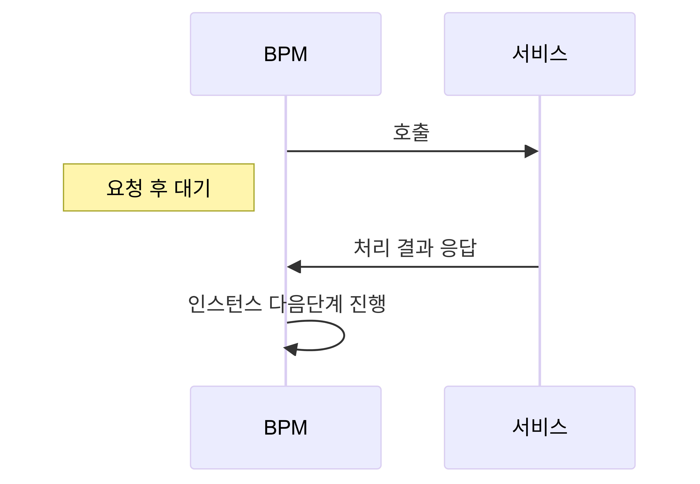
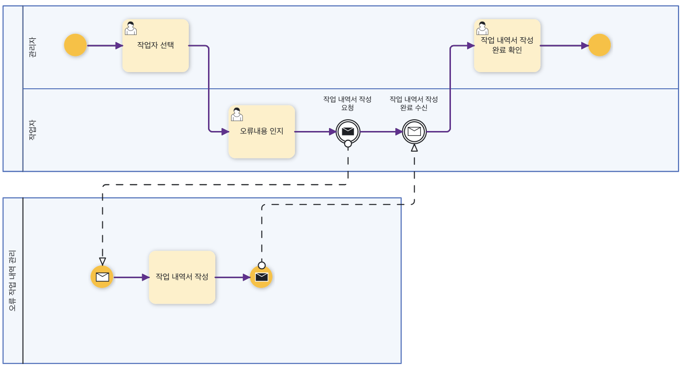
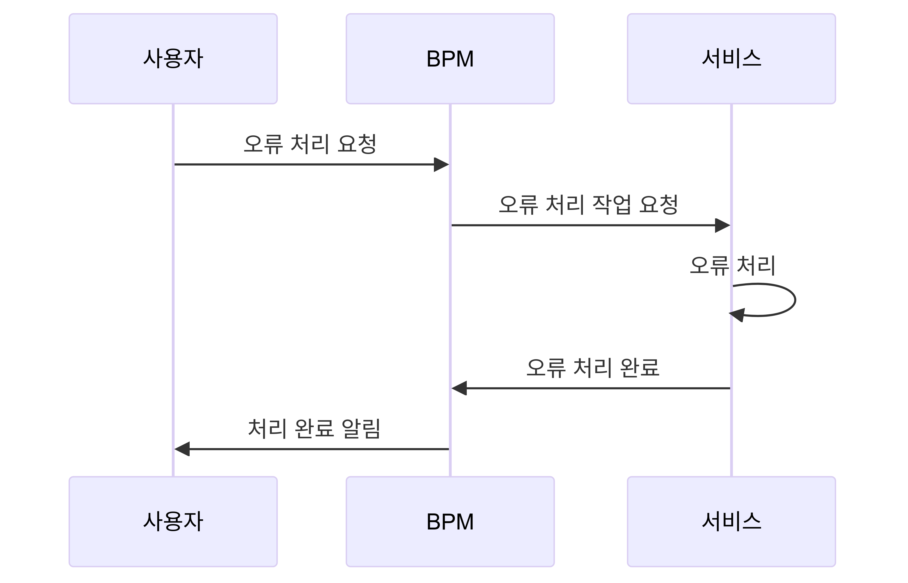
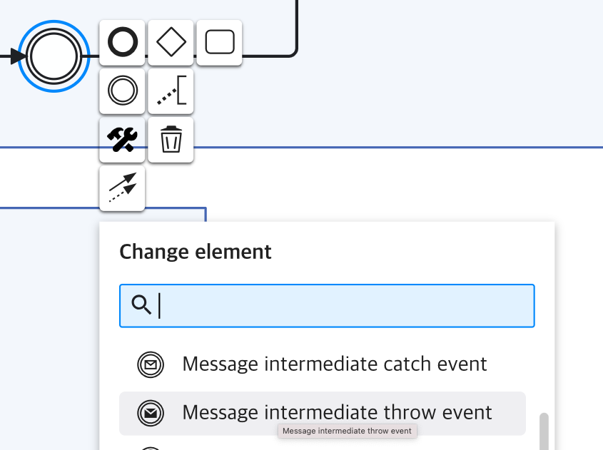
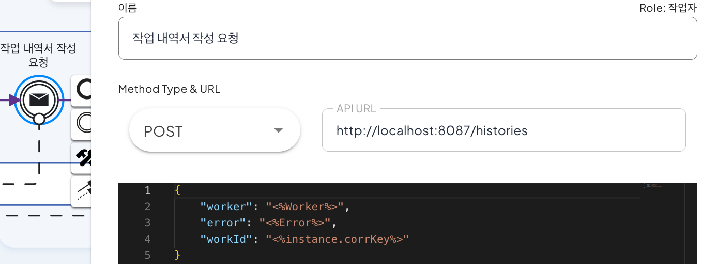
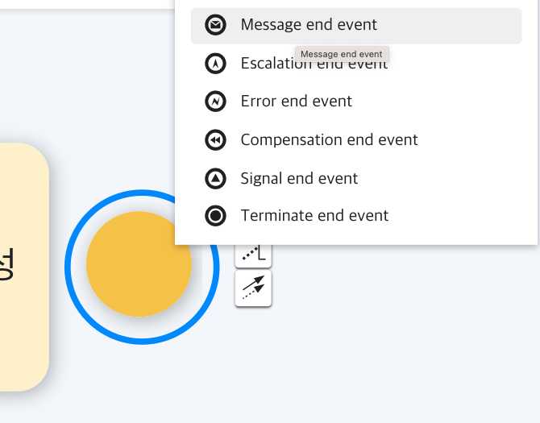
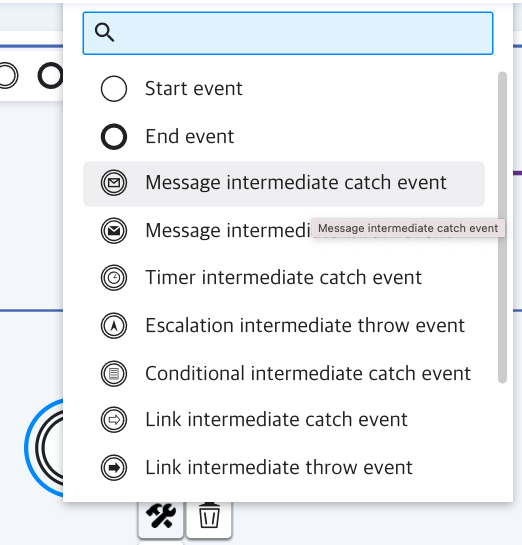
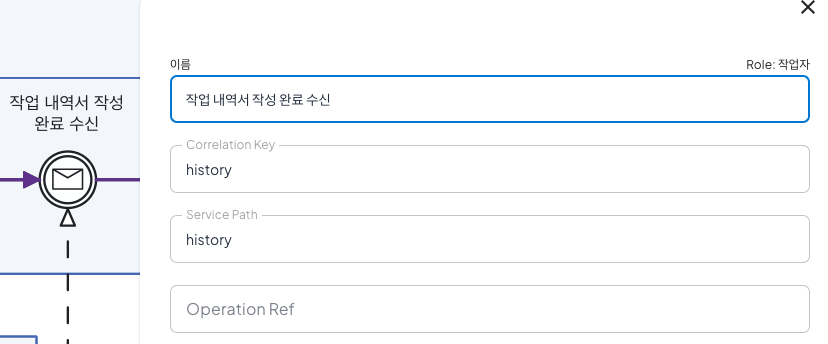
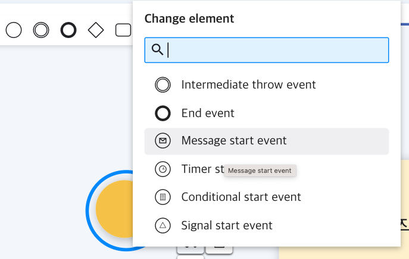

# BPM에서 외부 서비스 연동 

## 1. 연동 내용
 
[이미지 1] BPM에서 서비스 호출

  BPM에서 서비스의 데이터를 활용하여 조건을 변경하거나 업무 흐름을 조정할 수 있습니다. BPM은 서비스를 호출하고 응답을 대기하는 시스템 연동 기능 구현하였습니다. 서비스로부터의 응답에 따라 데이터를 활용하거나 데이터에 따라서 조건이 변경될 수 있기 때문에, **동기 방식**으로 서비스 응답을 대기 하는 방식입니다. 또한 서비스의 응답을 수신를 통해서 처리되므로 BPM은 서비스의 실시간 데이터를 처리 할 수 있습니다. 

  이를 위해서 연동시 BPM에서는 서비스에 대한 내용을 이해하고, 업무적인 내용을 프로세스에 정의 해야 합니다. 서비스에 대한 내용을 정의 프로세스에 업무를 호출 하고, 서비스에 대한 응답을 대기 하도록 프로세스를 구성 해야 합니다. 
  
  - 실시간 서비스 데이터 활용
  - 업무 처리 속도 향상
  - ??????

## 2. BPM에서 서비스 연동
### 2.1 예제 시나리오
  사용자가 업무를 처리중 오류가 발생 했을 때, BPM에서 서비스쪽으로 오류 처리 요청 합니다. 요청 후 처리 될때까지 응답을 기다리는 상태입니다.
  
  요청을 받은 서비스는 오류를 내부적으로 처리하고 처리된 오류를 BPM에 수신을 할 수 있도록 완료되었다는 것을 보냅니다. 사용자가 오류 처리된 내용을 확인 하는 "오류 처리 요청및 완료" 예제 입니다.
 
 
[이미지 2]"오류 처리 요청및 완료" 예제

 
[이미지 3]"오류 처리 요청및 완료" 흐름도


### 2.2 BPM에서 서비스 요청
 BPM에서는 서비스에 오류를 처리 완료후 진행 하기 위해서 동기 방식으로 호출 합니다.
 예제에서 "작업 내역서 작성 요청"을 통해서 오류를 처리 하기 위해서는 아래와 같이 동기 방식중 하나인 RESTful 방식으로 서비스를 호출 합니다. 서비스는 8087 포트 실행 중이고, 오류내용, 업무 식별 ID, 사용자 이름을 "전달 합니다.
```sh
# 예시
http POST http://localhost:8087/histories worker="<%Worker%>" error="<%Error%>" workId="<%instance.corrKey%>"
```

### 2.3 BPM에서 서비스 응답수신
  BPM에서는 자동으로 요청된 서비스에 응답을 받기 위해서 대기를 합니다. 이후 서비스에서 완료 되었다는 요청을 발생하고, "작업 내역서 작성 완료 수신"에서 수신 했을 때 BPM에서는 서비스가 완료 되었다는 것을 알게 됩니다. 


## 3. 프로세스 모델링
### 3.1 호출 설정
  프로세스 모델링에서 서비스를 호출 하기 위해서 BPM에서 호출 하는 부분과 서비스의 프로세스에 수신 할 수 있도록 처리를 해야 합니다. 

#### 3.1.1 BPM에서 서비스 호출
  BPM에서 서비스에 동기 방식으로 서비스를 호출 하기 위해서는 "Message intermediate throw event"으로 설정 합니다.
 
[이미지 4] 메시지 전달 이벤트 설정

 
[이미지 5] 서비스 호출 설정
  - 서비스 호출 URL및 Method 설정
  - 서비스 전달 데이터 설정

#### 3.1.2 서비스에서 BPM 호출
  서비스에서 처리되어 BPM으로 처리 완료 되었다는 "Message end event"으로 설정합니다.
 
[이미지 6] 서비스에서 BPM 호출 설정


### 3.2 응답 수신 설정
  BPM에서 호출 이후 서비스에서 응답을 기다리기 위해서 BPM에서 응답 수신 할 수 있도록 설정을 해야 합니다.

#### 3.2.1 BPM에서 서비스 수신
  BPM에서 서비스에 동기 방식으로 서비스를 수신 하기 위해서는 "Message intermediate catch event"으로 설정 합니다.

[이미지 7] 메시지 수신 이벤트 설정


[이미지 8] 서비스 수신 설정
 - 관련키 설정
 - 서비스의 경로
 - ??????

#### 3.2.2 서비스에서 BPM 수신
 서비스에서 BPM에서 호출시 수신하여 서비스 실행 되었다는 "Message start event" 으로 변경 합니다.
 
[이미지 9] 서비스 시작 설정


## 4. 실행
1. 서비스 호출
2. 서비스 수신


## 5. 정리
아래 내용바탕으로 작성.

포함내용
- 업무처리 속도
- 동기식 처리 장점
- 서비스의 실시간 데이터 처리 가능
- 


## 참고영상
[](https://youtu.be/bxkB-pkOpTQ)