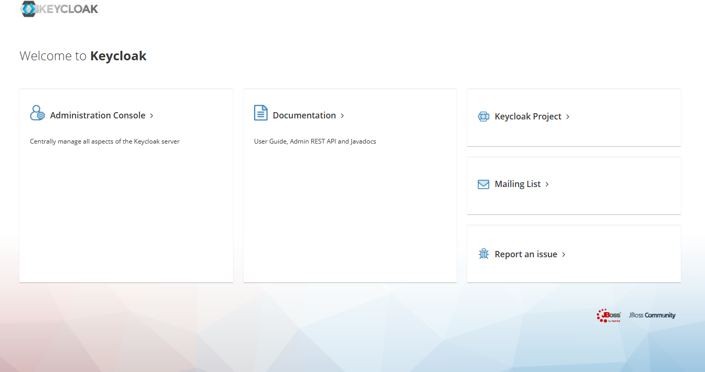
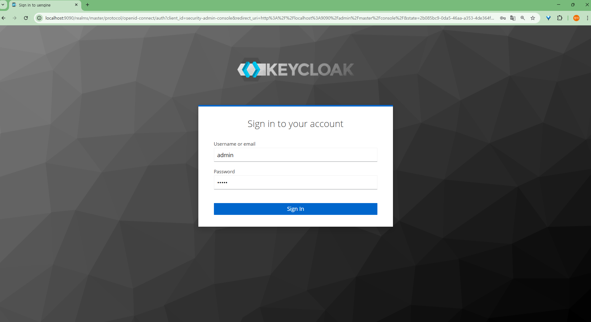
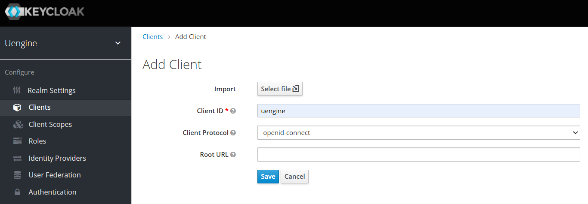
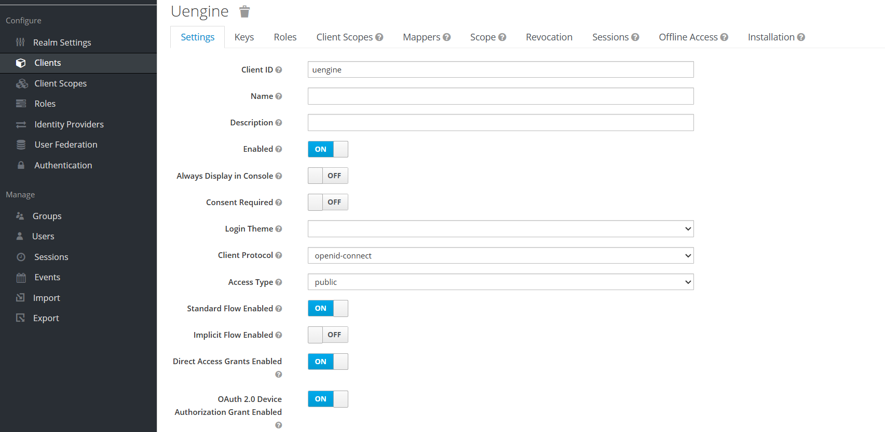
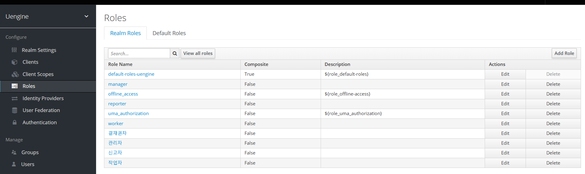
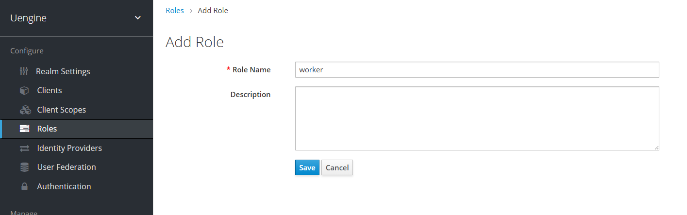
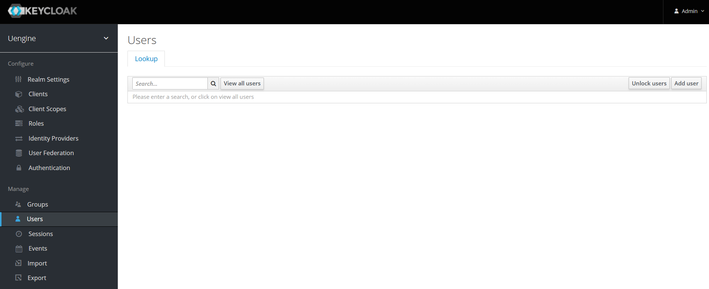
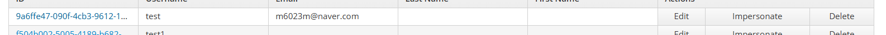
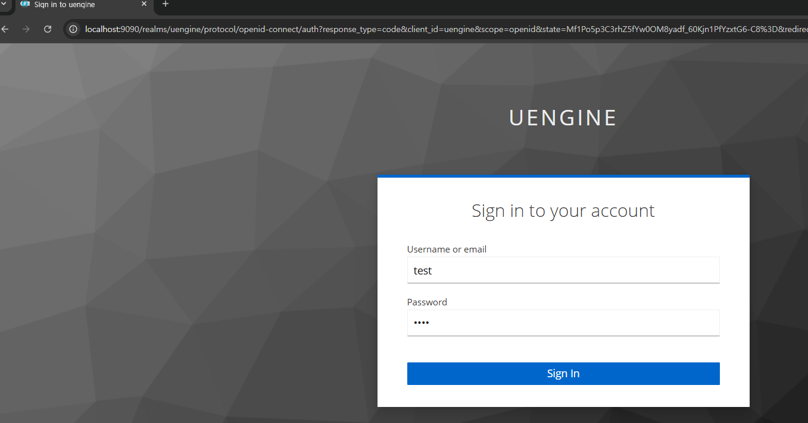

# 계정 관리

## Keycloak 설정

Keycloak은 uEngine6의 인증 및 권한 관리를 위한 오픈 소스 솔루션입니다. Keycloak을 설정하여 사용자 인증 및 권한 관리를 수행할 수 있습니다.

### Keycloak 관리자 페이지 접속

Keycloak 관리자 페이지에 접속하려면 다음 URL을 사용합니다:

```
http://keycloak:8080
```



여기서 Administration Console을 클릭하면 로그인 화면이 나옵니다.



### 기본 관리자 계정

Keycloak의 기본 관리자 계정은 다음과 같습니다:

- **사용자 이름**: `admin`
- **비밀번호**: `admin`

이 계정을 사용하여 Keycloak 관리자 페이지에 로그인할 수 있습니다. 로그인 후, 필요에 따라 관리자 계정의 비밀번호를 변경하는 것이 좋습니다.


### uEngine 클라이언트 추가

uEngine 클라이언트를 추가하여 uEngine6과의 통합을 설정할 수 있습니다. 다음 단계에 따라 클라이언트를 추가하세요

로그인 이 후 화면에서 clients 클릭


Create 버튼을 클릭하여 설정 화면 열기



이름을 uengine으로 설정 후 Save 버튼 클릭

성공적으로 생성되면 다음과 같이 클라이언트가 추가됨


여기서 Edit 버튼을 클릭하여 설정 화면 열기

설정을 아래 화면과 동일하게 설정 후 Save 버튼 클릭



### 역할 설정

역할 설정을 위해서는 Roles를 클릭하여 역할 목록을 확인합니다.



여기서 역할을 추가하고 싶으면 우측 상단의 Add Role 버튼을 클릭하여 역할을 추가합니다.



이 화면에서 역할 이름을 입력하고 save 버튼을 클릭하여 역할을 추가합니다.

역할이 추가되면 다음과 같이 역할이 추가된 것을 확인할 수 있습니다.


### 사용자 추가

사용자 추가를 위해서는 Users를 클릭하여 사용자 목록을 확인합니다.



여기서 사용자를 추가하고 싶으면 우측 상단의 Add User 버튼을 클릭하여 사용자를 추가합니다.


이 화면에서 사용자 이름을 입력하고 save 버튼을 클릭하여 사용자를 추가합니다.

사용자가 추가되면 다음과 같이 사용자가 추가된 것을 확인할 수 있습니다.



여기서 사용자에게 역할을 부여하고 비밀번호를 설정하기 위해 Edit 버튼을 클릭하여 사용자 설정 화면 열기


Credentials 탭에서 비밀번호를 설정하고 reset password 버튼을 클릭하여 비밀번호를 지정합니다.


Role Mappings 탭에서 사용자에게 역할을 부여합니다.
Available Roles에서 사용자에게 부여할 역할을 선택하고 Add Selected 버튼을 클릭하여 사용자에게 역할을 부여합니다.

### 접속 테스트

접속 테스트를 위해서는 전 단계에서 추가한 사용자 이름과 비밀번호를 사용하여 접속합니다.



접속 후 시작하기 버튼을 눌러 대시보드로 들어가면 다음과 같이 사용자 접속 확인 화면을 확인할 수 있습니다.


