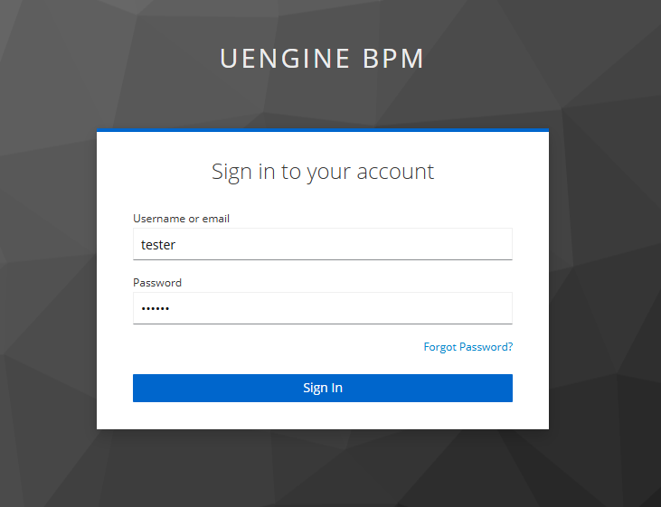
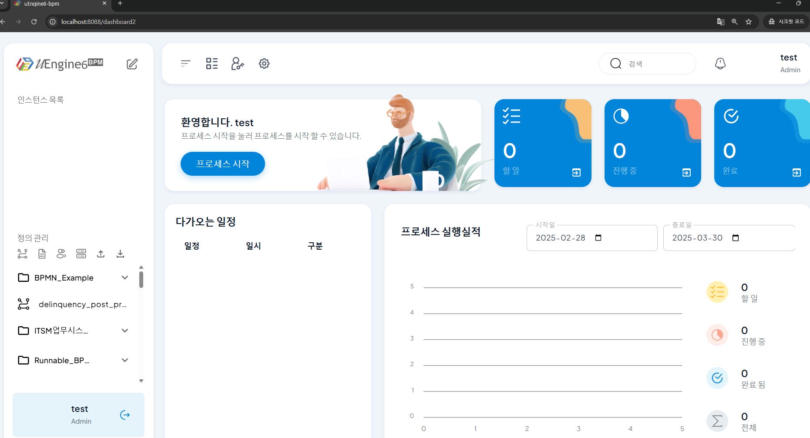

# 설치 및 접속 방법

## 개요
uEngine6는 비즈니스 프로세스 관리(BPM) 솔루션으로, 프로세스 정의, 실행, 모니터링을 위한 여러 마이크로서비스로 구성되어 있습니다. 이 문서에서는 두 가지 설치 방법을 안내합니다:
- **로컬 환경 설치**: 개발 및 테스트 목적에 적합
- **Docker 설치**: 빠른 시작과 운영 환경 배포에 권장

## 프로젝트 준비
GitHub에서 uEngine 프로젝트를 클론합니다:
```sh
git clone https://github.com/uengine-oss/uEngine6.git
cd uEngine6
```

## 설치 방법 선택
### 방법 1: Docker를 사용한 설치 (권장)
Docker Compose를 사용하면 모든 서비스(Kafka 포함)를 단일 명령으로 쉽게 실행할 수 있습니다.

1. infra 디렉토리로 이동:
```sh
cd infra
```

2. hosts 파일 수정:

시스템의 hosts 파일에 다음 항목을 추가합니다:
```
127.0.0.1  keycloak
```
> **참고**: 이 설정은 브라우저가 'keycloak' 호스트명으로 로컬 서비스에 접근하기 위해 필요합니다.

**Windows의 경우**:

> 1. 메모장을 관리자 권한으로 실행합니다
> 2. 파일 > 열기 > `C:\Windows\System32\drivers\etc\hosts` 파일을 엽니다
> 3. 파일 끝에 `127.0.0.1  keycloak` 추가 후 저장합니다

**Mac/Linux의 경우**:

> 1. 터미널에서 아래 명령어를 실행합니다:
```sh
sudo nano /etc/hosts
```
> 2. 파일 끝에 `127.0.0.1  keycloak` 추가 후 저장합니다
   - 저장: Ctrl+O, Enter
   - 종료: Ctrl+X

3. Docker Compose 실행:
```sh
docker-compose up -d
```

4. 서비스 실행 확인:
아래 이미지와 같이 uEngine 관련 컨테이너들이 실행됩니다.


5. uEngine 중지 (필요시):
```sh
docker-compose down
```

### 방법 2: 로컬 환경에서 설치 및 실행
개발 목적이나 각 서비스를 개별적으로 관리하고 싶을 때 이 방법을 사용합니다.

#### 1. Kafka 서버 설치 및 실행
uEngine6는 비동기 통신을 위해 Kafka를 사용합니다. 먼저 Kafka를 설치하고 실행해야 합니다.

1. [Apache Kafka 다운로드 페이지](https://kafka.apache.org/downloads)에서 Kafka를 다운로드합니다.
2. 다운로드한 파일을 압축 해제하고 해당 디렉토리로 이동합니다.
3. Zookeeper 시작:
```sh
./bin/zookeeper-server-start.sh config/zookeeper.properties
```
4. 새 터미널을 열고 Kafka 서버 시작:
```sh
./bin/kafka-server-start.sh config/server.properties
```

#### 2. uEngine 마이크로서비스 실행
각 서비스는 별도의 터미널에서 실행해야 합니다.

```sh
# 프로세스 서비스 실행 (포트 9094)
# 역할: 프로세스 인스턴스 실행 및 관리
cd process-service
mvn spring-boot:run

# 정의 서비스 실행 (포트 9093)
# 역할: 프로세스 정의 저장 및 관리
cd definition-service
mvn spring-boot:run

# 게이트웨이 서비스 실행 (포트 8088)
# 역할: API 게이트웨이 및 사용자 인터페이스 제공
cd gateway
mvn spring-boot:run
```

## uEngine 접속 및 확인

uEngine이 정상적으로 실행되면, 웹 브라우저를 열고 다음 URL로 최초 접속 시에는 keycloak 인증 화면이 나옵니다.
- **keycloak 인증 화면**: http://keycloak:8080/


keycloak 인증 화면에서 다음 계정 정보로 로그인할 수 있습니다:

| 사용자 유형 | 아이디 | 비밀번호 | 권한 |
|------------|-------|---------|------|
| 관리자 | admin | admin | 시스템 관리 및 모든 프로세스 접근 권한 |
| 일반 사용자 | tester | tester | 일반 프로세스 실행 및 조회 권한 |

일반 사용자 계정으로 로그인을 하게 되면 다음 URL로 자동으로 이동하게 됩니다.

- **uEngine BPM 포털**: http://localhost:8088/


접속 후 시작하기 버튼을 눌러 대시보드로 들어가면 다음과 같이 사용자 접속 확인 화면을 확인할 수 있습니다.



## 문제 해결

### 자주 발생하는 문제

1. **포트 충돌 오류**
   - 이미 사용 중인 포트가 있는 경우, 각 서비스의 application.yml 파일에서 포트를 변경할 수 있습니다.

2. **Kafka 연결 오류**
   - Kafka가 정상적으로 실행 중인지 확인하세요.
   - Docker 설치 시 서비스 간 네트워크 설정을 확인하세요.

3. **데이터베이스 연결 오류**
   - 각 서비스의 데이터베이스 설정을 확인하세요.

문제가 지속될 경우 help@uengine.org를 통해 문의해 주세요.

