# 외부 서비스 연동
uEngine6 BPM에서 외부 서비스 연동하여 프로세스를 실행하는 방법에 대해 설명합니다. 외부 서비스와 통신하는 방식에는 크게 3가지가 존재 하며, 각 방식에 대해서 설명합니다.
    
- SOA (MSA) 아키텍처 예제 - Event
- SOA (MSA) 아키텍처 예제 - Message
- REST API 연동 [<span style="color:red;font-size: 0.7em;">NOT RECOMMENDED</span>]

## SOA (MSA) 아키텍처 예제 - Event
- 외부 서비스와 이벤트로 전송및 수신을 하여 진행을 하는 방법입니다. 일반적으로 비동기 방식으로 진행되며 이벤트를 전송 후 진행되며, 외부 서비스의 업무지 진행되면 이벤트를 수신 받아서 진행됩니다. 비동기 방식은 동기 방식과는 다르게 결합도를 높이고, 장애 발생시 영향도가 낮은게 장점입니다.

### 예제 영상
<div style="position: relative; padding-bottom: 56.25%; padding-top: 0px; height: 0; overflow: hidden;">
	<iframe style="position: absolute; top: 0; left: 0; width: 100%; height: 100%;" 
        src="https://www.youtube.com/embed/E-tjj20-xxI?si=nhcIxujlVzTPXOeh" 
        frameborder="0" crolling="no" frameborder="none" allowfullscreen="">
    </iframe>
</div>
<br>

### 1. 동기 방식의 App 연동 시 문제점
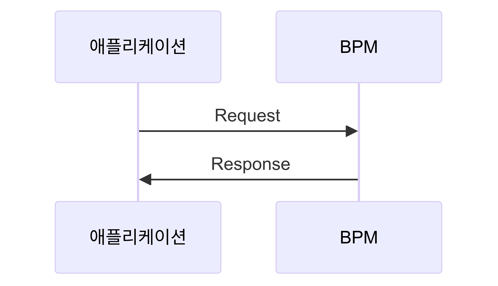 
[이미지 1] 동기식 방식

  동기 방식은 응답을 기다리는 방식입니다. BPM과 App 사이의 일반적인 동기 방식 연동은 BPM의 응답을 기다리기 때문에 BPM에 장애가 발생하면 App에도 영향을 줄 수 있습니다. 이로 인해 시스템 전체에 장애가 전파되고 응답 지연이 발생할 수 있습니다.

  또한, App에서 BPM으로 요청 하는 정보가 변경 시 BPM에서도 변경되어야 하는 세부 정보가 많아져 의존성(dependency)을 이해해야 하는 등의 문제점이 있습니다. 이러한 이유로 App과 BPM 간의 동기 방식 처리 시 장애가 전파되고, 결합도가 높아 실패 시 즉각적인 처리가 불가능하다는 단점이 있습니다.

- 상호 시스템간에 응답을 대기하여 **결합도 높아**집니다.
- BPM 시스템에 문제가 생길시 App에도 장애가 생기는 **장애 전파**가 됩니다.
- App의 요청및 응답 요구사항 변경시 BPM의 변경을 이야기하는 **의존성**이 생깁니다.


  동기 방식은 BPM의 장애가 App에 영향을 미치며, 시스템 전체에 장애가 전파되고 응답 지연이 발생합니다. 또한, 의존성이 높아져 변경 시 문제가 발생하여 동기 방식으로 연동은 적합하지 않습니다.
  

### 2. 비동기 방식의 App 연동

#### 2.1 연동 원칙
  App과 BPM을 **비동기 방식**으로 처리합니다. 이는 BPM이 중지된 상태에서도 App에도 장애가 전파가 되지 않도록 되며, 이로 인해 App과 BPM의 시스템간의 블로킹 문제 등을 해소하는데 탁월한 방법이 됩니다.

* 단방향 의존성 
    - **비의존성**
        - 메시지 브로커를 통해 이벤트 메시지를 전송하므로, BPM 호출을 기다리지 않습니다.
    - **장애 차단**
        - BPM시스템의 오류및 중지가 되었더라도, App에서의 영향이 없습니다. 장애 발생 시 다른 시스템에 영향을 주지 않습니다.
    - **보장성**
        - 중지된 BPM이 재실행 되더라도, 이전의 데이터가 반드시 처리가 되도록 보장합니다.

* 역할분리
    - App
        - 업무 화면 
        - 도메인로직 
        - 데이터 관리
    - BPM
        - 어플리케이션과 BPM 연동 시 시각적 이벤트 처리와 업무 공유 가능
        - BPM에서 프로세스 흐름 정의 및 업무 배분 용이
        - 업무 규칙(컨디션)에 따른 프로세스 분기/반복 
        - 담당자를 조직도에서 찾아서 담당자에게 업무 화면(App)을 라우팅 (워크아이템)

#### 2.2 예제 시나리오
  비동기 방식의 APP과 BPM을 연동 하는 "장애 신고 및 처리" 예제 입니다. 
  
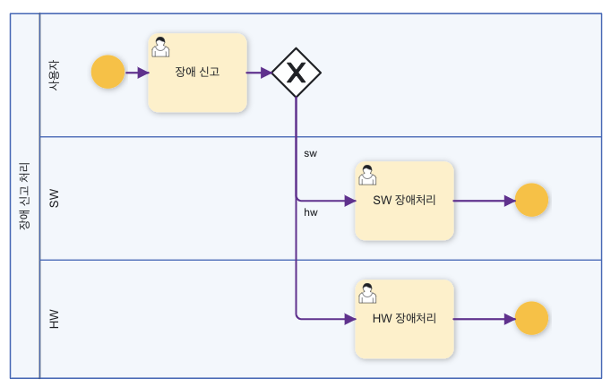 
[이미지 2] "장애 신고 및 처리" 예제

  사용자가 어떠한 장애문제가 생겨 문제를 해결 하기 위해 장애 신고를 진행 합니다.

  신고된 내용을 바탕으로 담당자가 지정이 되고, 지정된 담장자는 사용자가 신고한 내용을 바탕으로 문제를 해결하는 장애 처리 되는 예제 입니다.

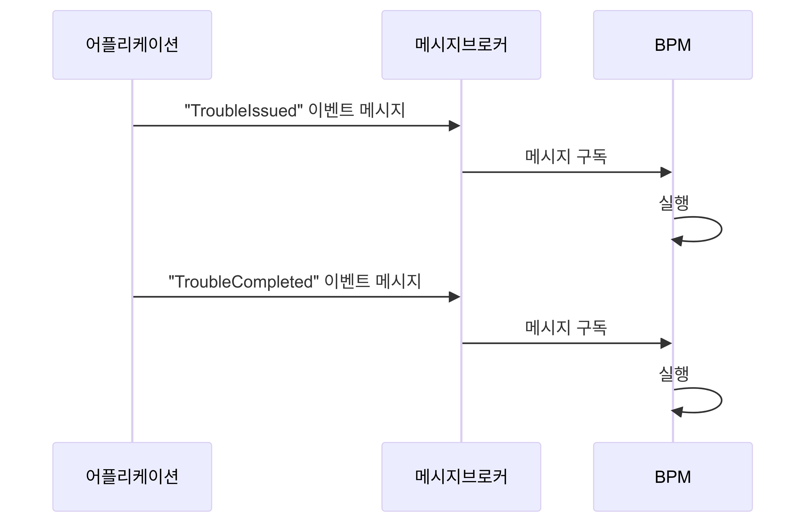
[이미지 3] "장애 신고 및 처리" 흐름도

"장애 신고 및 처리"의 예제는 2가지의 이벤트 타입을 정의 하여 진행 하였습니다.
- 장애 신고 (TroubleIssued)
- 장애 처리 (TroubleCompleted)

"장애 신고"는 사용자가 장애의 종류와 장애의 문제점을 작성 하여 전달하는 이벤트 타입 입니다. 
  
"장애 처리"는 사용자가 입력한 문제점을 바탕으로 담당자가 장애처리를 진행 한 후 완료되는 이벤트 타입 입니다. 

#### 2.3 애플리케이션(Publisher)
  App에서는 "장애 신고" 및 "장애 처리"를 사용자가 입력을 하기 위한 화면 및 이벤트 전송을 정의 합니다. 
  그리고 사용자가 입력한 정보를 가지고 "장애 신고(TroubleIssued)", "장애 처리(TroubleCompleted)"이벤트 타입으로 메시지브로커에 전달하기 위한 메시지 발행 시키는 역할을 합니다.

  아래 코드는 App에서 이벤트를 발생 시키기 위한 코드 입니다.

```java
public class TroubleIssued extends AbstractEvent {

    private Long id;
    private String troubleType;
    private String description;
   
    public TroubleIssued() {
        super();
    }

    public TroubleIssued(TroubleTicket ticket) {
        super(ticket);
    }   
}
```
1. 장애 티켓 발행(TroubleIssued) 이벤트 작성시 AbstractEvent클래스를 상속하고, TroubleIssued 속성값을 설정 합니다.

```java
// 예시 2-1) Kafka를 통한 메시지 송신
public class AbstractEvent {

    public void publish() {
        KafkaProcessor processor = ItsmApplication.applicationContext.getBean(KafkaProcessor.class);
        MessageChannel outputChannel = processor.outboundTopic();

        outputChannel.send(
            MessageBuilder
                .withPayload(this)
                .setHeader(
                    MessageHeaders.CONTENT_TYPE,
                    MimeTypeUtils.APPLICATION_JSON
                )
                .setHeader("type", getEventType())
                .build()
        );
    }

    public void publishAfterCommit() {
        TransactionSynchronizationManager.registerSynchronization(
            new TransactionSynchronizationAdapter() {
                @Override
                public void afterCompletion(int status) {
                    AbstractEvent.this.publish();
                }
            }
        );
    }
}
```
2. AbstractEvent 클래스는 메시지브로커 채널 연결하여 메시지를 전달 할 수 있도록 선언한 클래스입니다.

```java
// TroubleTicket.java
@Entity
@Table(name = "troubleTicket_table")
@Data
public class TroubleTicket {

    @Id
    @GeneratedValue(strategy = GenerationType.AUTO)
    private Long id;

    private String troubleType;
    private String description;
    private String reason;
    
    @PostPersist
    public void onPostPersist() {
        TroubleIssued trouble = new TroubleIssued(this);
        trouble.publishAfterCommit();
    }

    public void complete(TroubleTicket ticket) {
        TroubleCompleted troubleTicketCompleted = new TroubleCompleted(this);
        troubleTicketCompleted.setReason(ticket.getReason());
        troubleTicketCompleted.publishAfterCommit();
    }

    public static TroubleTicketRepository repository() {
        TroubleTicketRepository troubleTicketRepository = ItsmApplication.applicationContext.getBean(TroubleTicketRepository.class);
        return troubleTicketRepository;
    }
}
```
3. TroubleTicket 클래스로 이벤트를 송신(Publisher) 하기 위해서 실행하는 클래스 입니다. publishAfterCommit() 함수를 통해서 메시지 브로커 쪽으로 송신 하게 됩니다.
- 송신 메시지 예시
```sh
{"eventType":"TroubleIssued","timestamp":1718873491127,"id":1,"troubleType":"sw","description":"sw is error."}
```

#### 2.4 Message Broker
Message Broker(메시지 브로커)는 시스템간 비동기 방식으로 연동하기 위해서 사용합니다. 대표적으로 Kafka을 사용하는데, 메시지 브로커는 시스템간의 의존성을 제거 하여 블로킹 문제를 해소하는데 탁월한 방법이 됩니다. 또한 메시지를 전달 보장을 통해서 안전한 연동 방식을 지원 합니다. 이러한 특성으로 인해 대규모 시스템, 분산 시스템, 마이크로서비스 아키텍처에 널리 사용됩니다.

"장애 신고 및 처리" 예제에도 App과 BPM간의 의존성을 낮추고, 연동을 하기 위해서 비동기 방식인 Kafka를 사용하여 서로 장애 전파를 차단하고, 서로 시스템간에 영향도를 낮추는 작업을 했습니다.

#### 2.5 BPM(Subscriber)
App에서 메시지가 발행될 때마다 수신되며, 조건에 따라 메시지를 분류할 수 있습니다.

#### 2.6 비동기 연동의 회복성
비동기 방식의 장점 확인 하기 위해서 테스트를 진행 하였습니다. App과 BPM간에 서비스를 실행 중에 BPM의 서비스가 중지가 된 상태에서 App의 정상적인 실행 흐름을 가져가도록 하였습니다.

App에서는 이전 예제와 같이 장애신고를 접수를 받는 상황이고, BPM 서비스는 중지되어 이벤트 수신을 못받는 상황을 테스트 하였습니다. 


1. 사용자는 장애신고를 App에서 정상적으로 신고를 접수하여 메시지브로커의 Kafka를 통해서 이벤트가 발생되었습니다.
    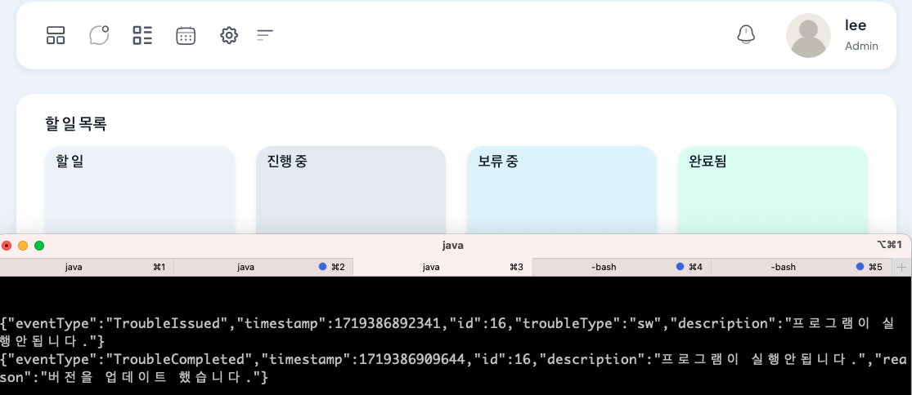
    [이미지 4] BPM 중지 상태

* 메시지 내용
```sh    
{"eventType":"TroubleIssued","timestamp":1719386892341,"id":16,"troubleType":"sw","description":"프로그램이 실행안됩니다."}
{"eventType":"TroubleCompleted","timestamp":1719386909644,"id":16,"description":"프로그램이 실행안됩니다.","reason":"버전을 업데이트 했습니다."}
```    
중지된 BPM의 상태와 상관 없이, App에서는 정상적인 "장애 신고"에 대한 업무를 진행하여, 이벤트가 발생된 것을 볼 수 있습니다.


2. 중지된 BPM 실행을 하고, 이전 메시지를 처리 하는지 확인 해보겠습니다. 
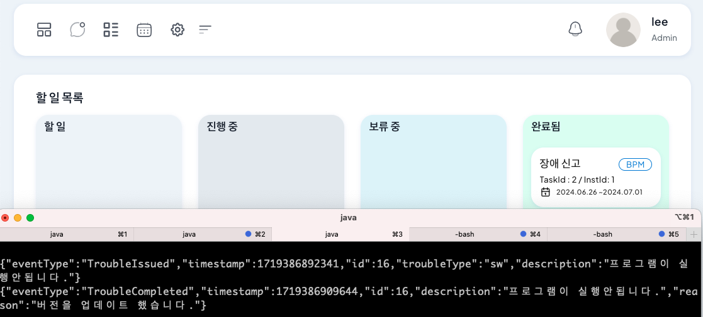
[이미지 5] BPM 재실행및 처리

중지된 BPM이 재실행 되면, App에서 메시지브로커를 통해서 발생된 이벤트를 BPM이 이후에 받아서 처리 하는 것을 확인 할 수 있습니다.


### 3. 프로세스 모델링
"프로세스 정의" 에서 프로세스에 대한 정의를 진행합니다. 업무의 흐름을 정의하고 각 업무에 대해서 정의 할 수 있습니다. 

#### 3.1 프로세스 변수 설정
- App에서 처리된 값을 저장 하기 위해서는 BPM에서의 변수를 담을 수 있도록 선언을 해야 합니다. 변수를 설정 하는 방법은 "프로세스 정의" 부분에서 왼쪽 상단에 "프로세스 변수" 클릭하여 설정 할 수 있습니다.
> text형식의 "TroubleType"변수를 선언합니다. 
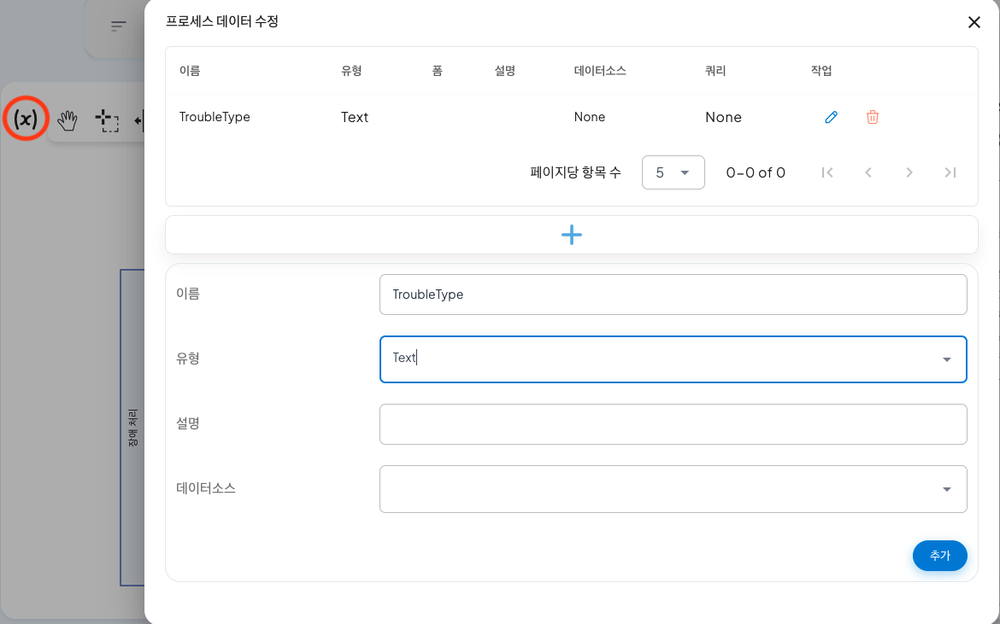
[이미지 6] 프로세스 변수 설정

#### 3.2 외부 어플리케이션 연동
App과 BPM을 연동 하기 위해서는 App에서 처리된 정보를 바탕으로 BPM은 정보를 수신하여 해당 App을 처리 할 수 있도록 합니다. 
연동하기 위해서는 User Task의 "외부 어플리케이션" 방식 선택하면 아래와 같은 방식으로 진행 합니다.
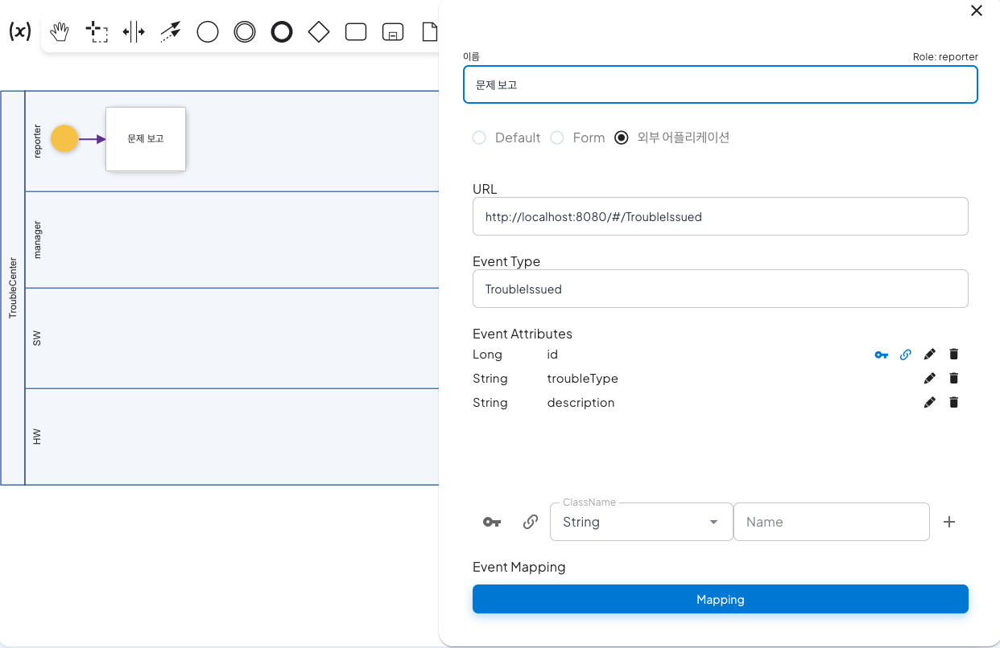
[이미지 7] 외부 어플리케이션 연동

##### 3.2.1 App 화면 설정
화면에 대한 정의 하는 부분입니다. App에서 정의된 화면을 접근 가능하게 하여 App의 화면URL을 넣습니다.
> Ex) App의 "장애 신고"화면 "http://localhost:8080/#/TroubleIssued" 정보를 넣습니다.
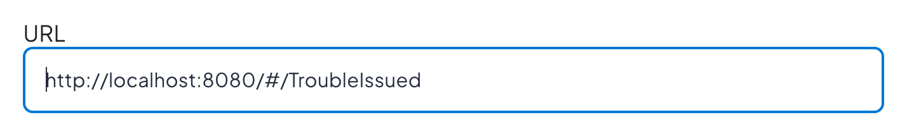
[이미지 8] App 화면 설정

##### 3.2.2 이벤트정의 설정
App에서 정의한 이벤트를 수신 할 수 있도록 이벤트 타입을 설정 하는 부분입니다. 설정된 이벤트 타입을 기준으로 App에서 발송된 이벤트를 수신하여 업무를 진행하게 됩니다. 
> Ex) "장애 신고"을 수신 할 수 있도록 "TroubleIssued"으로 설정합니다.
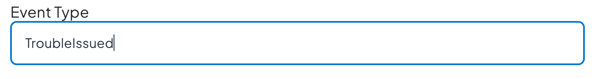
[이미지 9] 이벤트정의 설정

##### 3.2.3 이벤트 속성
App에서 발생한 이벤트의 정보를 수신하여, 수신된 정보를 사용 할 수 있도록 변수를 선언 하는 부분 입니다.
> Ex) "장애 신고"변수중 "troubleType"을 처리 위한 속성 처리. 
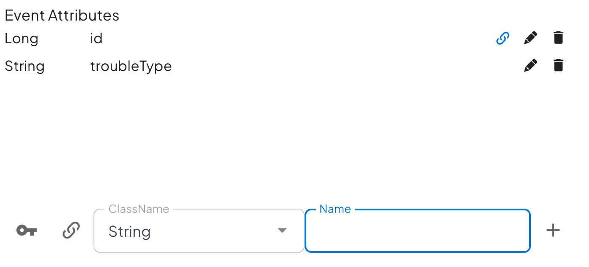
[이미지 10] 이벤트 속성

##### 3.2.4 이벤트 매핑
해당 업무에서 필요한 정보를 매핑 작업을 통해서 값을 전달 하거나 저장을 하는 역할을 합니다. 수신한 이벤트의 정보를 가지고 프로세스 변수에 저장하기도 합니다.
> Ex) 메시지의 속성값 "troubleType"을 프로세스 변수인"TroubleType"에 매핑
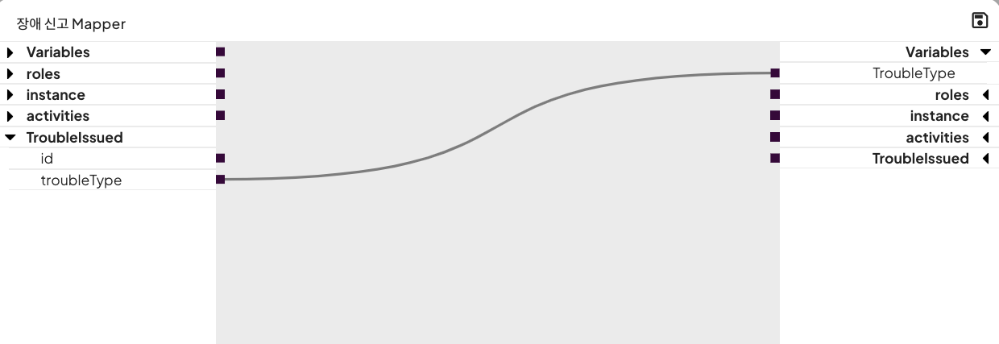
[이미지 11] 매핑 화면


### 4. 실행

1. "장애신고 및 처리" 프로세스 실행
- 사용자가 장애신고를 하기 위해서는 "프로세스 정의 체계도"에서 "장애 신고 및처리"프로세스를 선택하여 우측 상단버튼을 통해서 진행 합니다.
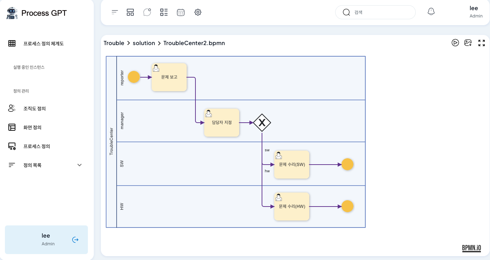
[이미지 12] 프로세스 정보

2. 사용자가 "장애 신고" 업무에서 장애 신청
- 사용자가 App에서 제공한 화면에서 장애 내용을 입력합니다.
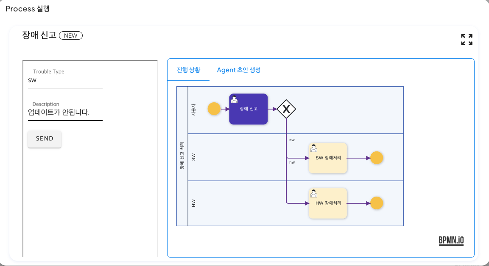 
[이미지 13] 실행 화면

3. 업무에 따른 화면 라우팅(엔지니어 업무 접수)
- 사용자의 신고신청을 하게 되면, 신고접수 기준으로 엔지니어의 "할일 목록"에 나타납니다.
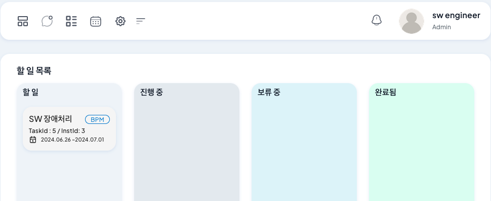 
[이미지 14] 엔지니어 업무 화면

4. 업무 완료 처리(엔지니어 장애 처리)
- 사용자가 입력한 "장애 신고" 기반으로 장애 처리 내역을 입력합니다.
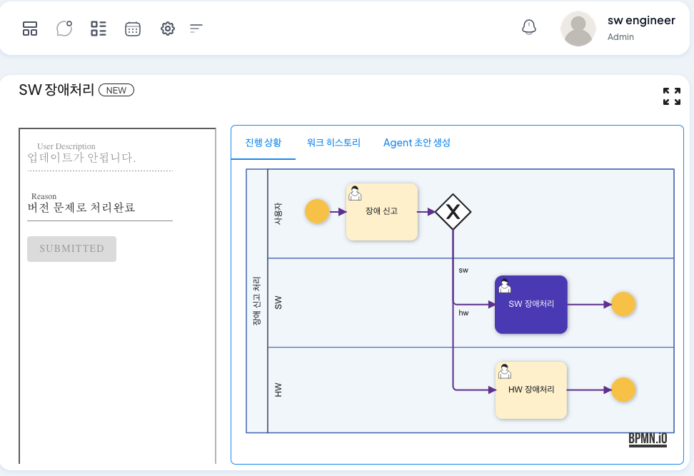 
[이미지 15] 엔지니어 장애 처리


### 5. 정리
  App과 BPM간의 비동기식 메시지브로커를 경유한 Pub/Sub 방식의 비동기식 연동은 상호시스템간에 **결합도를 낮게** 하여, **장애 차단** 할 수 있습니다. 반면, 동기식 방식에서 상호 서비스간에 응답을 기다리기 때문에 BPM에서 장애가 발생하면 App에서도 장애가 전파가 되는 문제가 있습니다.

  그리고 비동기 방식으로 상호 서비스를 연동 할때, App에서 BPM의 호출에 따라서 변경되거나, 상호 시스템에 응답을 기다리는 부분이 없어서 상호 시스템간에 **비의존성**을 가집니다. 

  그에따라서 BPM 시스템이 중지된 상태에서도 App에서 발생한 이벤트를 BPM이 이후에 받아서 처리 할 수 있고, 상태를 **동기화** 할 수 있습니다. 이것은 기존의 동기식방식의 장애전파와 runtime간에 시스템 블로킹의 문제를 해소하는데 탁월한 방법이 됩니다.

 - 상호 시스템간에 응답을 기다리지 않아 **결합도 낮습니다.**
 - BPM에서는 장애및 여러가지 이유로 중지시 App에는 영향이 가지않아 **장애 차단** 할 수 있습니다.
 - 서로의 시스템에 대한 응답에 대한 분리및 같은 **비의존성**을 가집니다. 
 - BPM이 중지된 상태라도 이전에 발생된 이벤트를 **동기화** 할 수 있습니다.
 


## SOA (MSA) 아키텍처 예제 - Message
- 외부 서비스와 메시지 이벤트를 이용하여 메시지를 전송 하고, 외부 서비스에서 처리 후에 외부 서비스에서 메시지를 전송을 하면, 메시지 이벤트가 수신 받은 후에 진행됩니다. Message Event Notation과 REST API를 이용하여 외부 시스템과 연동하는 방법을 예제를 통해 확인한다.

### 1. 예제 시나리오
장애 발생 시, 담당자 지정, 오류 내용 확인 후, 작업내역서 작성(외부 시스템), 처리 확인 완료의 단계로 진행된다.

### 2. 예제 영상
<div style="position: relative; padding-bottom: 56.25%; padding-top: 0px; height: 0; overflow: hidden;">
	<iframe style="position: absolute; top: 0; left: 0; width: 100%; height: 100%;" 
        src="https://www.youtube.com/embed/bxkB-pkOpTQ?si=YRmhriPf_I49H1tw" 
        frameborder="0" crolling="no" frameborder="none" allowfullscreen="">
    </iframe>
</div>
<br>

### 3. 예제 BPMN
<details>
  <summary>BPMN 보기</summary>

  ```xml
  <?xml version="1.0" encoding="UTF-8"?>
<bpmn:definitions xmlns:xsi="http://www.w3.org/2001/XMLSchema-instance" xmlns:bpmn="http://www.omg.org/spec/BPMN/20100524/MODEL" xmlns:bpmndi="http://www.omg.org/spec/BPMN/20100524/DI" xmlns:uengine="http://uengine" xmlns:dc="http://www.omg.org/spec/DD/20100524/DC" xmlns:di="http://www.omg.org/spec/DD/20100524/DI" id="Definitions_0bfky9r" targetNamespace="http://bpmn.io/schema/bpmn" exporter="bpmn-js (https://demo.bpmn.io)" exporterVersion="16.4.0">
  <bpmn:collaboration id="Collaboration_0ketuy3">
    <bpmn:participant id="Participant_1o9wosn" processRef="Process_1oscmbn" />
    <bpmn:participant id="Participant_1vhtw3k" name="오류 작업 내역 관리" processRef="Process_0on1ux0" $type="bpmn:Participant">
      <bpmn:extensionElements>
        <uengine:properties>
          <uengine:json>{"serviceURL":"http://localhost:8087"}</uengine:json>
        </uengine:properties>
      </bpmn:extensionElements>
    </bpmn:participant>
    <bpmn:messageFlow id="Flow_1b35vsc" sourceRef="Event_0937ss0" targetRef="Event_1liy11t" />
    <bpmn:messageFlow id="Flow_1hda9cb" sourceRef="Event_1v118e8" targetRef="Event_00iut9o" />
  </bpmn:collaboration>
  
  <bpmn:process id="Process_1oscmbn" isExecutable="true">
    <bpmn:extensionElements>
      <uengine:properties>
        <uengine:variable name="Worker" type="Text">
          <uengine:json>{"defaultValue":""}</uengine:json>
        </uengine:variable>
        <uengine:variable name="Error" type="Text">
          <uengine:json>{"defaultValue":""}</uengine:json>
        </uengine:variable>
        <uengine:variable name="Status" type="Text">
          <uengine:json>{}</uengine:json>
        </uengine:variable>
      </uengine:properties>
    </bpmn:extensionElements>
    <bpmn:laneSet id="LaneSet_0cwgyi6">
      <bpmn:lane id="Lane_1f3275c" name="관리자" $type="bpmn:Lane">
        <bpmn:extensionElements>
          <uengine:properties>
            <uengine:json>{"roleResolutionContext":{"_type":"org.uengine.five.overriding.IAMRoleResolutionContext","scope":"manager"}}</uengine:json>
          </uengine:properties>
        </bpmn:extensionElements>
        <bpmn:flowNodeRef>Event_1z0qf6o</bpmn:flowNodeRef>
        <bpmn:flowNodeRef>Event_0pmhyq2</bpmn:flowNodeRef>
        <bpmn:flowNodeRef>Activity_0lwj0om</bpmn:flowNodeRef>
        <bpmn:flowNodeRef>Activity_1tz1c18</bpmn:flowNodeRef>
      </bpmn:lane>
      <bpmn:lane id="Lane_0cnpt7b" name="작업자" $type="bpmn:Lane">
        <bpmn:extensionElements>
          <uengine:properties>
            <uengine:json>{"roleResolutionContext":{"_type":"org.uengine.five.overriding.IAMRoleResolutionContext","scope":"manager"}}</uengine:json>
          </uengine:properties>
        </bpmn:extensionElements>
        <bpmn:flowNodeRef>Activity_0x6enn9</bpmn:flowNodeRef>
        <bpmn:flowNodeRef>Event_0937ss0</bpmn:flowNodeRef>
        <bpmn:flowNodeRef>Event_00iut9o</bpmn:flowNodeRef>
      </bpmn:lane>
    </bpmn:laneSet>
    <bpmn:startEvent id="Event_1z0qf6o">
      <bpmn:outgoing>Flow_0l0zoj6</bpmn:outgoing>
    </bpmn:startEvent>
    <bpmn:sequenceFlow id="Flow_0l0zoj6" sourceRef="Event_1z0qf6o" targetRef="Activity_0lwj0om" />
    <bpmn:sequenceFlow id="Flow_0nn4qnj" sourceRef="Activity_0lwj0om" targetRef="Activity_0x6enn9" />
    <bpmn:sequenceFlow id="Flow_1j42mu7" sourceRef="Activity_0x6enn9" targetRef="Event_0937ss0" />
    <bpmn:sequenceFlow id="Flow_1wveg9i" sourceRef="Event_0937ss0" targetRef="Event_00iut9o" />
    <bpmn:sequenceFlow id="Flow_0jf4xqm" sourceRef="Event_00iut9o" targetRef="Activity_1tz1c18" />
    <bpmn:endEvent id="Event_0pmhyq2">
      <bpmn:incoming>Flow_0l2xymz</bpmn:incoming>
    </bpmn:endEvent>
    <bpmn:sequenceFlow id="Flow_0l2xymz" sourceRef="Activity_1tz1c18" targetRef="Event_0pmhyq2" />
    <bpmn:userTask id="Activity_0lwj0om" name="작업자 선택" $type="bpmn:UserTask">
      <bpmn:extensionElements>
        <uengine:properties>
          <uengine:json>{"parameters":[{"direction":"IN-OUT","variable":{"name":"Worker"},"argument":{"text":"Worker"}}]}</uengine:json>
        </uengine:properties>
      </bpmn:extensionElements>
      <bpmn:incoming>Flow_0l0zoj6</bpmn:incoming>
      <bpmn:outgoing>Flow_0nn4qnj</bpmn:outgoing>
    </bpmn:userTask>
    <bpmn:userTask id="Activity_0x6enn9" name="오류내용 인지" $type="bpmn:UserTask">
      <bpmn:extensionElements>
        <uengine:properties>
          <uengine:json>{"parameters":[{"direction":"IN-OUT","variable":{"name":"Error"},"argument":{"text":"Error"}}]}</uengine:json>
        </uengine:properties>
      </bpmn:extensionElements>
      <bpmn:incoming>Flow_0nn4qnj</bpmn:incoming>
      <bpmn:outgoing>Flow_1j42mu7</bpmn:outgoing>
    </bpmn:userTask>
    <bpmn:intermediateThrowEvent id="Event_0937ss0" name="작업 내역서 작성 요청" $type="bpmn:IntermediateThrowEvent">
      <bpmn:extensionElements>
        <uengine:properties>
          <uengine:json>{}</uengine:json>
        </uengine:properties>
      </bpmn:extensionElements>
      
      <bpmn:messageEventDefinition id="MessageEventDefinition_0f3qhct" />
    </bpmn:intermediateThrowEvent>
    <bpmn:intermediateCatchEvent id="Event_00iut9o" name="작업 내역서 작성 완료 수신" $type="bpmn:IntermediateCatchEvent">
      <bpmn:extensionElements>
        <uengine:properties>
          <uengine:json>{"correlationKey":"history","servicePath":"history"}</uengine:json>
        </uengine:properties>
      </bpmn:extensionElements>
      <bpmn:incoming>Flow_1wveg9i</bpmn:incoming>
      <bpmn:outgoing>Flow_0jf4xqm</bpmn:outgoing>
      <bpmn:messageEventDefinition id="MessageEventDefinition_0pxe7n6" />
    </bpmn:intermediateCatchEvent>
    <bpmn:userTask id="Activity_1tz1c18" name="작업 내역서 작성 완료 확인" $type="bpmn:UserTask">
      <bpmn:extensionElements>
        <uengine:properties>
          <uengine:json>{"parameters":[{"direction":"IN-OUT","variable":{"name":"Status"},"argument":{"text":"Status"}}]}</uengine:json>
        </uengine:properties>
      </bpmn:extensionElements>
      <bpmn:incoming>Flow_0jf4xqm</bpmn:incoming>
      <bpmn:outgoing>Flow_0l2xymz</bpmn:outgoing>
    </bpmn:userTask>
  </bpmn:process>

  <bpmn:process id="Process_0on1ux0" isExecutable="false">
    <bpmn:task id="Activity_09u6k20" name="작업 내역서 작성" $type="bpmn:Task">
      <bpmn:extensionElements>
        <uengine:properties>
          <uengine:json>{}</uengine:json>
        </uengine:properties>
      </bpmn:extensionElements>
      <bpmn:incoming>Flow_00drr7g</bpmn:incoming>
      <bpmn:outgoing>Flow_1fzqzav</bpmn:outgoing>
    </bpmn:task>
    <bpmn:sequenceFlow id="Flow_00drr7g" sourceRef="Event_1liy11t" targetRef="Activity_09u6k20" />
    <bpmn:sequenceFlow id="Flow_1fzqzav" sourceRef="Activity_09u6k20" targetRef="Event_1v118e8" />
    <bpmn:startEvent id="Event_1liy11t">
      <bpmn:outgoing>Flow_00drr7g</bpmn:outgoing>
      <bpmn:messageEventDefinition id="MessageEventDefinition_1hmq8nc" />
    </bpmn:startEvent>
    <bpmn:endEvent id="Event_1v118e8">
      <bpmn:incoming>Flow_1fzqzav</bpmn:incoming>
      <bpmn:messageEventDefinition id="MessageEventDefinition_1y6bk1d" />
    </bpmn:endEvent>
  </bpmn:process>
  
  <bpmndi:BPMNDiagram id="BPMNDiagram_1">
    <bpmndi:BPMNPlane id="BPMNPlane_1" bpmnElement="Collaboration_0ketuy3">
      <bpmndi:BPMNShape id="Participant_1o9wosn_di" bpmnElement="Participant_1o9wosn" isHorizontal="true">
        <dc:Bounds x="80" y="120" width="1018" height="250" />
      </bpmndi:BPMNShape>
      <bpmndi:BPMNShape id="Lane_1f3275c_di" bpmnElement="Lane_1f3275c" isHorizontal="true">
        <dc:Bounds x="110" y="120" width="988" height="125" />
        <bpmndi:BPMNLabel />
      </bpmndi:BPMNShape>
      <bpmndi:BPMNShape id="Lane_0cnpt7b_di" bpmnElement="Lane_0cnpt7b" isHorizontal="true">
        <dc:Bounds x="110" y="245" width="988" height="125" />
        <bpmndi:BPMNLabel />
      </bpmndi:BPMNShape>
      <bpmndi:BPMNShape id="Event_1z0qf6o_di" bpmnElement="Event_1z0qf6o">
        <dc:Bounds x="172" y="162" width="36" height="36" />
      </bpmndi:BPMNShape>
      <bpmndi:BPMNShape id="Event_0pmhyq2_di" bpmnElement="Event_0pmhyq2">
        <dc:Bounds x="962" y="162" width="36" height="36" />
      </bpmndi:BPMNShape>
      <bpmndi:BPMNShape id="Activity_0sn28ng_di" bpmnElement="Activity_0lwj0om">
        <dc:Bounds x="260" y="140" width="100" height="80" />
        <bpmndi:BPMNLabel />
      </bpmndi:BPMNShape>
      <bpmndi:BPMNShape id="Activity_060rqeu_di" bpmnElement="Activity_0x6enn9">
        <dc:Bounds x="420" y="270" width="100" height="80" />
        <bpmndi:BPMNLabel />
      </bpmndi:BPMNShape>
      <bpmndi:BPMNShape id="Event_1p7vfle_di" bpmnElement="Event_0937ss0">
        <dc:Bounds x="582" y="292" width="36" height="36" />
        <bpmndi:BPMNLabel>
          <dc:Bounds x="563" y="254.5" width="73" height="27" />
        </bpmndi:BPMNLabel>
      </bpmndi:BPMNShape>
      <bpmndi:BPMNShape id="Event_07sc6sc_di" bpmnElement="Event_00iut9o">
        <dc:Bounds x="682" y="292" width="36" height="36" />
        <bpmndi:BPMNLabel>
          <dc:Bounds x="663" y="254.5" width="73" height="27" />
        </bpmndi:BPMNLabel>
      </bpmndi:BPMNShape>
      <bpmndi:BPMNShape id="Activity_0oyw50a_di" bpmnElement="Activity_1tz1c18">
        <dc:Bounds x="790" y="140" width="100" height="80" />
        <bpmndi:BPMNLabel />
      </bpmndi:BPMNShape>
      <bpmndi:BPMNEdge id="Flow_0l0zoj6_di" bpmnElement="Flow_0l0zoj6">
        <di:waypoint x="208" y="180" />
        <di:waypoint x="260" y="180" />
      </bpmndi:BPMNEdge>
      <bpmndi:BPMNEdge id="Flow_0nn4qnj_di" bpmnElement="Flow_0nn4qnj">
        <di:waypoint x="360" y="180" />
        <di:waypoint x="390" y="180" />
        <di:waypoint x="390" y="310" />
        <di:waypoint x="420" y="310" />
      </bpmndi:BPMNEdge>
      <bpmndi:BPMNEdge id="Flow_1j42mu7_di" bpmnElement="Flow_1j42mu7">
        <di:waypoint x="520" y="310" />
        <di:waypoint x="582" y="310" />
      </bpmndi:BPMNEdge>
      <bpmndi:BPMNEdge id="Flow_1wveg9i_di" bpmnElement="Flow_1wveg9i">
        <di:waypoint x="618" y="310" />
        <di:waypoint x="682" y="310" />
      </bpmndi:BPMNEdge>
      <bpmndi:BPMNEdge id="Flow_0jf4xqm_di" bpmnElement="Flow_0jf4xqm">
        <di:waypoint x="718" y="310" />
        <di:waypoint x="754" y="310" />
        <di:waypoint x="754" y="180" />
        <di:waypoint x="790" y="180" />
      </bpmndi:BPMNEdge>
      <bpmndi:BPMNEdge id="Flow_0l2xymz_di" bpmnElement="Flow_0l2xymz">
        <di:waypoint x="890" y="180" />
        <di:waypoint x="962" y="180" />
      </bpmndi:BPMNEdge>
      <bpmndi:BPMNShape id="Participant_1vhtw3k_di" bpmnElement="Participant_1vhtw3k" isHorizontal="true">
        <dc:Bounds x="80" y="410" width="600" height="250" />
        <bpmndi:BPMNLabel />
      </bpmndi:BPMNShape>
      <bpmndi:BPMNShape id="Activity_09u6k20_di" bpmnElement="Activity_09u6k20">
        <dc:Bounds x="300" y="490" width="100" height="80" />
        <bpmndi:BPMNLabel />
      </bpmndi:BPMNShape>
      <bpmndi:BPMNShape id="Event_171hny1_di" bpmnElement="Event_1liy11t">
        <dc:Bounds x="212" y="512" width="36" height="36" />
      </bpmndi:BPMNShape>
      <bpmndi:BPMNShape id="Event_0ekav1f_di" bpmnElement="Event_1v118e8">
        <dc:Bounds x="452" y="512" width="36" height="36" />
      </bpmndi:BPMNShape>
      <bpmndi:BPMNEdge id="Flow_00drr7g_di" bpmnElement="Flow_00drr7g">
        <di:waypoint x="248" y="530" />
        <di:waypoint x="300" y="530" />
      </bpmndi:BPMNEdge>
      <bpmndi:BPMNEdge id="Flow_1fzqzav_di" bpmnElement="Flow_1fzqzav">
        <di:waypoint x="400" y="530" />
        <di:waypoint x="452" y="530" />
      </bpmndi:BPMNEdge>
      <bpmndi:BPMNEdge id="Flow_1b35vsc_di" bpmnElement="Flow_1b35vsc">
        <di:waypoint x="600" y="328" />
        <di:waypoint x="600" y="390" />
        <di:waypoint x="230" y="390" />
        <di:waypoint x="230" y="512" />
      </bpmndi:BPMNEdge>
      <bpmndi:BPMNEdge id="Flow_1hda9cb_di" bpmnElement="Flow_1hda9cb">
        <di:waypoint x="470" y="512" />
        <di:waypoint x="470" y="420" />
        <di:waypoint x="700" y="420" />
        <di:waypoint x="700" y="328" />
      </bpmndi:BPMNEdge>
    </bpmndi:BPMNPlane>
  </bpmndi:BPMNDiagram>
</bpmn:definitions>

  ```
</details>

### 4. 예제 실행 과정

#### Step 1: BPMN Process 작성
- **1.1** 아래 그림과 같이 2개의 Pool을 생성합니다. 오류 처리 Pool은 uEngine6가 동작 하는 Process, 오류 작업 내역 관리 Pool 은 외부 시스템의 역할을 합니다.
    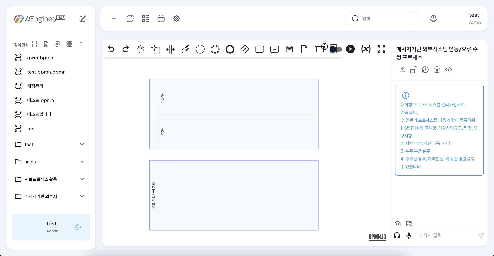

- **1.2** 생성 한 Pool 중, 오류 작업 내역 관리 Pool을 설정합니다. API URL은 서버의 Endpoint, Open API 스펙은 해당 서버의 Open API 스펙 정보를 입력합니다.
    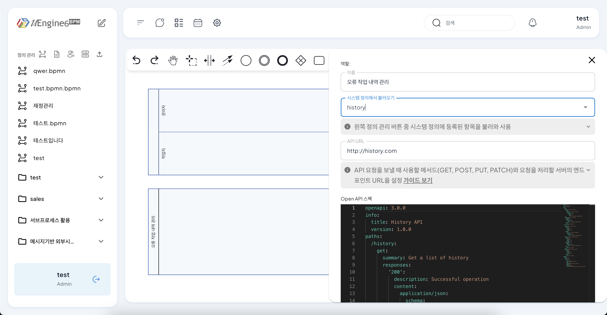

- **1.3** 프로세스 변수를 설정합니다. 프로세스 변수는 Worker, Error, Status 세가지로 모두 String Type으로 지정합니다.
    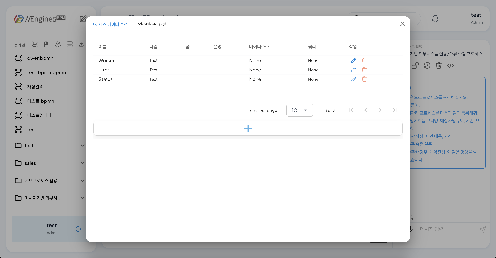

- **1.4** StartEvent와 UserTask를 추가합니다. 해당 UserTask에서는 Worker를 지정합니다.
    - UserTask
    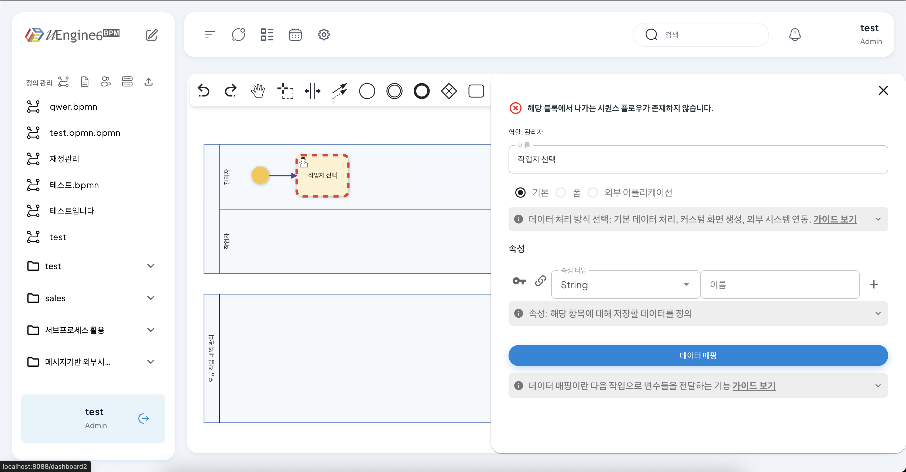
    - UserTask - 데이터 매핑
    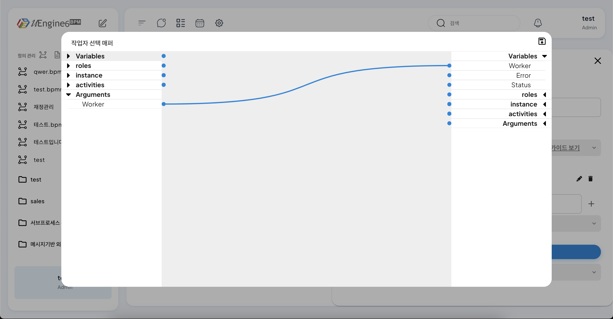

- **1.5** UserTask를 추가합니다. 해당 UserTask에서는 오류 내용을 작성합니다.
    - UserTask
    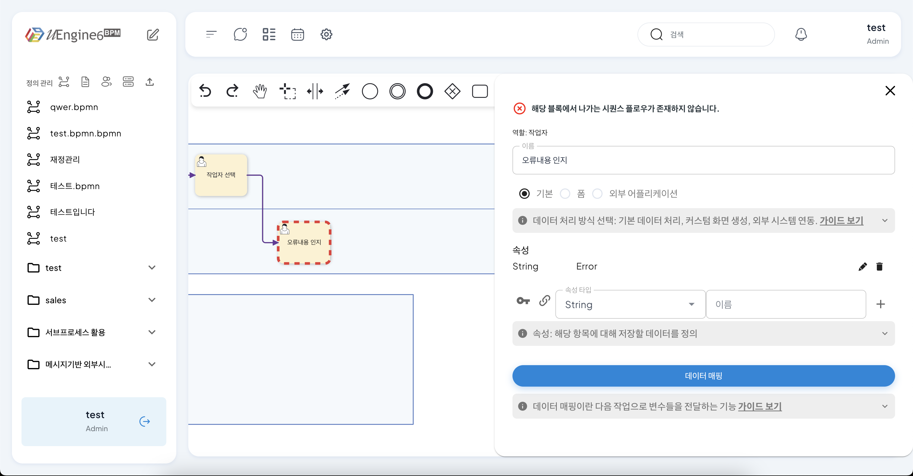
    - UserTask - 데이터 매핑
    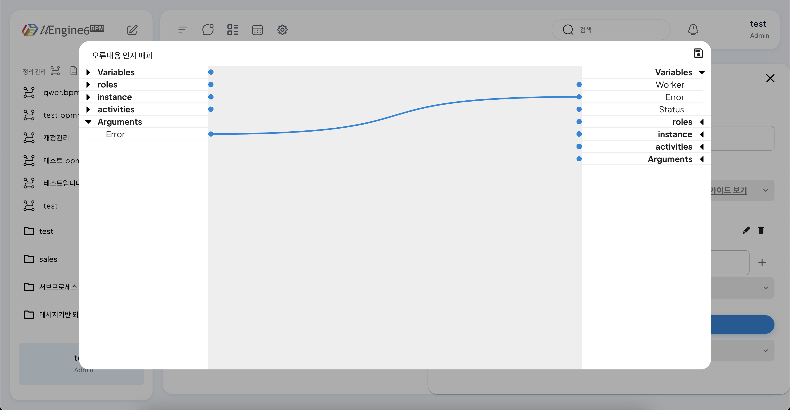

- **1.6** MessageIntermediateThrowEvent를 추가합니다. 해당 Event에서는 등록 된 API를 호출합니다.
    - MessageIntermediateThrowEvent
    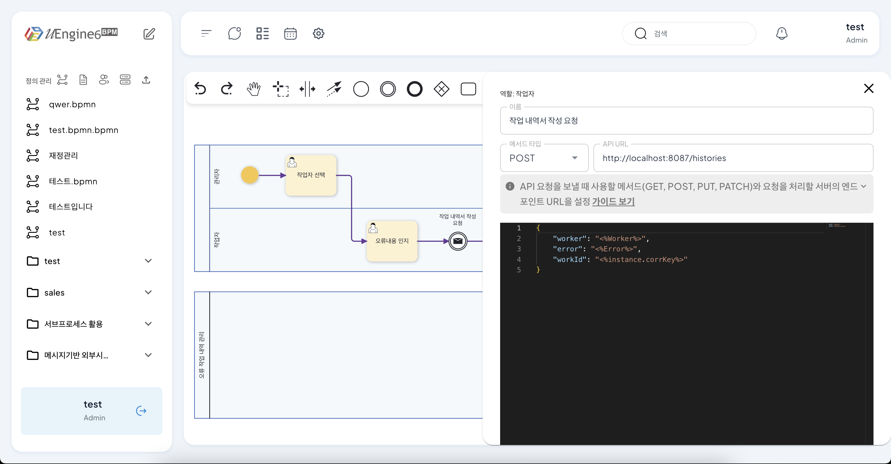

- **1.7** MessageIntermediateCatchEvent를 추가합니다. 해당 Event에서는 등록 서비스 경로로 관계키가 들어오면 해당 Event가 완료처리 됩니다.
    - MessageIntermediateCatchEvent
    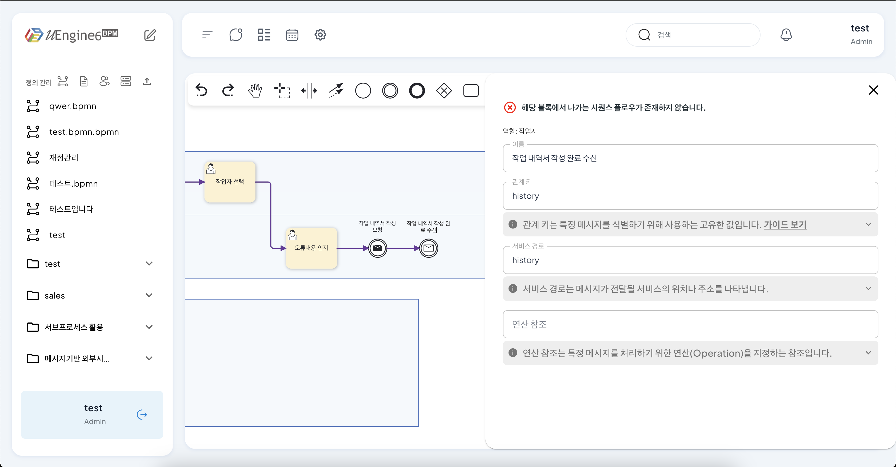

- **1.8** 외부 시스템과 연결합니다. 외부 시스템은 실제로 BPM은 동작하지 않으므로, 의미적으로 노테이션을 그려 연결합니다.
    - 외부 시스템
    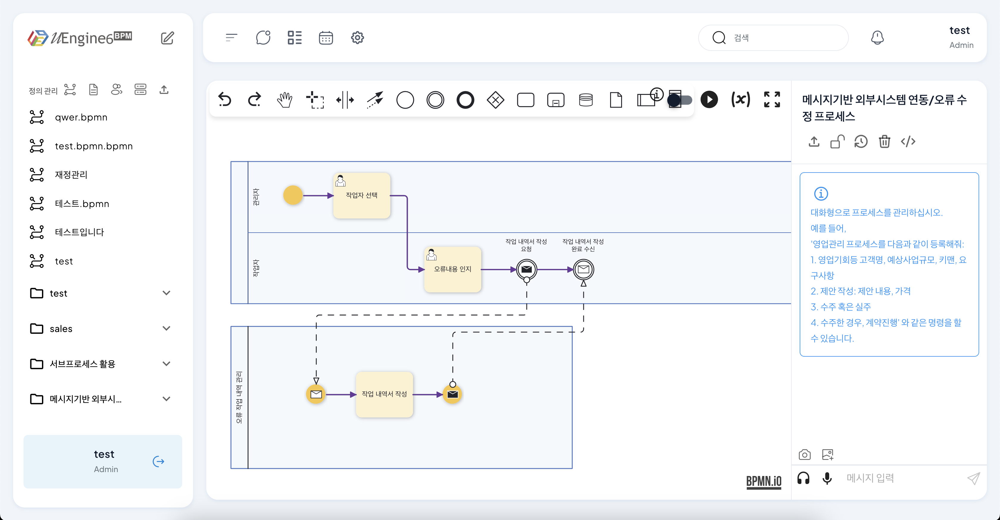

- **1.9** 작업 완료 확인 UserTask와 EndEvent를 추가합니다. 해당 Task에서는 완료를 확인 후, EndEvent를 통해 프로세스가 종료됩니다.
    - UserTask
    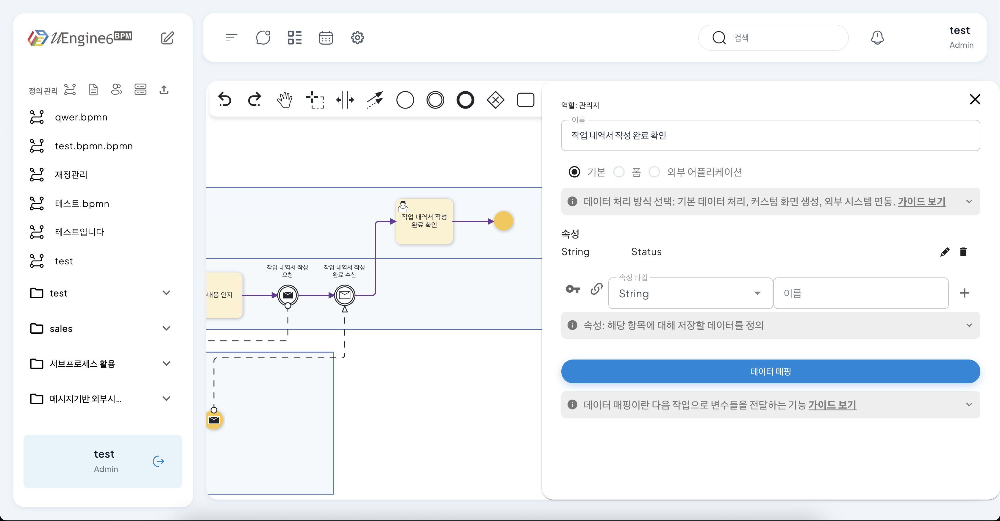
    - UserTask - 데이터 매핑
    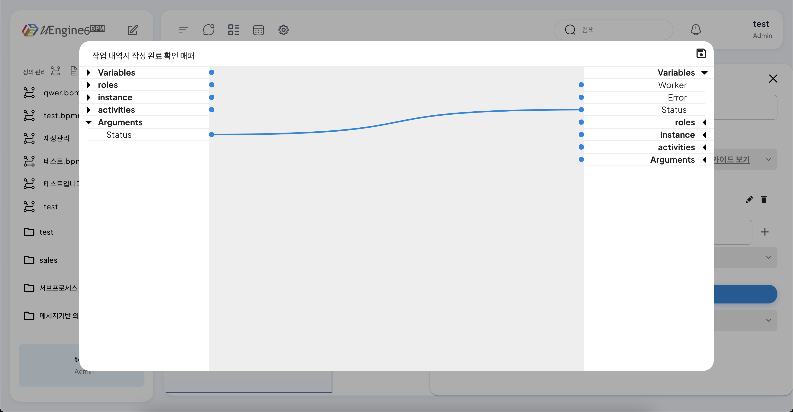

#### Step 2: Process의 실행
- **2.1** 프로세스를 실행합니다. 첫 업무에서는 Worker를 지정합니다.
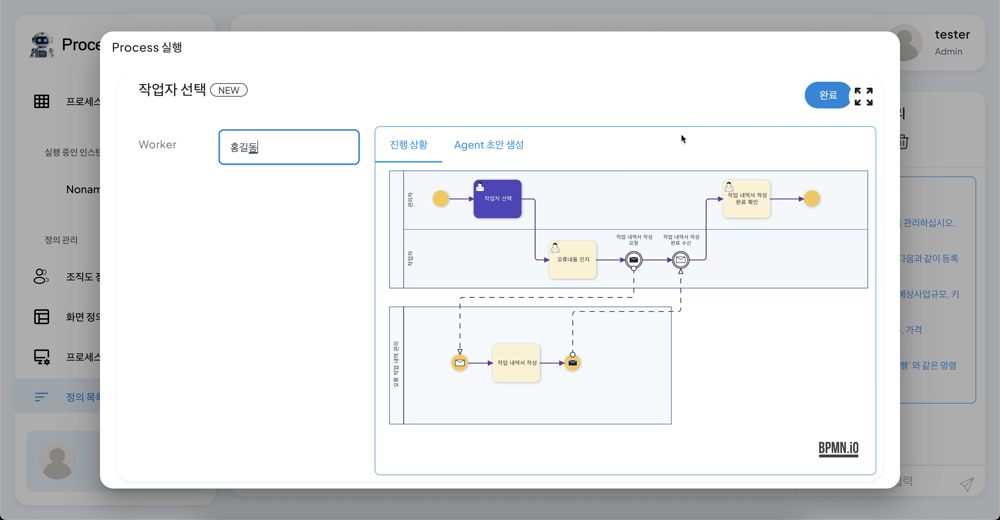

- **2.2** 다음 업무를 진행합니다. 해당 업무에서는 오류 내용을 작성합니다.
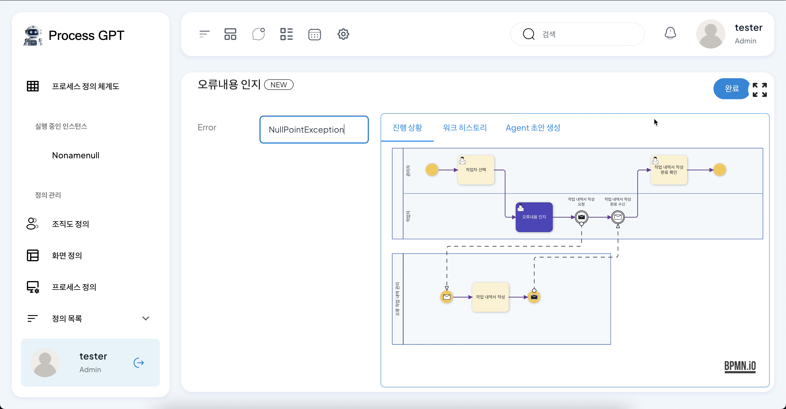

- **2.3** 프로세스를 실행합니다. 오류 내용을 작성합니다.
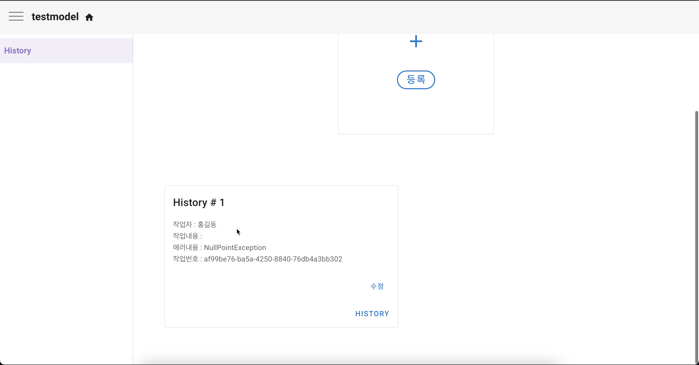

- **2.4** 프로세스를 실행합니다. 오류 내용을 작성합니다.
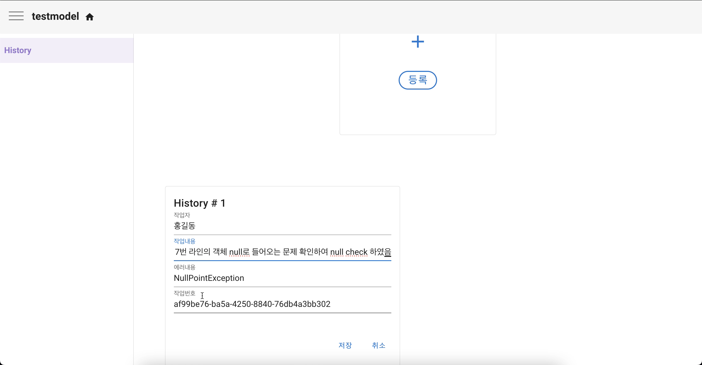

- **2.5** 프로세스를 실행합니다. 오류 내용을 작성합니다.
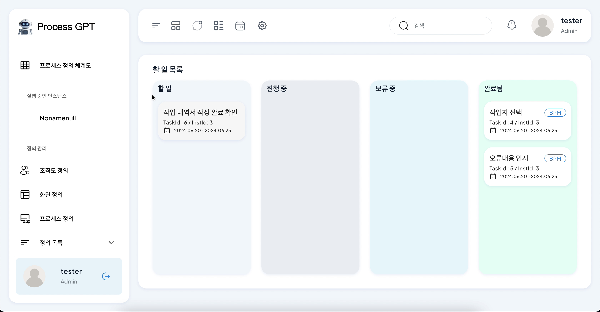

- **2.6** 프로세스를 실행합니다. 오류 내용을 작성합니다.
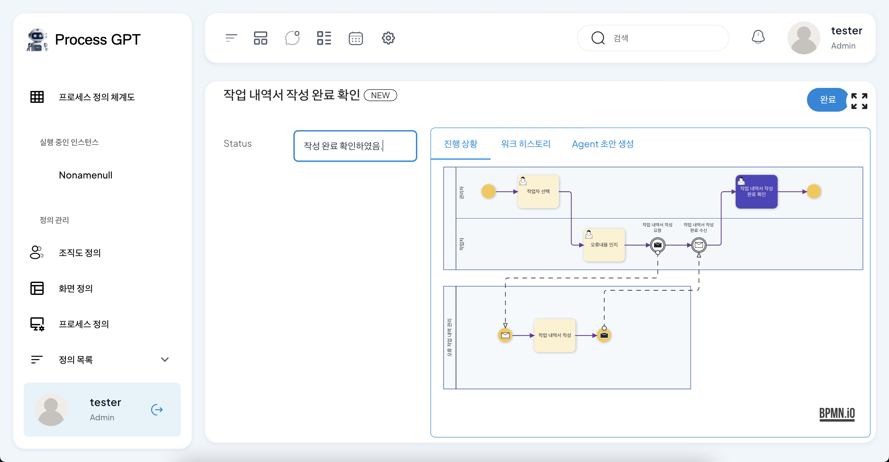

## REST API 연동 [<span style="color:red;font-size: 0.8em;">NOT RECOMMENDED</span>]
- 외부 서비스와 uEngine6 BPM은 간에 직접적인 통신을 하는 방법입니다. 외부 서비스에 uEngine6 BPM으로 직접적으로 호출을 하고 응답을 받아서 진행되며, 외부 서비스의 업무가 변경되면 uEngine6 BPM도 함께 변경되어야 합니다. 또한 동기 방식으로 진행되어 외부 서비스 또는 BPM의 장애발생시 전파되어 서로 영향도를 가지게 됩니다.

<span style="color:red;">[Warning] 외부 어플리케이션 연동(REST API)는 프로세스 모델링 시 권장되지 않습니다.</span>


