# 구성요소

## 내용
uEngine6 BPM의 컴포넌트는 프로세스를 구성하는 기본 요소입니다. 각 컴포넌트는 특정한 역할과 기능을 수행하며, 이를 통해 복잡한 프로세스를 모델링하고 실행할 수 있습니다.

## 1. Events
Events는 프로세스에서 발생하는 사건을 나타내며, 프로세스가 이벤트에 반응하거나 이벤트를 발생시킬 수 있습니다. 이벤트는 각각 시작 이벤트, 종료 이벤트, 중간 이벤트, 경계 이벤트로 구분됩니다.

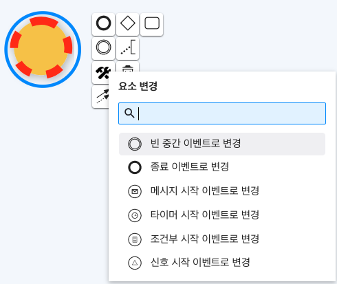
요소 변경에서 다양한 events 요소를 변경 할 수 있습니다.

- Start events (시작 이벤트)
---
프로세스나 하위 프로세스의 시작 지점을 정의합니다.

- End events (종료 이벤트)
---
프로세스에서 특정 시퀀스의 끝을 정의합니다.

- Intermediate events (중간 이벤트)
---
프로세스의 중간에 발생하는 이벤트를 나타내며, 프로세스의 흐름을 제어하거나 변경하는 데 사용됩니다.
이벤트의 종류에 따라서 Throw, Catch 이벤트로 구분 하여 프로세스의 특정한 트리거(trigger)를 정의 합니다.

- Boundary events (경계 이벤트)
---
프로세스에서 진행중인 흐름에서 이벤트를 발생 한 경우 어떤 일을 처리 해야 하는지를 정의 합니다. 예를 들어, 프로세스가 사용자의 특정업무를 발생 되었을 경우에 중간 메시지 CATCH 이벤트를 작업에 첨부하여 메시지 전송 작업으로 시퀀스 흐름을 자동화 하여 메시지를 보낼 수 있습니다.

## Events 종류 및 설명
### 1.1 Message events (메시지 이벤트)
메시지 이벤트는 정의된 메시지를 프로세스에서 발생 및 수신 하여 이벤트를 발생 시키는 이벤트 입니다.

- **Message start event (메시지 시작 이벤트)**
  + 프로세스는 1개 이상의 메시지 시작 이벤트를 가질 수 있습니다. 각 메시지 이벤트는 서로 다른 이름을 가져야 합니다.
- **Message intermediate throw event (메시지 중간 발생 이벤트)**
  + 프로세스 진행하는 과정에서 해당 이벤트 도달시 메시지 작업을 생성하고 완료를 기다립니다. 작업 완료시 다음 계속 진행됩니다.
- **Message intermediate catch event (메시지 중간 수신 이벤트)**
  + 프로세스 진행하는 과정에서 해당 이벤트 도달시 메시지 수신 작업을 생성하고, 해당 인스턴스는 이 지점에서 중지된 상태로 특정 메시지 수신 작업을 대기합니다. 특정 메시지가 수신되면 이벤트 완료후 계속 진행됩니다.
- **Message boundary catch event (메시지 경계 수신 이벤트)**
  + TASK에서 1개 이상의 메시지 경계 이벤트가 있을 수 있습니다. 해당 업무가 진행중에 이벤트는 수신 작업을 생성하고, 특정 메시지 수신시 해당 이벤트로 트리거 됩니다.
- **Message end event (메시지 종료 이벤트)**
  + 프로세스 진행중 해당 이벤트로 도달시 메시지를 전송과 동시에 프로세스 종료 됩니다.
- **예시**
  + 작업자가 오류를 인지 하고 작업 관리를 위해서 메시지를 전달하고, 오류 내용을 작성한 후에 완료 메시지를 전달하는 과정이 있는 예시 프로세스 입니다.
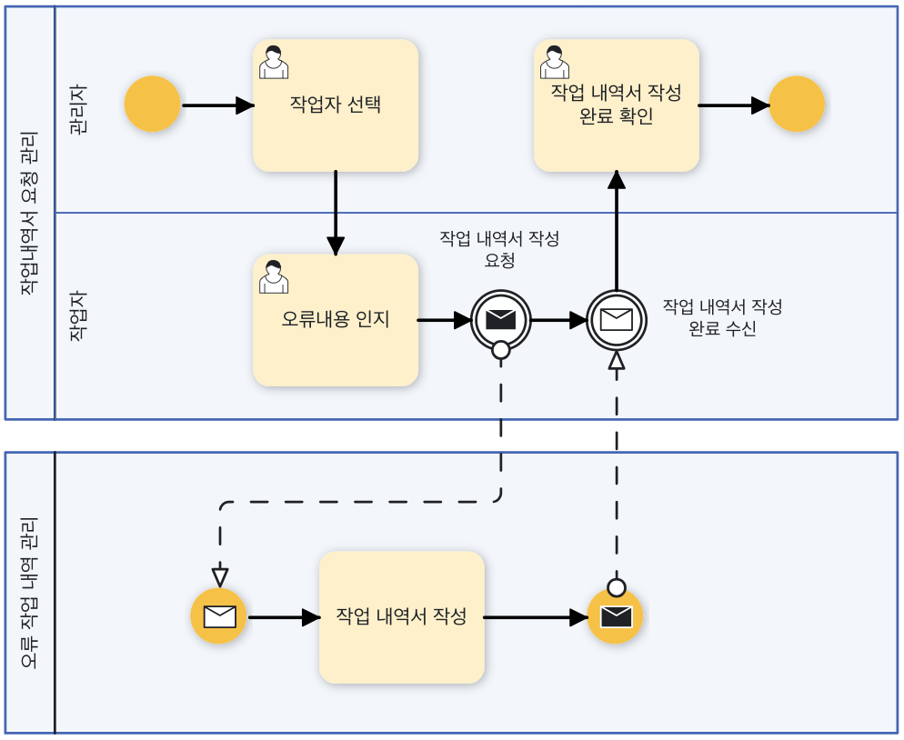

### 1.2 Timer events (타이머 이벤트)
타이머 이벤트는 정의된 시간 또는 주기에 따라서 이벤트 수신시 정의된 작업을 수행 후 다음 프로세스를 실행 시키는 이벤트 입니다. 프로세스에서 일정 시간을 기다리리거나 주기적으로 실행해야 할 업무가 있을 때 사용 됩니다.

- **Timer start event (타이머 시작 이벤트)**
  + 프로세스에서 1개 이상의 타이머 시작 이벤트를 가질수 있습니다. 시간 날짜 또는 시간의 주기 정의를 해야 합니다. 타이머 트리거 되면 인스턴스와 타이머 시작 이벤트가 활성화 됩니다.
- **Timer intermediate catch event (타이머 중간 수신 이벤트)**
  + 중간 수신 타이머는 시간 날짜 또는 지속시간 정의를 해야 합니다. 프로세스 해당 지점에서 멈추고, 트리거가 될때까지 대기합니다. 이벤트가 완료 후에는 프로세스가 계속 됩니다.
- **Timer boundary catch event (타이머 경계 수신 이벤트)**
  + 타이머 경계 수신 이벤트는 시간 날짜 또는 시간 기간 정의를 해야 합니다. 해당 이벤트는 TASK의 활동이 해당 정의된 타이머 트리거가 완료 되는 시점에 TASK도 완료 됩니다.

- **예시**
  + 타이머 이벤트를 이용하여 출근 하는 프로세스예시 입니다.
    - 매일 정해진 시간에 프로세스가 시작을 하고, 출근 시간 이후 30분 동안 출근체크를 안하면 출근을 요청하고, 출근시 완료 완료를 전달 하는 예시 프로세스 입니다.
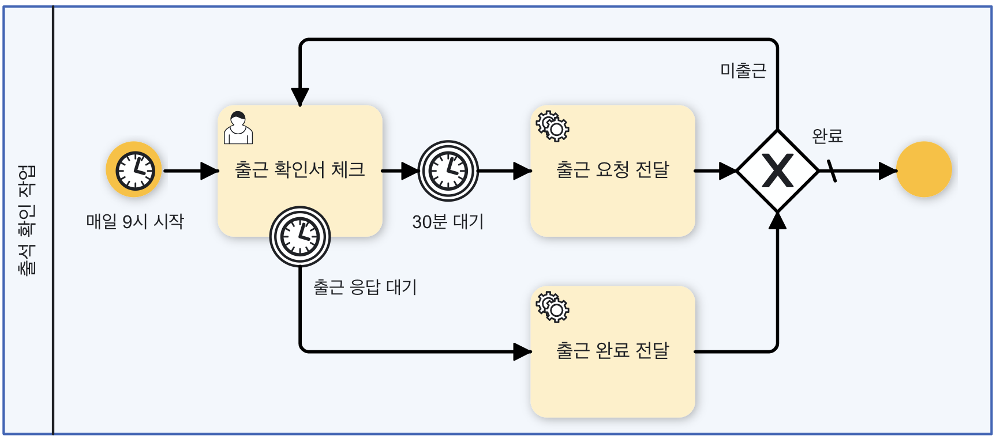

### 1.3 Compensation events (보상 이벤트)
보상 이벤트는 진행중인 프로세스에서 특정 작업을 이전으로 돌려 취소 해야 하는 경우에 사용됩니다. 정상적인 업무를 수행하였으나 이후 잘못된 흐름으로 인해 해당 업무를 취소시 해당 이벤트가 발생 하여 취소 작업으로 보상작업을 진행 합니다. 

- **Compensation intermediate throw event (보상 중간 발생 이벤트)**
  + 프로세스에서 진행중인 작업 중 취소 해서 보상이 필요한 작업을 진행 하기 위해서 해당 이벤트를 사용 합니다. 해당 이벤트를 통해서 보상 이벤트를 트리거하고, 보상 이벤트 완료시 다음 작업으로 진행합니다.
- **Compensation boundary catch event (보상 경계 수신 이벤트)**
  + 보상 중간 발생 이벤트에서 트리거 되어, 해당 이벤트가 수신 하여 보상 업무를 진행합니다. 보상 업무를 진행 완료후에 완료 되었다는 것을 알립니다. 
- **Compensation end event (보상 종료 이벤트)**
  + 종료 시점에서 보상 작업을 트리거하는 역할을 합니다. 프로세스가 종료될 때, 이전에 완료된 작업을 취소하거나 보상해야 할 필요가 있을 때 사용됩니다.
- **예시**
  + 상품을 구매시 우선적으로 상품의 재고를 보류하고 구매 완료 후 재고를 차감 하는 예시 프로세스 입니다. 그러나 결제하는 과정에서 취소시 재고를 차감하지 않고 재고를 보상 하는 예시 프로세스 입니다.
  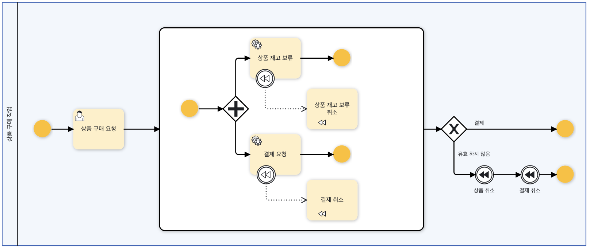

### 1.4 Error events (오류 이벤트)
오류 이벤트는 프로세스 진행중에 오류를 파악하여 이벤트를 전달 및 수신 하여 오류 처리를 위해 사용되는 이벤트 입니다.

- **Error boundary catch event (오류 경계 수신 이벤트)**
  + 오류 처리 이벤트를 수신을 기다리는 이벤트 이며, 프로세스 에서 전달 받은 오류 이벤트를 수신 하여 오류 처리 업무로 전달 합니다.
- **Error end event (오류 종료 이벤트)**
  + 프로세스에서 오류가 발생시 해당 이벤트를 발생및 종료 시켜 오류 처리를 알리는 이벤트 입니다.
- **예시**
  + 상품의 재고를 조회하는 과정에서 신상품및 등록되지 않은 상품 등을 조회할때 확인 불가 오류가 발생되면 직접 확인하는 예시 프로세스 입니다.
  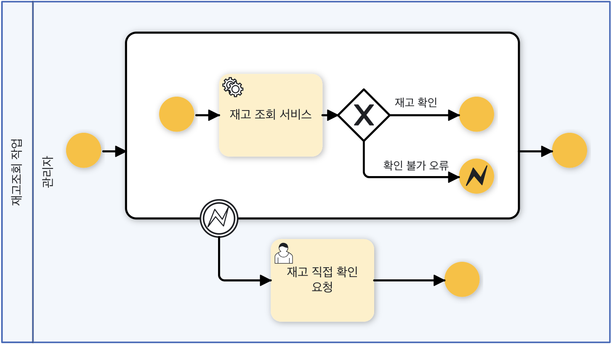

### 1.5 Signal events (신호 이벤트)
신호 이벤트는 프로세스 간에 신호를 보내거나 받는 데 사용됩니다. 브로드 캐스팅된 신호와 일치하는 모든 수신한 신호 이벤트가 트리거 할 수 있는 이벤트입니다. 특정조건이나 상태 변화에 따라서 알리기 위해 사용됩니다.

- **Signal start event (신호 시작 이벤트)**
  + 프로세스 시작시 신호시작 이벤트로 수신한 여러개의 신호이벤트를 트리거 할 수 있습니다.
- **Signal intermediate throw event (신호 중간 발생 이벤트)**
  + 수신하고 있는 신호를 발생 시킬 수 있도록 신호 발생 시키는 이벤트 입니다.
- **Signal intermediate catch event (신호 중간 수신 이벤트)**
  + 프로세스에서 해당 이벤트로 실행시 해당 지점에서 멈추고, 신호 수신를 대기 합니다. 해당 신호 수신후 이벤트가 완료되면 프로세스가 계속 됩니다. 
- **Signal boundary catch event (신호 경계 수신 이벤트)**
  + Task에는 1개 이상의 이벤트가 존재 할 수 있습니다. 해당 Task 실행시 신호 수신을 대기하고, Task에서 신호 발생시 해당 이벤트로 트리거 됩니다.
- **Signal end event (신호 종료 이벤트)**
  + 프로세스 종료 시점에 신호 종료 이벤트로 신호를 전송하고, 프로세스를 종료 합니다. 예로 들면, 프로세스 완료를 다른 프로세스에 알리는 작업을 진행 할 수 있습니다.
- **예시**
  + 판매자가 상품판매, 구매취소 요청, 사이즈교환 요청을 받아서 처리하는 예시 프로세스 입니다. 구매취소시 결제관리 부서에 요청을 하여 취소를 한 후 완료시 알림을 주는 작업을 하고, 사이즈 교환시 교환사이즈가 없으면 택배 배송을 요청하는 예시 프로세스 입니다.
  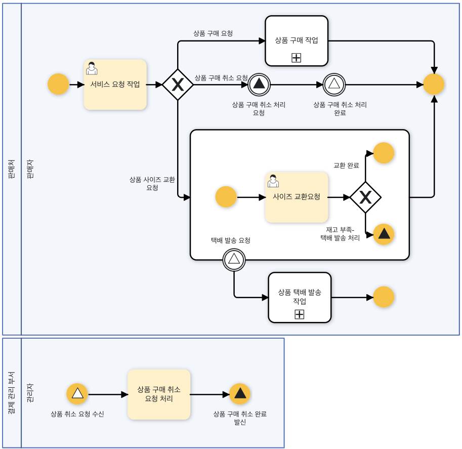

### 1.6 Conditional events (조건부 이벤트)
조건부 이벤트는 주어진 조건이 일치하는 경우에 트리거 되는 이벤트 입니다. 일반적으로 프로세스 변수나 외부 데이터에 기반하여 정의됩니다. 시작과 경계 이벤트는 중단 방식 및 비중단 방식 설정가능 하며, 기본적으로 중단 방식 입니다. 중단 방식은 기존 프로세스를 중지 하고 새로운 인스턴스를 생성하는 방식입니다. 비중단 방식은 기존 프로세스를 유지하고 새로운 인스턴스를 생성하는 방식입니다.

- **Conditional start event (조건부 시작 이벤트)**
  + 프로세스에서 1개 이상의 조건부 시작 이벤트를 가질 수 있습니다. 프로세스의 시작 시점에서 특정 조건이 충족될 때 프로세스를 시작합니다. 여러 조건부 시작 이벤트가 있을 수 있으며, 각 조건이 충족되면 해당 프로세스가 시작됩니다.
- **Conditional intermediate catch event (조건부 중간 수신 이벤트)**
  + 프로세스의 중간에서 특정 조건이 충족될 때까지 대기하고, 조건이 충족되면 프로세스를 계속 진행합니다.
- **Conditional boundary catch event (조건부 경계 수신 이벤트)**
  + Task에는 1개 이상의 해당 이벤트가 존재 할 수 있습니다. 해당 Task 실행시 수신 대기를 하며, 이벤트가 조건이 충족될 때 트리거됩니다.
- **예시**
  + 판매자가 재고관리를 위해서 100개 이하로 재고가 존재시 알림을 전송하거나, 자동으로 생산업체에 요청이 가도록 조건을 두어 처리하는 예시 프로세스 입니다.
  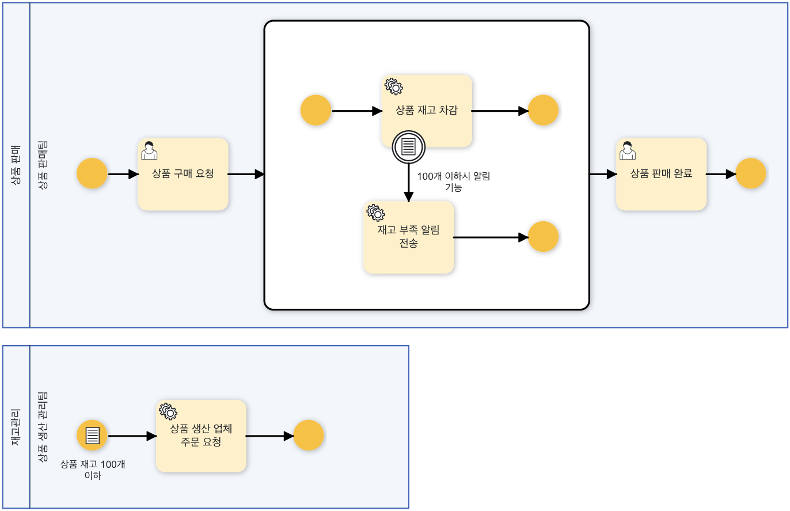

### 1.7 Link events (링크 이벤트)
링크 이벤트는 동일한 프로세스에서 분리된 섹션간에 연결 하는데 사용 할 수 있습니다. 링크 이벤트는 여러 발생 링크 이벤트가 하나의 수신 링크 이벤트로 연결될 수 있지만, 하나의 발생 링크 이벤트가 여러 수신 링크 이벤트로 연결될 수는 없습니다. 

- **Link intermediate throw event (링크 중간 발생 이벤트)**
  + 끝나는 지점에 링크 중간 발생 이벤트를 설정 하여, 수신 이벤트가 활성화 할 수 있도록 이벤트를 전달 합니다.
- **Link intermediate catch event (링크 중간 수신 이벤트)**
  + 발생 이벤트가 트리거 될 때 활성화 하여, 수신 이벤트을 호출 하여 프로세스를 연결 시키는 이벤트 입니다.
- **예시**
  + 의류를 만들기위한 프로세스로 디자인팀부터 검수팀까지 링크 이벤트를 통해서 연결 하는 예시 프로세스 입니다.
  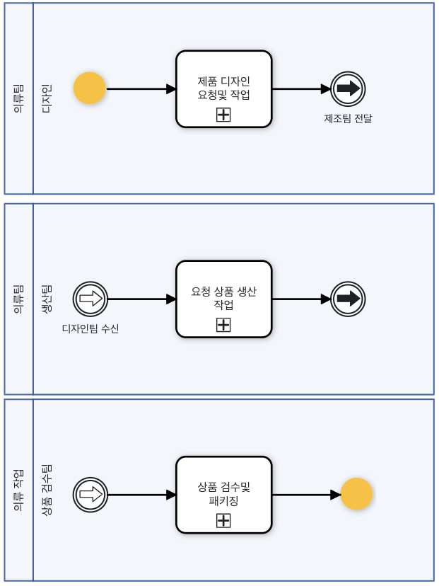

### 1.8 Terminate events (종료 이벤트)
종료 이벤트는 프로세스가 종료 이벤트에 도달 하면 종료 이벤트와 같은 흐름의 업무와 인스턴스는 종료 됩니다.

- **Terminate end event (종료 종료 이벤트)**
  + 프로세스가 종료 이벤트에 도달 하면 종료 이벤트와 같은 인스턴스는 종료 됩니다.
- **예시**
  + 쿠폰 판매처에서 자신이 발행한 쿠폰을 처리하기 위한 예시 프로세스 입니다.
  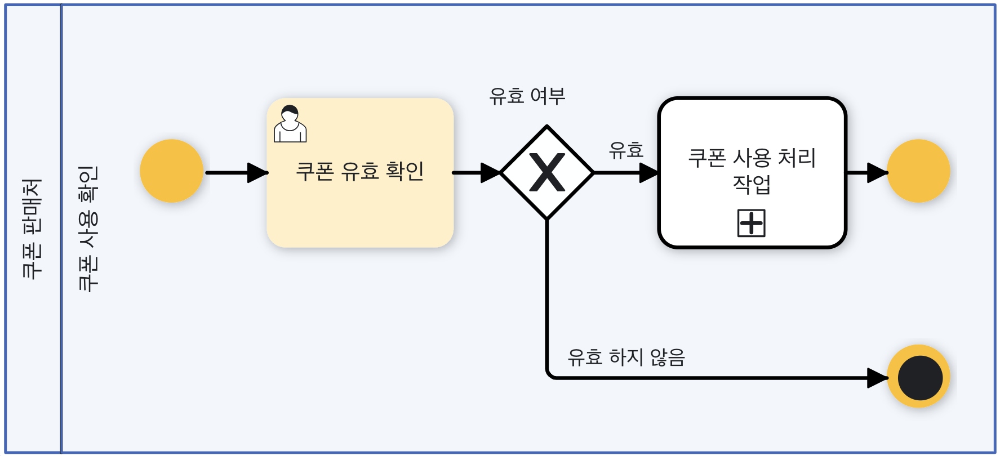

### 1.9 Escalation events (승급 이벤트)
승급 이벤트는 상위 프로세스와 통신하는데 사용됩니다. 오류 이벤트와 달리 프로세스 흐름에는 영향이 없이 상위 프로세스에 전달후 진행 됩니다.

- **Escalation intermediate throw event (승급 중간 발생 이벤트)**
  + 상위 프로세스 전달 하는 이벤트로 승급 이벤트를 코드로 전달 후 그대로 프로세스를 진행 합니다.
- **Escalation boundary catch event (승급 경계 수신 이벤트)**
  + 1개의 수신 이벤트만 정의 할 수 있습니다. 가장 가까운 발생 코드 이벤트를 수신하고, 수신 받은 이벤트의 흐름을 진행합니다.
- **예시**
  + 판매자가 재고부족으로 배송을 시키는데, 프로세스의 흐름에 영향이 없이 1일 이내 배송이 가능하면 배송을 시키고, 배송 지연 알림 메시지를 전달하는 예시 프로세스 입니다.
  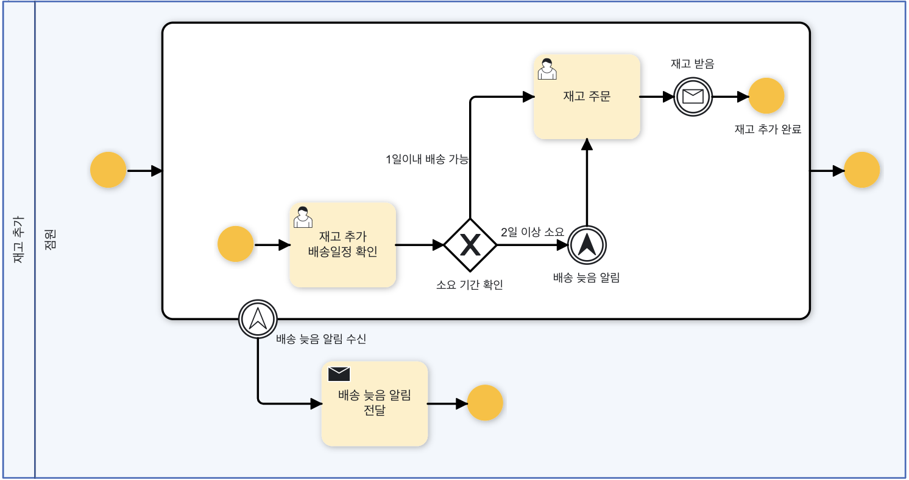
   	     
## 2. Tasks
Tasks는 프로세스의 작업을 수행하는 데 사용됩니다. 각 TASK는 특정한 작업을 수행하며, 실제 실행하는 단위로 모델링을 할 수 있습니다. 

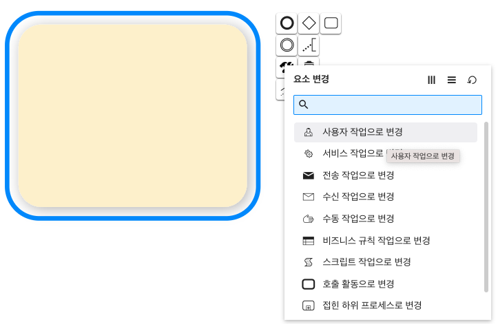
요소 변경에서 다양한 Tasks 요소를 변경 할 수 있습니다.

## Tasks 종류 및 설명
### 2.1 User task (사용자 작업)
- 사용자가 업무를 처리해야 하는 작업입니다. 사용자는 소프트웨어 및 자동화된 시스템을 이용하여 업무를 진행하며, 해당 작업이 도달하면 관련 역할자에게 작업 Todo 목록이 생성됩니다.

uEngine6 BPM에서는 User task 기능 3가지 형식으로 제공합니다.
- 기본 형식
  + 사용자가 설정되어 있는 속성값에 따라서 값을 입력하는 기본적인 형식입니다.
- 폼 형식
  + 특정 정해진 폼 형식을 작성하여, 폼형식에 맞게 사용자가 입력하는 방식입니다. 폼의 상세정보는 "[**폼 관리**](/bpm6-started/form-definition/)" 페이지에서 확인 할 수 있습니다.
- 외부 어플리케이션 형식
  + 외부 어플리케이션을 호출하여 업무를 진행하는 형식입니다. 외부 서비스를 iframe 형식으로 보여지며, 외부 서비스의 호출을 통해서 업무를 진행하는 형식입니다.

- **예시**
  + 기본형식: 사용자가 입력하는 속성값을 입력합니다.
  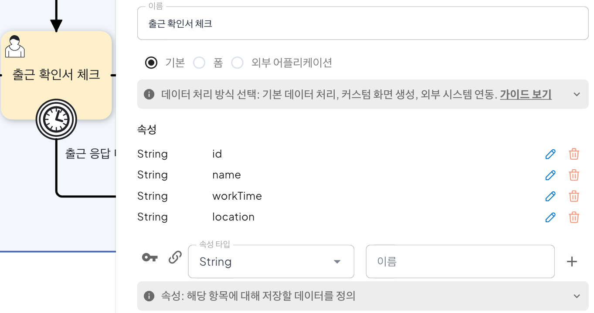
  + 폼 형식: 폼에서 정의를 한후에 정의된 폼 정보를 불러와 폼 선택시 해당 폼으로 설정이 됩니다.
  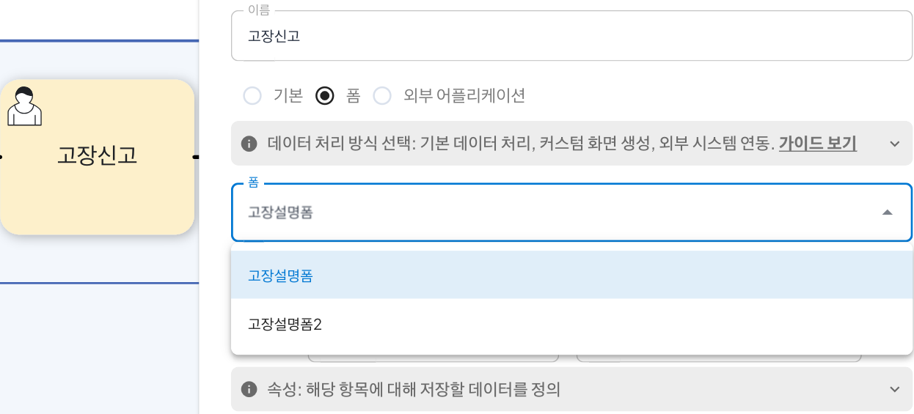
  + 외부 어플리케이션 형식: 외부 서비스의 URL입력을 한후, 외부 서비스에서 전달해 주는 속성값을 입력 하여 외부 서비스를 정보를 수신 합니다.
  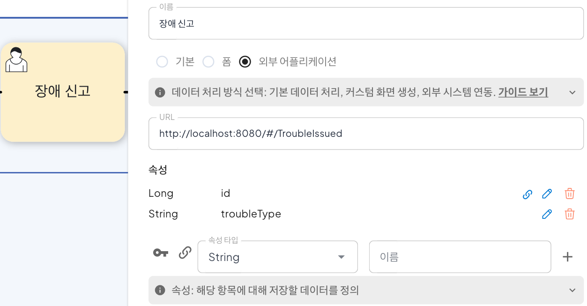

### 2.2 Service task (서비스 작업)
- 일반적으로 외부 시스템과 상호작용을 위해 사용 됩니다. 외부 서비스로 호출 하는 작업을 진행하고, 결과를 받아오는 작업을 진행합니다.
- **예시**
  + 외부 서비스에서 상품의 재고를 파악 하기 위해서 호출 결과 값을 result 값으로 받아오는 예시 프로세스 입니다.
  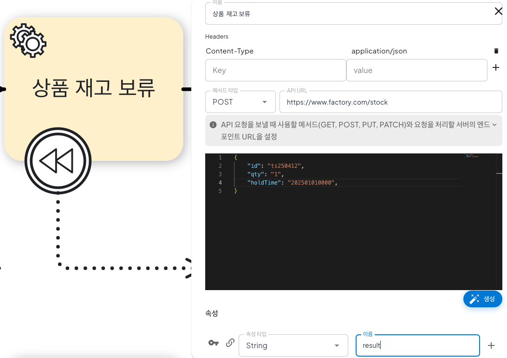

### 2.3 Script task (스크립트 작업)
- Javascript 나 Java 언어를 직접 액티비티에 설정하여 프로세스 설정만으로 처리하기 힘든 마이크로한 설정이나 액션을 실행가능하게 합니다.
- **예시**
  + 신상품을 출시 하기위해서 상품기준점을 정보를 이용하여, 스크립트 조건에 따른 결과 값을 "result" 변수에 값을 저장하는 예시 프로세스 입니다.
 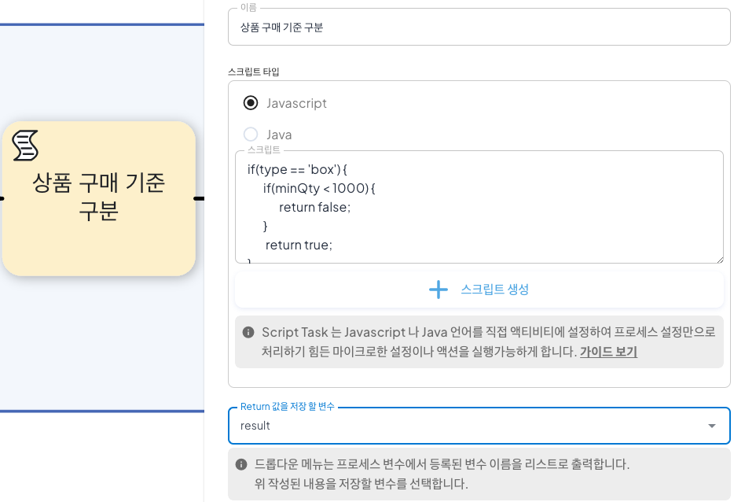

[Warn] Script Task 에 의존하여 너무 많은 로직을 작성하지 마십시오! 이후, 프로세스가 비대해지며 관리하기 힘들어지므로, 프로세스 정의로 가능한 설계하되 그것이 어려운 경우, 별도의 서비스로 개발하여 형상 관리하시기 바랍니다.

### 2.4 Send task (전송 작업)
- 일반적으로 외부 시스템에 메시지를 보내는데 사용됩니다. 메시지 전송에만 특화 되어 있으며, Service task와 동일한 방식으로 구현되지만, 전송에 중점을 둡니다.
- **예시**
  + 신상품을 구매완료후 외부서비스에 전달하여 외부서비스에서 처리할 수 있도록 하는 예시 프로세스 입니다.
  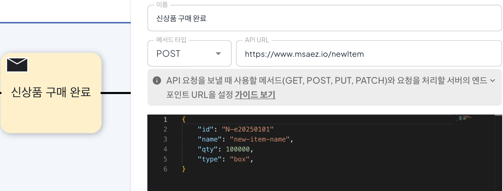

### 2.5 Receive task (수신 작업)
- 특정 메시지나 이벤트를 기다리는 작업으로 해당 메시지및 이벤트가 수신할 때 까지 진행을 멈추고 대기합니다. 메시지가 도달시 다음단계로 진행합니다.
- **예시**
  + 외부 서비스에서 등록 할때 까지 대기하며, 외부 서비스에서 수신 할 정보를 넣어서 수신 할 수 있도록 하는 예시 프로세스 입니다.
   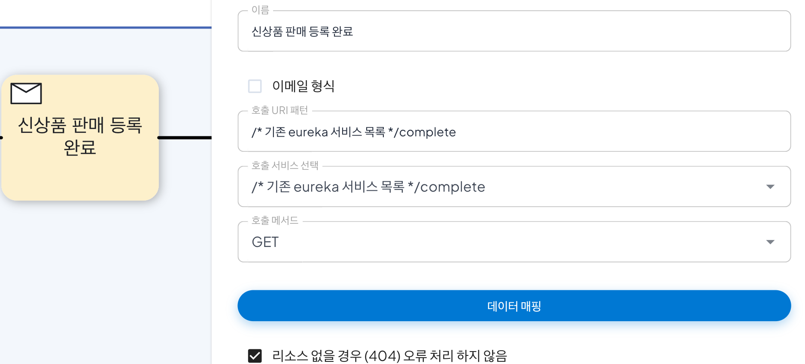

### 2.6 Manual task (수동 작업)
- 사람이 수동으로 작업 해야 할 업무를 나타냅니다. 소프트웨어및 자동화된 시스템등을 이용하지 않고 사람이 직접 작업을 수행 해야 할 경우 사용 됩니다. 예를 들어, 문서를 읽고 판단 하거나 특정 업무를 수행 해야 할 경우 사용 됩니다.
- **예시**
  + 실제로 신상품이 등록 되었는지 확인 하고 사람이 실제로 등록 되었는지 확인 하는 예시 프로세스 입니다.
  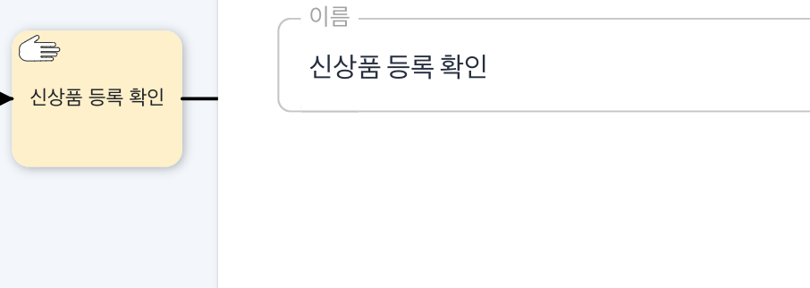

### 2.7 Business rule task (비즈니스 규칙 작업)
- 프로세스에서 비즈니스 규칙을 검증하고 실행합니다. 하나 이상의 비즈니스 규칙을 정하고 규칙에 따라 프로세스를 진행 합니다.
- **예시**
  + 회사의 내규의 구매 규칙에 따라서 구매 여부를 확인하는 예시 프로세스 입니다.
  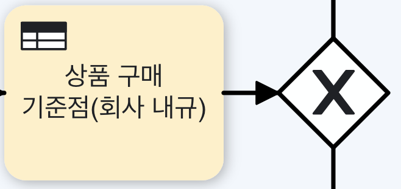

## 3. SubProcess
SubProcess는 프로세스 내의 특정 작업을 프로세스로 그룹화 하여 재사용성을 높이는 작업입니다. 반복되는 작업을 하위프로세스로 만들거나, 복잡한 프로세스를 작은 단위로 나누어서, 전체 프로세스의 가독성을 높일 수 있습니다.
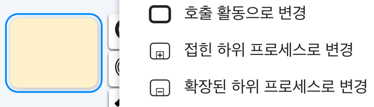
요소 변경에서 다양한 SubProcess 요소를 변경 할 수 있습니다.
## SubProcess 종류 및 설명
### 3.1 Embedded SubProcess (내장 하위 프로세스)
- 메인 프로세스에 포함되어 있으며, 외부에서는 독립적으로 호출 할 수 없는 내장 하위 프로세스 입니다. 해당 서브프로세스를 이용하여 동일한 작업을 반복적 작업을 할때 사용됩니다. 해당 프로세스는 메인프로세스에서만 실행됩니다.
- **예시**
  + 프로세스 내에서 반복적인 작업을 서브프로세스로 만들어 재사용할 수 있도록, 고장 신고를 처리하는 작업을 실행하는 예시 프로세스입니다.
  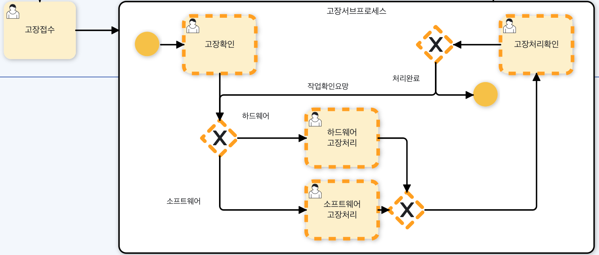
 
### 3.2 Call Activity (호출 활동)
- 외부에 정의된 프로세스를 호출 하여 실행합니다. 재사용이 가능한 프로세스로 여러 프로세스에서 동일하게 호출 하여 사용할 수 있습니다.
- **예시**
  + "구매 진행 작업"에서 회원 여부에 따라 동일한 작업을 진행할 때, 동일한 프로세스를 호출하여 반복적인 모델링 작업을 줄일 수 있습니다.
  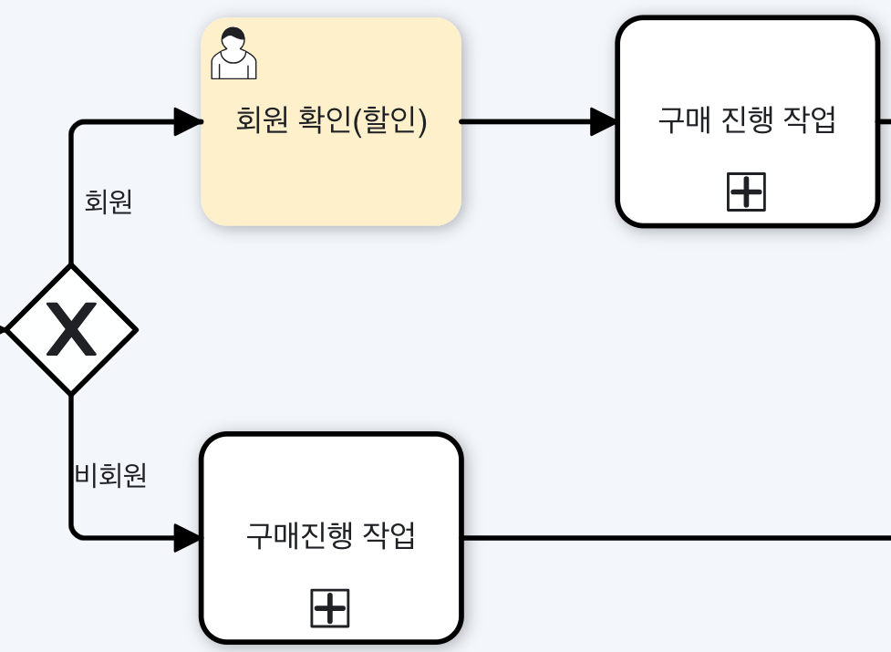

## 4. Gateways
Gateways는 프로세스의 흐름을 분기하거나 병합하는 데 사용됩니다. gateways는 프로세스의 실행경로를 제어하고 조건에 따라서 다른 경로를 진행시킬 수 있습니다. 또한 각 gateway에서 발신(나가는 선), 수신(들어오는 선)의 조건을 이용하여 프로세스의 흐름을 제어 할 수 있습니다. 상세한 정보는 [**조건 분기 처리**](/bpm6-started/conditional-branch/) 페이지를 참고 해주세요.
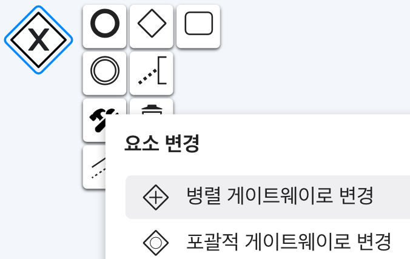
요소 변경에서 다양한 gateways 요소를 변경 할 수 있습니다.

## Gateways 종류 및 설명
### 4.1 Exclusive gateway (단독 게이트웨이)
- 여러개의 조건중에 일치하는 하나의 경로만 실행되며, 다른 경로는 무시됩니다. 2개 이상의 경로가 일치 할 때는 우선순위에 따라서 하나의 경로가 선택됩니다.
  + 발신: 조건에 따라서 일치하는 1개의 경로로 진행합니다.
  + 수신: 연결된 경로중 1개 수신시 다음 경로로 진행합니다.
- **예시**
  + 조건에 일치하는 1개의 부서에 진행하는 예시 프로세스 입니다.
  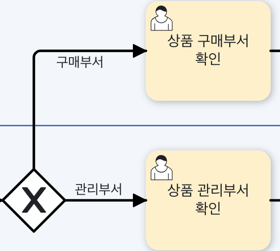

### 4.2 Parallel gateway (병렬 게이트웨이)
- 여러개의 경로를 동시에 실행됩니다. 병렬로 실행되는 경우 모든 경로가 완료되면 다음 경로로 진행합니다.
  + 발신: 조건이 없이 연결된 모든 경로로 병렬진행합니다.
  + 수신: 연결된 모든 경로가 완료되면 다음 경로로 진행합니다.
- **예시**
  + 2개의 부서에서 동시에 진행되는 예시 프로세스 입니다.
  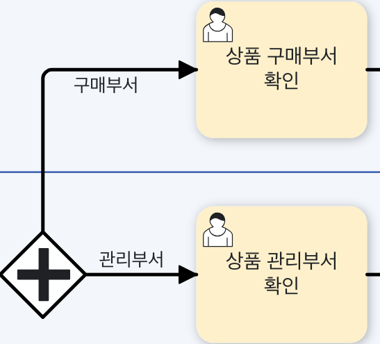

### 4.3 Inclusive gateway (포괄적 게이트웨이)
- 하나 이상의 경로가 선택 되어 한개 또는 여러개의 경로를 동시에 실행 될 수 있습니다. 병렬로 실행되는 경우 하나의 경로가 완료되면 다음 경로로 진행합니다. 
  + 발신: 조건에 따라서 일치하는 **1개 이상**의 경로로 진행합니다.
  + 수신: 연결된 경로중 1개 수신시 다음 경로로 진행합니다.
- **예시**
  + 조건에 일치하는 **1개 이상**의 부서에 진행하는 예시 프로세스 입니다.
  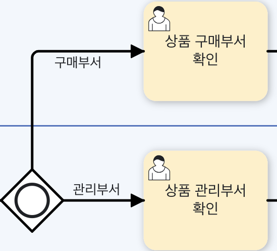

## 5. Pool & Lane
프로세스에서 Pool과 Lane을 사용하여 역할과 조직을 시각적으로 구분 하는데 사용됩니다. 또한 순서의 흐름을 통해서 책임과 역할을 이해 할 수 있습니다.

### 5.1 Pool
 - 일반적으로 조직이나 시스템을 나타내며, 프로세스가 수행되는 경계를 정의합니다.즉, 각 Pool은 독립적인 프로세스를 뜻하며, Pool에는 여러 개의 Lane이 존재할 수 있습니다.

### 5.2 Lane
 - 각 Lane은 특정 업무 단위나 역할을 구분하는 데 사용됩니다. Lane을 통해서 프로세스의 흐름을 시각적으로 구분 합니다.

 - **예시**
  + pool에는 보통 lane에 포괄하는 조직및 시스템을 뜻하여, "상품팀"이라는 조직을 넣고, 상품팀 하위의 역할자를 표시하는 예시 프로세스 입니다.
  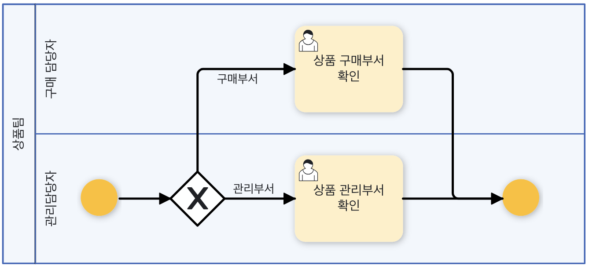