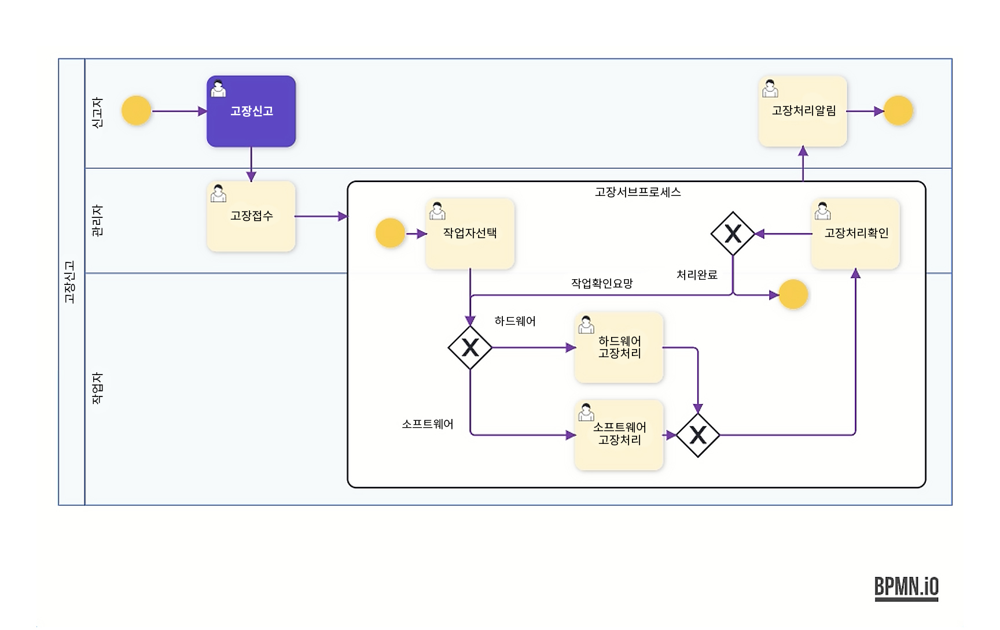
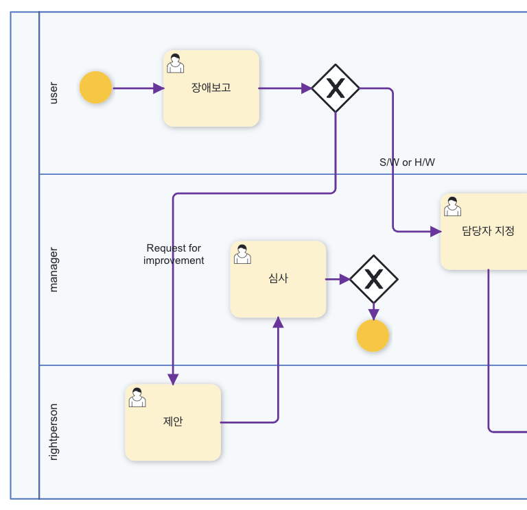
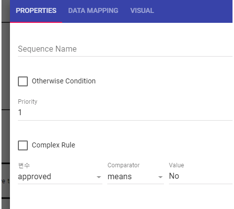
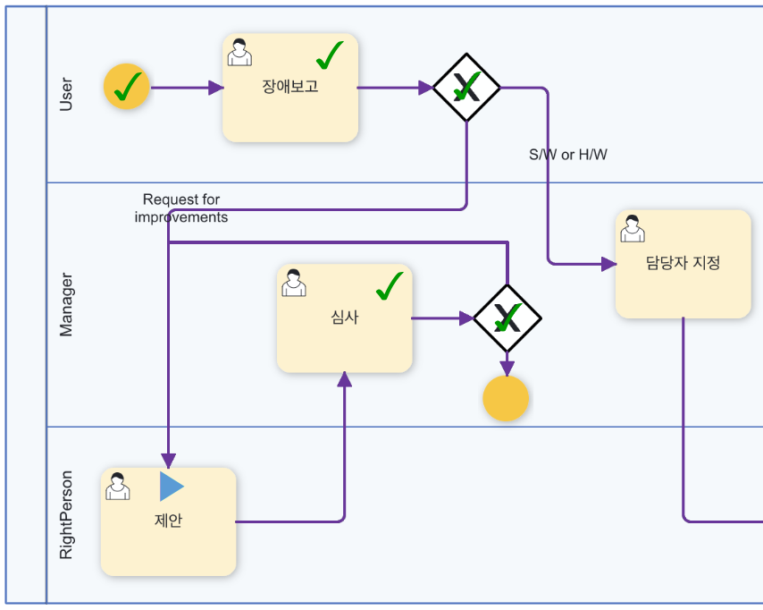
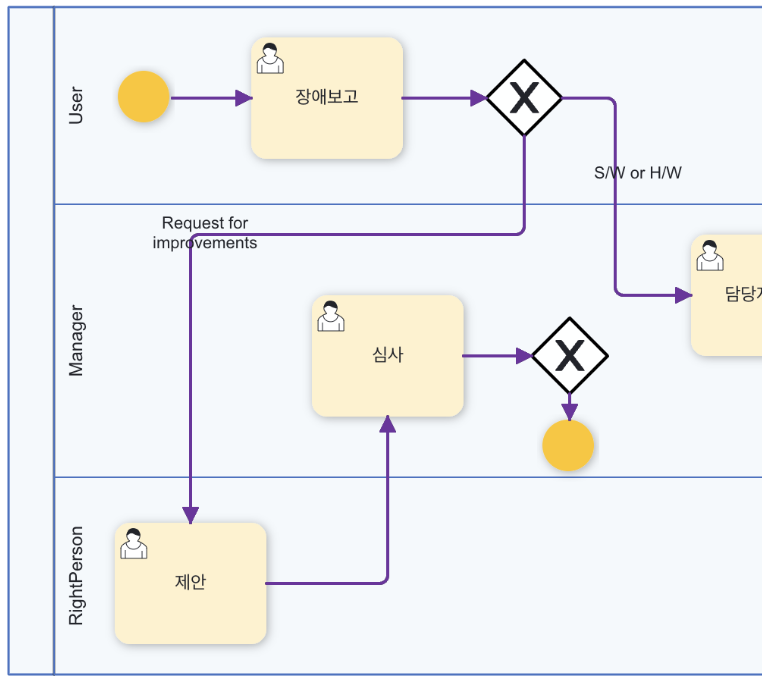
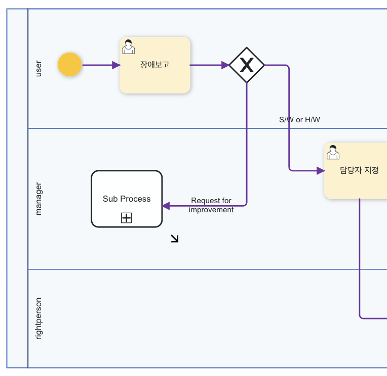
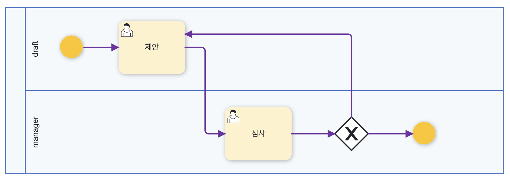
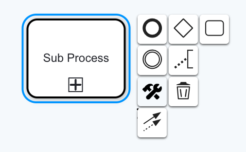

# 멀티플 인스턴스

## 서브 프로세스를 활용한 멀티플 인스턴스 처리

- 멀티플 인스턴스 적용 모델 예시

>

### 멀티플 인스턴스의 정의
실행 중에 어떠한 실행 구간의 개수가 정해지는 특성의 복잡한 프로세스 실행 기능

### 멀티플 인스턴스 지정 요령
멀티플 인스턴스 실행구간의 범위를 지정해주는 서브프로세스가 지원되고, 서브프로세스의 설정에 멀티플 인스턴스를 발생시키는 인자값 (배열값) 에 해당하는 프로세스 변수를 지정해주면, 해당 변수에 입력된 값의 개수만큼을 Parallel 혹은 Loop 방식으로 반복하여 멀티플 인스턴스를 동적으로 발생시켜 준다.

메인 프로세스 내부에 특정 업무에 해당하는 서브 프로세스를 배치하여 다양한 인스턴스를 처리하도록 하고 업무를 배분한다.

서브 프로세스 생성 시 ForEach Variable에 저장할 수 있는 변수를 추가하고 폼 매핑을 통해 멀티 데이터가 있는 항목을 해당 변수에 매핑한다.

## Loop 방식 적용 예시

이번 장에서는 사용자가 기능개선의 조건으로 진행한 경우 기능개선 내용을 제안할 수 있는 업무로 분기할 수 있도록 개선시켜 보자.

이때 개선조건이 충족될 때까지 반복하여 수행할 수 있도록 “반복흐름” 유형을 배워 보도록 하겠다.

>

>**그림 1) 최종 프로세스 화면**

조건 분기의 Case 2의 Request for improvement에서 앞 장에서

만든 빈 작업 액티비티를 삭제하고 사용할 기능개선제안

프로세스를 다음과 같이 작성한다.

Gateway액티비티를 먼저 설치한 후 일반사람 업무 액티비티

두 개를 추가하여 루프 안에 배치한다.

간단한 형태이므로 플로우 차트의 작성과정은 생략하도록 하겠다.

추가할 변수와 액티비티 별 변수 설정은 다음과 같다.

 

- 변수정의

>|프로세스 변수 ID|프로세스 변수 명칭(화면출력용)|데이터 형식|
>|------|---|---|
>|contents|contents|Text|
>|approved|approved|Yes or No|

 

- 액티비티 정의

>|액티비티|담당역할|Parameter|
>|------|---|---|
>|제안|Right person(테스터)|Contents|
>|심사|Trouble manager|Contents(→), approved|

 

- 반복흐름 액티비티 정의

>|조건 변수|조건|값|
>|------|---|---|
>|approved|==|No(Directvalue)|

>

>**그림 2) 반복 조건 설정**

이와 같이 설정한 후 저장하고 실행시켜 본다.

제안 승인 부분에서 approved 변수를 no를 선택하였을 경우

업무가 다시 반복됨을 확인할 수 있다.

>

>**그림 3) Loop 화면**

## 서브프로세스 적용 예시

**서브 프로세스의 정의(기능개선제안)**

사용자가 “기능개선”의 조건으로 진행한 경우 기능개선 내용을 제안할 수 있는 프로세스로 분기할 수 있도록 업무를 개선시켜 보겠다.

이를 위해 기능개선제안을 수행하는 단계를 단순히 [그림 A] 처럼 해당 조건 블록에 추가하는 것도 방법이지만 우리는 기능개선업무를 “서브 프로세스”라는 개념을 이용하여 [그림 B] 와 같이 그 프로세스의 정의를 분리하여 작업을 처리하도록 해 보겠다.

>

>**그림 A**

>

>**그림 B**

이렇게 서브프로세스를 활용할 경우 다음과 같은 장점이 있다.

- 1. 여러 메인 프로세스에서 서브 프로세스를 반복하여 재사용할 수 있다.
- 2. 크기가 큰 프로세스의 범위를 서브 프로세스로 쪼개어 쉽게 모니터링 될 수 있도록 조직화 할 수 있다.

먼저 예제에서 사용할 서브 프로세스를 작성하여 등록해 보겠다.

조건 분기의 Case 2의 Request for improvement에서 사용할

기능개선제안 프로세스를 다음과 같이 작성한다.

>

>**그림 1) 기능개선제안 프로세스**

흐름제어 메뉴 중에서 반복흐름 액티비티를 먼저 설치한 후

일반사람 업무 액티비티 두 개를 추가하여 루프 안에 배치한다.

간단한 형태이므로 플로우 차트의 작성과정은 생략하도록 하겠다.

참여자 정의와 액티비티 별 변수 설정은 다음과 같다.

 

- 참여자 정의

>|참여자 ID|참여자명칭(화면출력용)|
>|------|---|---|
>|Drafter|drafter|
>|Manager|Manager|

 

- 변수 정의

>|프로세수 변수 ID|프로세스 변수 명칭(화면출력용)|데이터 형식|
>|------|---|---|
>|contents|contents|Text|
>|approved|승인|Yes or No|

 

- 액티비티 정의

>|액티비티|담당역할|Parameter|
>|------|---|---|
>|제안|Drafter|contents|
>|심사|Manager|Contents(in), approved|

 

- 반복흐름 액티비티 정의

>|조건 변수	|조건|값|
>|------|---|---|
>|approved|==|No(Directvalue)|

 

이와 같이 설정한 후 저장하여 실행시킨다.

**3.2 서브 프로세스의 설정**

기존의 액티비티 파렛트에서 제어 -> 서브프로세스를 클릭하여

두 번째 분기점에 끌어다 놓고 기존의 빈 작업은 삭제한다.

>

>**그림 2) 서브프로세스 정의**

- 서브 프로세스 기본 속성 설정

이제 이 서브프로세스의 속성을 설정해 보도록 하겠다.

‘프로세스 정의’ 속성의 프로세스 정의 버튼을 클릭하면

현재 프로세스 매니저상에 등록된 프로세스들의 리스트가 나온다.

만들어 놓은 서브프로세스를 지정한다.

>

>**그림 3) 서브프로세스 지정**