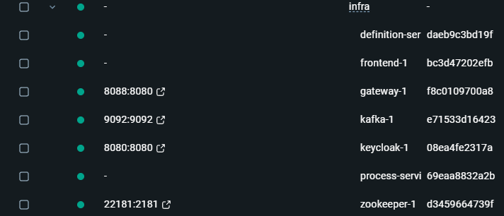

# 실행환경 구성

## uEngine을 Docker에 올려서 실행시키기

Docker에 uEngine을 올려서 실행하려면 다음 단계를 따르세요:

1. **프로젝트 클론**: GitHub에서 uEngine 프로젝트를 클론합니다.
    ```sh
    git clone https://github.com/uengine-oss/uEngine6.git
    ```
2. **디렉토리 이동**: 클론한 프로젝트의 루트 디렉토리로 이동합니다.
    ```sh
    cd uengine
    ```
3. **Docker Compose 실행**: Docker Compose를 사용하여 uEngine을 실행합니다. 이때, `infra` 폴더에 있는 Docker Compose 파일을 사용합니다.
    ```sh
    # Docker Compose
    cd infra
    docker compose up
    ```
    이 명령어는 `infra` 폴더에 정의된 모든 서비스를 시작합니다.
4. **실행 확인**:
실행이 완료되면 다음 이미지와 같이 uEngine과 관련된 docker image가 실행됩니다.




5. **uEngine 종료**: uEngine을 종료하려면 다음 명령어를 사용합니다.
    ```sh
    docker compose down
    ```

