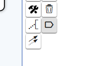
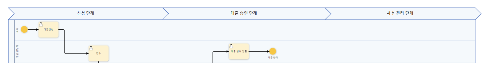

### 페이즈(Phase)란?

BPMN에서 페이즈(Phases)는 비즈니스 프로세스를 논리적이고 구조화된 단계로 구분하여, 복잡한 워크플로우를 명확하고 체계적으로 표현하는 방법입니다.

### 페이즈 표시 기능 소개

페이즈 표시 기능은 프로세스 정의에서 각 프로세스 단계를 시각적으로 구분하여 표시하는 기능입니다. 이를 통해 프로세스 진행 단계를 한눈에 확인할 수 있으며, 복잡한 프로세스에서도 흐름을 쉽게 이해할 수 있도록 도와줍니다.

#### 페이즈 추가 기능

[이미지-1]: 페이즈 추가 버튼

프로세스에 새로운 페이즈를 추가하는 기능입니다.

사용자는 이 버튼을 클릭하여 원하는 위치에 새로운 페이즈를 생성할 수 있습니다.

#### 페이즈 표시 예시

[이미지-2]: 적용된 페이즈

프로세스 내에서 페이즈가 적용된 모습을 보여줍니다.

각 단계가 시각적으로 구분되며, 프로세스의 흐름을 명확하게 파악할 수 있습니다.

