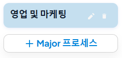
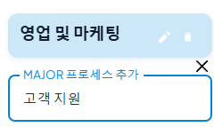
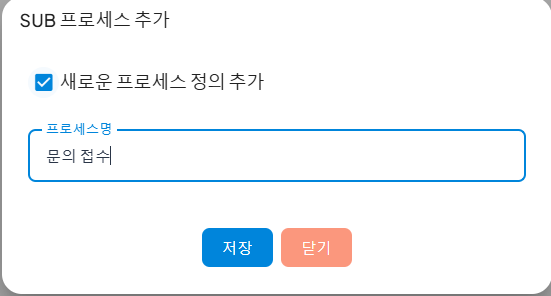
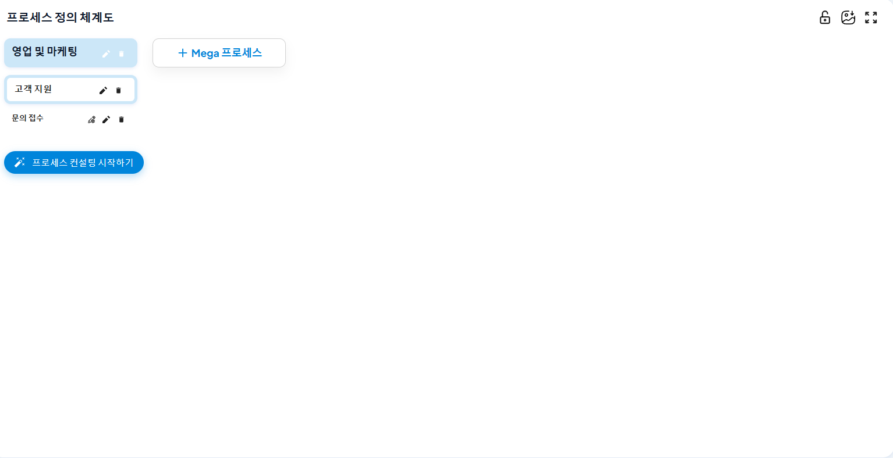
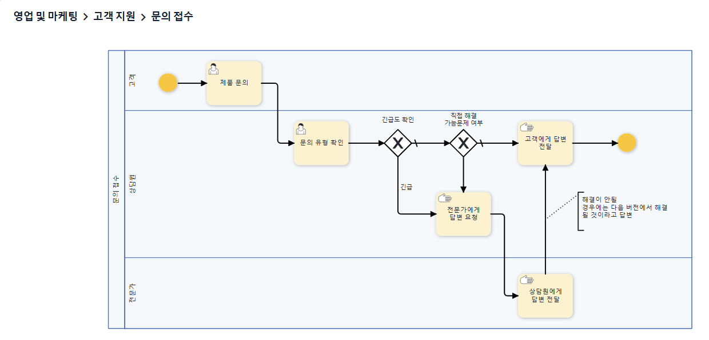

# 프로세스 정의 체계도 작성 방법

### 작성 방법

1. **잠금 해제**  
   - 프로세스 정의 체계도를 편집하려면 상단의 잠금 해제 버튼을 클릭하여 수정 가능한 상태로 만듭니다.  
   - **[이미지-2]**: 잠금 해제 버튼
   

2. **MEGA 프로세스 추가**  
   - 체계도에서 `MEGA 프로세스 추가` 버튼을 클릭하여 최상위 프로세스를 생성합니다.  
   - 생성된 MEGA 프로세스 안에서 추가 세부 프로세스를 정의할 수 있습니다.  
   - **[이미지-3]**: MEGA 프로세스 추가 버튼과 실행 화면  
   
   
   
   

3. **MAJOR 프로세스 추가**  
   - MEGA 프로세스 내부에서 `MAJOR 프로세스 추가` 버튼을 클릭합니다.  
   - MAJOR 프로세스는 중간 단계의 프로세스를 나타내며, 하위 프로세스 추가를 지원합니다.  
   - **[이미지-4]**: MAJOR 프로세스 추가 버튼과 실행 화면  
   
   

   

4. **SUB 프로세스 추가**  
   - MAJOR 프로세스 내부에서 `SUB 프로세스 추가` 버튼을 클릭합니다.  
   - 팝업 창에서 새로운 프로세스 정의를 체크한 후 프로세스명을 입력합니다.  
   - `저장` 버튼을 클릭하면 SUB 프로세스가 생성됩니다.  
   - **[이미지-5]**: SUB 프로세스 추가 팝업 화면  
   
   

   

5. **프로세스 정의 완료**  
   - 프로세스 정의가 완료되면 체계도 상단의 `저장` 버튼을 클릭하여 프로세스 정의를 저장합니다.  
   - **[이미지-6]**: 프로세스 정의 완료 화면  
   
   

6. **프로세스 확인**  
   - 프로세스 정의가 완료되면 체계도 상단의 `프로세스 확인` 버튼을 클릭하여 프로세스 정의를 확인합니다.  
   - **[이미지-7]**: 프로세스 확인 화면  
   
   
