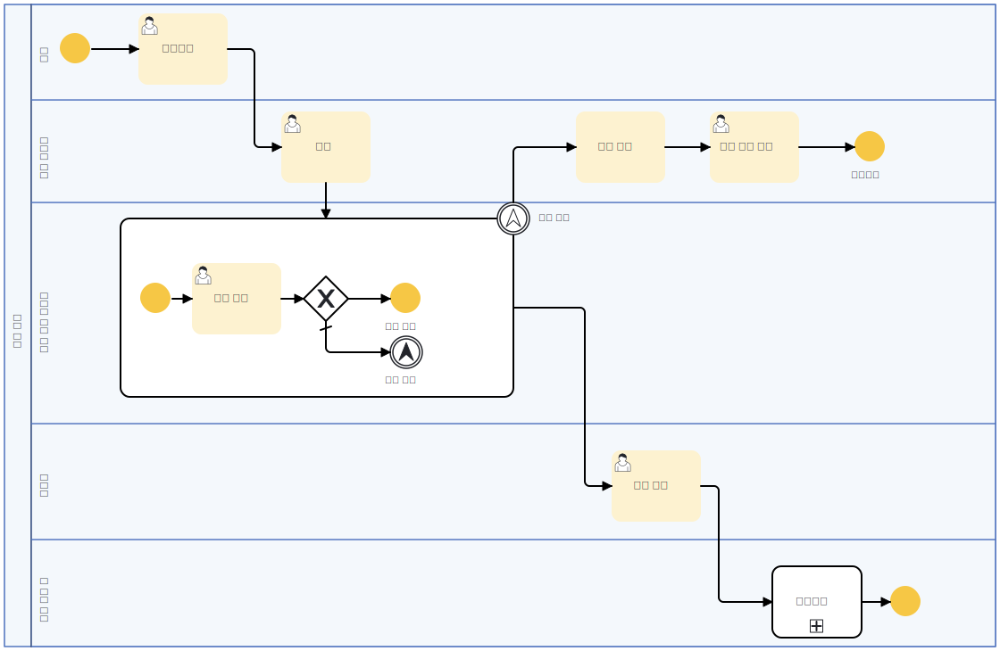
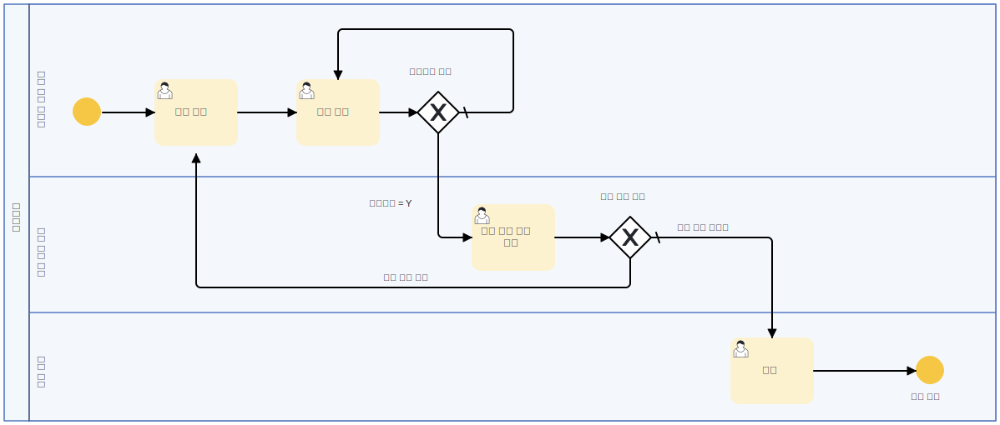

### 콜 액티비티(Call Activity)의 활용

이 다이어그램은 앞서 정의된 대출 프로세스에서 호출된 **사후 관리(Call Activity)** 프로세스입니다. 대출 실행 이후 발생하는 연체 여부 확인, 유예 요청 처리 및 추심 절차를 포함하고 있으며, 콜 액티비티를 통해 별도의 프로세스로 관리됩니다.

#### 콜 액티비티(Call Activity)란?
- **콜 액티비티**는 다른 프로세스를 하위 프로세스로 호출하여 실행하는 BPMN 요소입니다.
- 상위 프로세스와 분리하여 독립적으로 실행될 수 있으며, 여러 프로세스에서 공통적으로 사용할 수 있습니다.
- **유지보수성과 재사용성을 높이는 역할**을 하며, 특정 업무 로직을 모듈화하는 데 유용합니다.

#### 이 프로세스에서의 콜 액티비티 역할
- 대출 실행 이후 **사후 관리 프로세스를 별도로 실행**하기 위해 콜 액티비티를 사용하였습니다.
- 주요 기능:
  1. **서류 관리** - 대출 실행 이후 필요한 문서를 정리합니다.
  2. **연체 확인** - 고객의 대출 연체 여부를 점검합니다.
  3. **연체 여부 판단** - 연체가 발생하면 후속 절차를 진행합니다.
  4. **상환 유예 요청 처리** - 고객이 상환 유예를 요청한 경우 이에 대한 프로세스를 수행합니다.
  5. **추심 절차 진행** - 연체되었으나 유예 요청이 없는 경우, 추심을 진행합니다.

#### 콜 액티비티를 활용한 장점
1. **독립적인 관리**  
   - 대출 실행 프로세스와 사후 관리 프로세스를 분리하여 유지보수성을 향상시킵니다.
   
2. **재사용 가능**  
   - 여러 대출 상품에 동일한 사후 관리 절차를 적용할 수 있습니다.

3. **변경 용이성**  
   - 사후 관리 프로세스가 변경될 경우, 콜 액티비티를 수정하면 모든 연관 프로세스에 적용됩니다.

이처럼 콜 액티비티를 활용하면 특정 프로세스를 반복적으로 사용하면서도 독립적으로 유지할 수 있어 BPMN 기반 프로세스 설계에서 매우 유용한 기능을 제공합니다.

