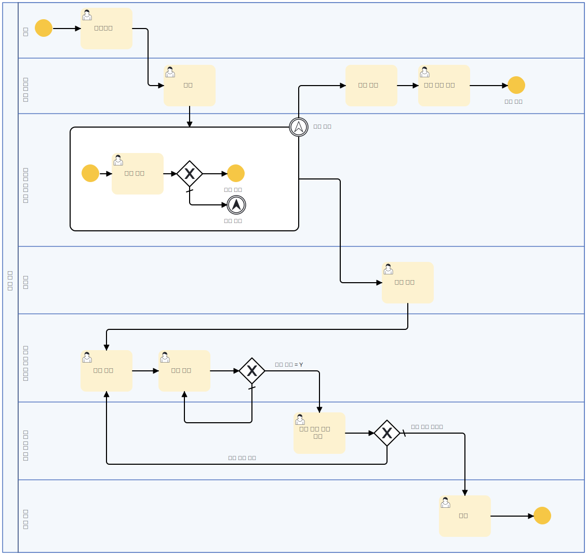
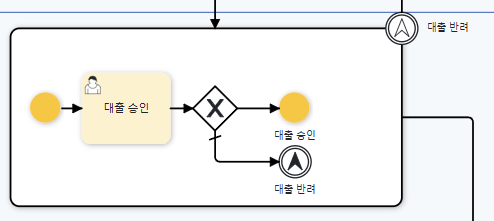

### 서브 프로세스를 활용한 프로세스 작성

이 프로세스에서는 **서브 프로세스**를 활용하여 대출 승인 프로세스를 보다 체계적이고 효율적으로 처리할 수 있도록 구성하였습니다.  

#### 프로세스 동작 원리

- 대출 승인 프로세스 부분에서 결재자가 많아질 경우 반복되는 결재 절차를 하나의 서브 프로세스로 구성하였습니다.
- 결재 과정에서 한 명이라도 대출 반려를 하게 될 경우에는 대출 승인 프로세스를 종료하고 대출 반려 프로세스로 이동합니다.

#### 서브 프로세스의 역할
- 대출 승인 과정에서 **반복적으로 수행되는 승인 절차를 하나의 서브 프로세스로 구성**하여 관리가 용이하도록 하였습니다.
- 승인 및 반려 여부를 결정하는 주요 프로세스를 **독립적인 단위로 분리**하여, 여러 프로세스에서 동일한 승인 절차를 재사용할 수 있습니다.
- 변경 사항이 발생할 경우, 서브 프로세스만 수정하면 되어 **프로세스 유지보수성을 향상**시킬 수 있습니다.

이를 통해 사용자에게는 **보다 일관된 승인 절차 제공**, **처리 속도 향상**, **업무 효율성 증대** 등의 효과를 줄 수 있습니다.
