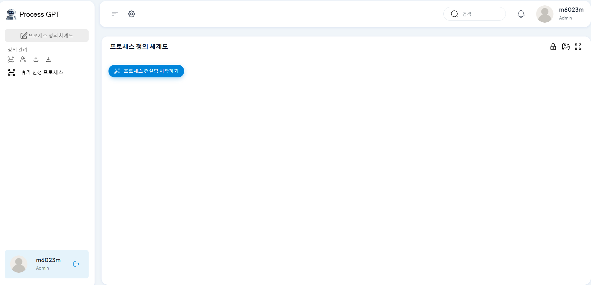

# PAL 개요 및 목적

PAL (Process Asset Library)은 조직 내 프로세스 자산을 체계적으로 관리하고 공유하기 위한 도구입니다. PAL은 BPMN 체계도를 통해 복잡한 프로세스를 시각화하고, 조직 구성원들이 프로세스 구조와 세부 정보를 효율적으로 이해할 수 있도록 돕습니다.

**1. PAL의 주요 목적:**

- 프로세스 자산의 중앙 집중화 및 재사용성 향상  
- 전체 프로세스 구조의 시각적 이해 제공  
- 프로세스 관리 효율성 증대 및 협업 강화  

PAL을 통해 조직은 표준화된 프로세스를 유지하며, 구성원들이 각자의 역할과 책임을 명확히 이해할 수 있습니다.

**[이미지-1]**: PAL 메인 화면 예시
