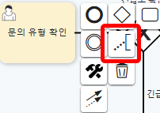
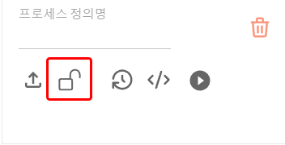

### 프로세스 편집

#### 편집 방법

1. **프로세스 불러오기**  
   - BPMN 메뉴에서 기존에 저장된 프로세스를 선택하여 불러오거나 프로세스 정의 체계도에서 수정 버튼을 누릅니다.  
   - **[이미지-6]**: 프로세스 편집 화면
   
   

2. **프로세스 편집**  
   - BPMN 표준에 맞게 프로세스 다이어그램을 수정합니다.  
   - **[이미지-7]**: BPMN 요소 수정 화면  
   
   

3. **Description 사용**  
   - 각 프로세스의 Description 필드를 활용하여 전반적인 설명을 기록할 수 있습니다.  
   - Description 필드에 프로세스의 목적, 주요 사항, 실행 지침 등을 작성합니다.  
   - Description은 저장된 XML 파일에 함께 기록됩니다.  
   - **[이미지-9]**: Description 필드 입력 화면  

   

   <!--  -->

   

   

4. **태스크에 파일 첨부**  
   - 각 태스크에 파일을 첨부하여 관련 문서를 함께 관리할 수 있습니다.  
     - 태스크를 선택합니다.  
     - 속성 창에서 `파일 첨부` 옵션을 클릭합니다.  
     - 첨부할 파일을 선택합니다.  
     - 파일이 첨부된 상태로 저장됩니다.  
   - **[이미지-10]**: 태스크에 파일 첨부 과정 화면  

   

8. **변경사항 저장**  
   - 수정 후 `저장` 버튼을 클릭하여 변경 사항을 저장합니다.  
   - **[이미지-11]**: 변경 사항 저장 버튼과 확인 화면  

   

   

   