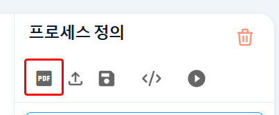

### 프로세스 정의 PDF 저장 방법

#### BPMN 전체를 PDF로 저장 방법

   - 프로세스 정의 PDF를 저장하려면 상단의 저장 버튼을 클릭하면 이미지 저장용 미리보기를 할 수 있습니다.  
   
   - **[이미지-1]**: 저장 버튼  
     - 프로세스 정의를 이미지로 저장하기 위해 사용하는 버튼입니다.  

     

   - **[이미지-2]**: 미리보기 화면  
     - 저장 버튼을 클릭하면 저장 가능한 미리보기가 제공됩니다.  

     

   - **[이미지-3]**: PDF로 변환하는 버튼  
     - BPMN 프로세스를 PDF 파일로 변환하여 저장할 수 있습니다.  

     

   - **[이미지-4]**: 로딩 이미지  
     - PDF 변환 중에 표시되는 로딩 이미지를 보여줍니다.  

     

   - **[이미지-5]**: PDF로 변환한 파일  
     - 변환된 PDF 파일을 확인할 수 있습니다.  

     

#### BPMN 태스크 패널 PDF 저장 방법

   - 태스크 패널을 PDF로 저장하려면 하단의 PDF 저장 버튼을 클릭하면 이미지 저장용 미리보기를 할 수 있습니다.  

   - **[이미지-1]**: PDF 저장 버튼  
     - 태스크 패널을 PDF 파일로 변환하여 저장할 수 있습니다.  

     

   - **[이미지-2]**: 미리보기 화면  
     - PDF 저장 버튼을 클릭하면 저장 가능한 미리보기가 제공됩니다.  

     
     
   - **[이미지-3]**: PDF로 변환하는 버튼  
     - BPMN 프로세스를 PDF 파일로 변환하여 저장할 수 있습니다.  

     

   - **[이미지-4]**: 로딩 화면  
     - PDF 저장 버튼을 클릭한 후, 저장 과정에서 표시되는 로딩 화면입니다.  

     

   - **[이미지-5]**: PDF로 변환한 파일  
     - 변환된 PDF 파일을 확인할 수 있습니다.  

     

