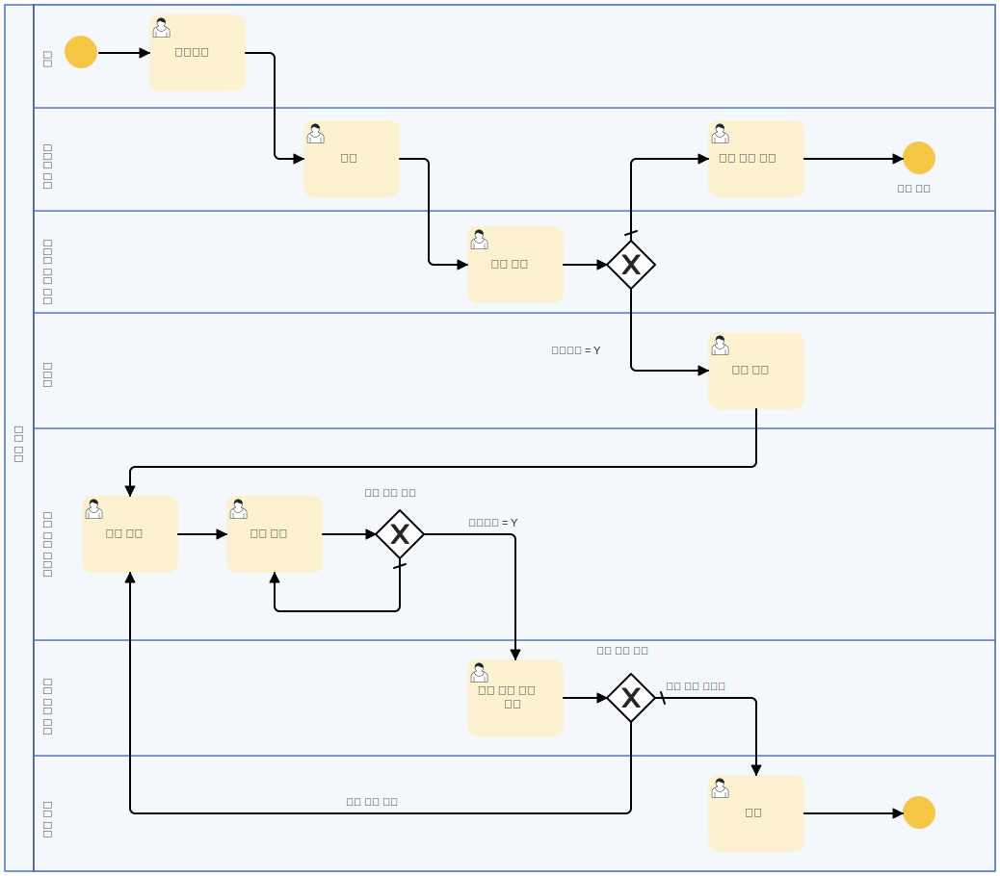

---

description: '서브 프로세스를 활용한 프로세스 작성'
sidebar: 'getting-started'

---

### 여신관리 프로세스

아래 프로세스는 uEngine6 프로세스 모델러를 활용해서 대출 승인 및 실행 과정을 모델링하는 방법을 설명합니다. 이 다이어그램은 대출 신청부터 실행, 연체 확인, 그리고 추심까지의 흐름을 보여줍니다.

#### 프로세스 개요
이 프로세스는 여신 관리 프로세스에 대해 설명하는 부분입니다. 대출이 어떻게 접수되고, 승인되며, 실행되는지에 대한 흐름을 설명합니다. 주요 단계는 다음과 같습니다:

1. **대출 신청**: 고객이 대출을 신청합니다.
2. **접수**: 담당 부서에서 신청을 접수합니다.
3. **대출 승인 여부 결정**: 승인되면 실행, 거절되면 종료됩니다.
4. **대출 실행 후 연체 여부 확인**: 대출 실행 후 일정 기간마다 연체 여부를 확인합니다.
   - 연체 발생 시: 추가적인 관리가 필요합니다.
   - 연체가 없으면: 정상적으로 유지됩니다.

#### 프로세스 흐름 상세 설명
1. 고객이 대출을 신청하면, 이를 담당 부서에서 접수합니다.
2. 심사를 거쳐 대출 승인 여부가 결정됩니다.
3. 승인된 경우 대출이 실행되며, 이후 일정 주기로 연체 여부를 확인합니다.
4. 연체가 발생하면, 서류 검토 후 연체 여부를 다시 확인합니다.
   - 연체가 지속되면 추심 요청이 진행됩니다.
   - 연체가 해결되면 정상 흐름을 유지합니다.
5. 연체 상태가 계속되면 최종적으로 추심 절차가 진행됩니다.

이 문서를 참고하여 uEngine6에서 대출 프로세스를 구성하고, 필요에 따라 조정해보세요.

### 서브 프로세스를 활용한 프로세스 작성

이 프로세스에서는 **서브 프로세스**를 활용하여 대출 승인 프로세스를 보다 체계적이고 효율적으로 처리할 수 있도록 구성하였습니다.

#### 프로세스 동작 원리

- 대출 승인 프로세스 부분에서 결재자가 많아질 경우 반복되는 결재 절차를 하나의 서브 프로세스로 구성하였습니다.
- 결재 과정에서 한 명이라도 대출 반려를 하게 될 경우에는 대출 승인 프로세스를 종료하고 대출 반려 프로세스로 이동합니다.

#### 서브 프로세스의 역할
- 대출 승인 과정에서 **반복적으로 수행되는 승인 절차를 하나의 서브 프로세스로 구성**하여 관리가 용이하도록 하였습니다.
- 승인 및 반려 여부를 결정하는 주요 프로세스를 **독립적인 단위로 분리**하여, 여러 프로세스에서 동일한 승인 절차를 재사용할 수 있습니다.
- 변경 사항이 발생할 경우, 서브 프로세스만 수정하면 되어 **프로세스 유지보수성을 향상**시킬 수 있습니다.

이를 통해 사용자에게는 **보다 일관된 승인 절차 제공**, **처리 속도 향상**, **업무 효율성 증대** 등의 효과를 줄 수 있습니다.

### 콜 액티비티(Call Activity)의 활용

이 다이어그램은 앞서 정의된 대출 프로세스에서 호출된 **사후 관리(Call Activity)** 프로세스입니다. 대출 실행 이후 발생하는 연체 여부 확인, 유예 요청 처리 및 추심 절차를 포함하고 있으며, 콜 액티비티를 통해 별도의 프로세스로 관리됩니다.

#### 콜 액티비티(Call Activity)란?
- **콜 액티비티**는 다른 프로세스를 하위 프로세스로 호출하여 실행하는 BPMN 요소입니다.
- 상위 프로세스와 분리하여 독립적으로 실행될 수 있으며, 여러 프로세스에서 공통적으로 사용할 수 있습니다.
- **유지보수성과 재사용성을 높이는 역할**을 하며, 특정 업무 로직을 모듈화하는 데 유용합니다.

#### 이 프로세스에서의 콜 액티비티 역할
- 대출 실행 이후 **사후 관리 프로세스를 별도로 실행**하기 위해 콜 액티비티를 사용하였습니다.
- 주요 기능:
  1. **서류 관리** - 대출 실행 이후 필요한 문서를 정리합니다.
  2. **연체 확인** - 고객의 대출 연체 여부를 점검합니다.
  3. **연체 여부 판단** - 연체가 발생하면 후속 절차를 진행합니다.
  4. **상환 유예 요청 처리** - 고객이 상환 유예를 요청한 경우 이에 대한 프로세스를 수행합니다.
  5. **추심 절차 진행** - 연체되었으나 유예 요청이 없는 경우, 추심을 진행합니다.

#### 콜 액티비티를 활용한 장점
1. **독립적인 관리**  
   - 대출 실행 프로세스와 사후 관리 프로세스를 분리하여 유지보수성을 향상시킵니다.
   
2. **재사용 가능**  
   - 여러 대출 상품에 동일한 사후 관리 절차를 적용할 수 있습니다.

3. **변경 용이성**  
   - 사후 관리 프로세스가 변경될 경우, 콜 액티비티를 수정하면 모든 연관 프로세스에 적용됩니다.

이처럼 콜 액티비티를 활용하면 특정 프로세스를 반복적으로 사용하면서도 독립적으로 유지할 수 있어 BPMN 기반 프로세스 설계에서 매우 유용한 기능을 제공합니다.

